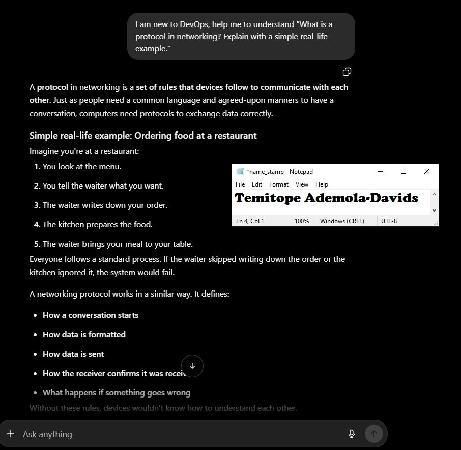
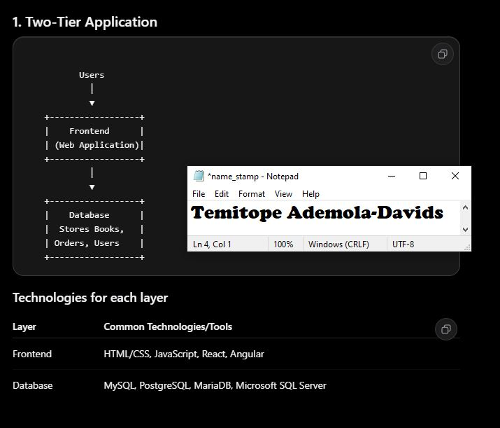
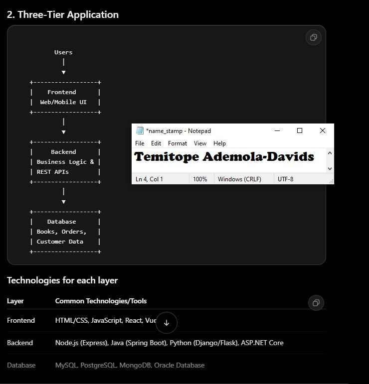
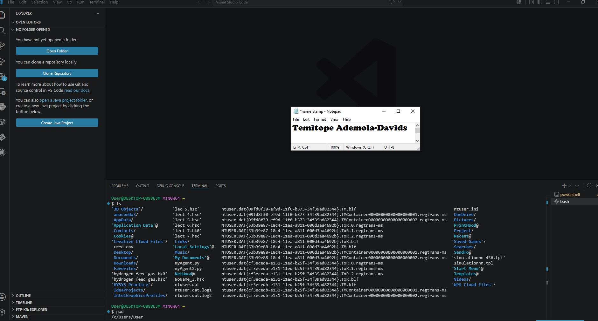

# Week 00 - Internet and Networking

Part of the DevOps Micro Internship (DMI) Cohort 3 with Agentic AI

---

# 🧑‍💻 Task 1: Using ChatGPT as Your Learning Assistant

## Scenario

You're new to DevOps and will frequently encounter technical questions. ChatGPT can be your learning companion.

## Your Task

Write a clear ChatGPT prompt to help you understand:

> "What is a protocol in networking? Explain with a simple real-life example."

Take a screenshot of your interaction showing:

* Your detailed prompt (with clear expectations)
* ChatGPT's simplified response with an example

## Screenshot

Save your screenshot in the `screenshots` folder and update the file name below.




---

## What I Learned (2–3 lines)

I learned that ChatGPT is a tool to help learners and professionals grow in their field of study. Like in my case, ChatGPT helped me get more knowledge on networking and communication concepts.

---

# 🌐 Task 2: Internet and Networking

## Scenario

Your friend is launching an online bookstore named **EpicReads**.

He asked you to explain how users globally can access his website hosted in Finland.

## Your Task

Write a short explanation (**100–150 words**) that includes:

* Packet Switching
* IP Address
* TCP/IP
* HTTP/HTTPS

💡 **Tip:** You may use ChatGPT (as demonstrated in Task 1) to refine your explanation.

## Answer

When EpicReads is hosted on a server in Finland, customers from anywhere in the world can still access the website through the internet. When a user enters the website address in a browser, the request is broken into small pieces called packets using packet switching. Each packet travels across different network paths and is reassembled when it reaches the server. Every device connected to the internet has an IP address, which acts like a unique home address so packets know where to go and where to return. The TCP/IP protocol suite manages this communication by ensuring packets are correctly addressed, transmitted, and reassembled in the right order. Once the connection is established, HTTP or the more secure HTTPS protocol is used to transfer web pages between the user's browser and the server. HTTPS also encrypts data, protecting sensitive information such as login credentials and payment details, allowing customers worldwide to browse and purchase books safely.


---

# 🏗️ Task 3: Application Architecture & Stack

## Scenario

EpicReads bookstore has two application versions:

### Two-Tier Application

* Frontend
* Database

### Three-Tier Application

* Frontend
* Backend
* Database

## Your Task

* Draw simple diagrams (hand-drawn or tool-based such as draw.io)
* Label each layer clearly
* List at least two common technologies or tools used for each layer
* Submit a screenshot or photo clearly showing your own drawing

## Diagram Screenshot / Photo

Save your diagram image in the `screenshots` folder and update the file name below.





Replace `task-3-diagram.png` with your actual diagram file name.

---

## Technologies Used

### Frontend

* HTML, CSS and JS
* React, Angular

### Backend

* Node JS, ASP.NET, Python


### Database

* MariaDB, MongoDB, 
* MySQL

---

# 🌍 Task 4: Domain Name & DNS (Basic Concepts)

## Scenario

Your friend's bookstore **EpicReads** is currently accessible through:

```text
52.172.142.222:3000
```

He purchased the domain:

```text
epicreads.com
```

## Your Task

In **50–100 words**, explain in your own words:

1. What is DNS (Domain Name System)?
2. Which DNS record type should be used to connect the domain to the given IP, and why?

## Answer

The Domain Name System (DNS) is like the internet's phonebook. It maps easy-to-remember domain names, such as www.epicreads.com, into IP addresses that computers understand and use to locate websites. 

To connect www.epicreads.com to the IP address 52.172.142.222, an A (Address) record should be used because it maps a domain name directly to an IPv4 address. This allows users to access the bookstore using the domain name instead of remembering the numeric IP address.
---

# 💻 Task 5: Visual Studio Code Setup (Hands-on)

## Your Task

Install Visual Studio Code (if not already installed).

Take a screenshot of your VS Code environment showing:

* Terminal open inside VS Code
* Running a basic command:

### Windows

```powershell
dir
```

### Linux / macOS

```bash
pwd
ls
```

* Your selected VS Code theme clearly visible

⚠️ **Important:** The screenshot must show your username or another identifiable detail to confirm it is your environment.

## Screenshot

Save your screenshot in the `screenshots` folder and update the file name below.




Replace `task-5-vscode.png` with your actual screenshot file name.

---

# 🔗 Task 6: Publish Your Assignment as a LinkedIn Post

## Objective

Publishing on LinkedIn helps you:

* Build your professional online presence
* Reinforce your learning
* Document your DevOps journey publicly

## Your Task

Summarize your answers from Tasks 1–5 into a LinkedIn post.

Clearly structure your post into the following sections:

* ChatGPT
* Internet & Networking
* App Architecture
* DNS
* VS Code Setup

Add the following credit note at the end of your post:

> **P.S. This post is a part of DevOps Micro Internship with Agentic AI Cohort-3 by Pravin Mishra. You can start your DevOps journey by joining this Discord community: https://discord.pravinmishra.com/**

---

## LinkedIn Post URL

Paste your LinkedIn post URL here:


https://www.linkedin.com/posts/topedavids_pravin-mishra-the-cloudadvisory-linkedin-activity-7448018134445395968-CFUf?utm_source=share&utm_medium=member_desktop&rcm=ACoAAAySvXcBSksEGgTHjx1oRy7rOmDlzNAFmEA


---

## LinkedIn Post Backup Copy

Paste the full text of your LinkedIn post here:

🚀 My DevOps Micro-Internship Journey – A Deeper Dive into My Learning Experience
Here I document my DevOps process as I grow. This internship pushes me to think beyond theory, helping me connect concepts to real-world applications.
Throughout this week, I explored Networking, Application Architecture, DNS, and Development Tools. 

Here’s a more detailed look at what I worked on:

🤖 Task 1: Leveraging ChatGPT for Technical Clarity
 I used ChatGPT as a learning companion, it helped me break down complex technical concepts—like network protocols, DNS resolution, and application structures—into simpler explanations.
 This improved my understanding, also elevated how I communicate technical ideas in a clear, structured manner—an essential skill in DevOps.

🌐 Task 2: Understanding Internet & Networking Fundamentals
How users from anywhere in the world access websites hosted on remote servers. I learned how multiple technologies work together seamlessly using :
Packet Switching to break into smaller chunks and efficiently routed across networks and also Protocols that guides communications like TCP/IP, HTTP/S. What stood out most is how these layers collaborate behind the scenes to deliver a smooth browsing experience—whether the server is nearby or located across continents.

🏗️ Task 3: Exploring Application Architecture
 Modern applications are structured in tiers. I compared two major tiers:
🔹 Two-Tier Architecture (Client ↔ Database)
 In this simpler setup, the frontend communicates directly with the database. It’s easier to implement.
 Technologies used: HTML, CSS, React, SQL, MongoDB
🔹 Three-Tier Architecture (Client ↔ Server ↔ Database)
 Here, a backend layer acts as an intermediary between the frontend and the database. 
 Technologies used: HTML, CSS, React, Node.js/Python, SQL, MongoDB
This comparison gave me a clearer understanding of why modern systems favor layered architectures, especially for large-scale applications.

🌍 Task 4: Demystifying DNS (Domain Name System)
 I learned that DNS acts like the internet’s phonebook—translating human-friendly domain names into machine-readable IP addresses.
e.g mapping epicreads.com to 52.172.142.222 requires an A-record, which directly links a domain name to an IPv4 address.
 This means users can access websites without needing to memorize numerical IP addresses.

💻 Task 5: Setting Up My Development Environment (VS Code)
 I set up Visual Studio Code as my IDE. I used its integrated terminal and practiced running basic commands which is a crucial step toward working efficiently in real-world development and DevOps workflows.

💪 💪 💪 

P.S. This post is part of the FREE DevOps Micro Internship (DMI) Cohort 3 run by Pravin Mishra. You can be part of this learning community too.
JOIN HERE (https://lnkd.in/eM3Afqmm ) DMI Cohort 3: https://lnkd.in/eYBAA5pX
Pravin Mishra Profile: https://lnkd.in/e4xUPE8n

---

# Reflection – Week 0

### What did you find easy?

Well, we are just bootsrapping in the session, so taking off has less frictions to me. Everything seem easy, with my background even prompting to get information.

---

### What was difficult?

For now, nothing...the concept is something I am currently familiar with.

---

### What will you improve next week?

Starting my assignments early enough

---

## 📌 About DMI & CloudAdvisory

DevOps Micro Internship (DMI) is a project-based DevOps program run by Pravin Mishra (The CloudAdvisory) focused on real-world execution, systems thinking, and career readiness.

It helps learners build strong DevOps foundations with hands-on experience.


## 📌 Resources

- 🌐 **DMI Official Website:** https://pravinmishra.com/dmi  
- 🎓 **DevOps for Beginners (Udemy):** https://www.udemy.com/course/devops-for-beginners-docker-k8s-cloud-cicd-4-projects/  
- 🎓 **Ultimate Agentic AI DevOps with Clude Code** https://www.udemy.com/course/ultimate-agentic-ai-devops-with-claude-code/?referralCode=448389767BC96284087B
- 🎓 **DevOps with Claude Code: Terraform, EKS, ArgoCD & Helm** https://www.udemy.com/course/devops-with-claude-code-terraform-eks-argocd-helm/?referralCode=1C5B734505D65A010FA3
- ▶️ **YouTube Playlist (DMI Cohort 3):** https://www.youtube.com/playlist?list=PLFeSNDtI4Cho  
- 🔗 **Pravin Mishra (LinkedIn):** https://www.linkedin.com/in/pravin-mishra-aws-trainer/  
- 🏢 **CloudAdvisory (LinkedIn):** https://www.linkedin.com/company/thecloudadvisory/

---

*This submission is part of DevOps Micro Internship (DMI) Cohort 3 — Agentic AI Track*