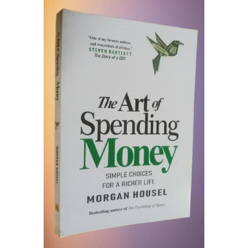
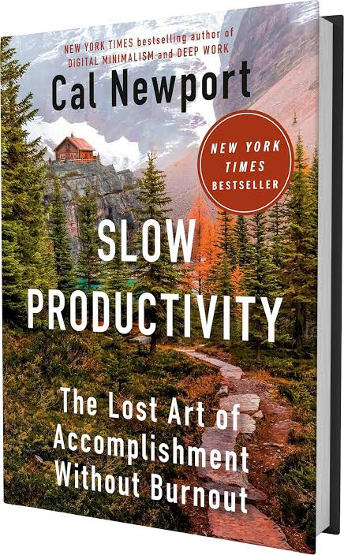
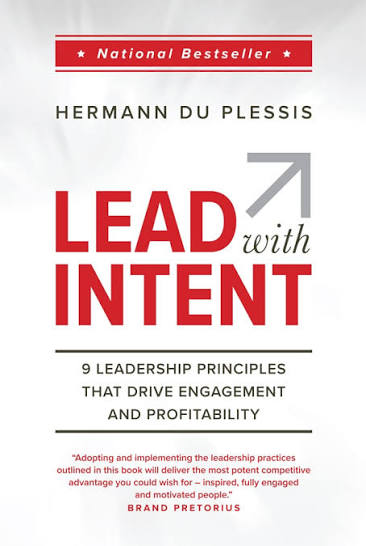
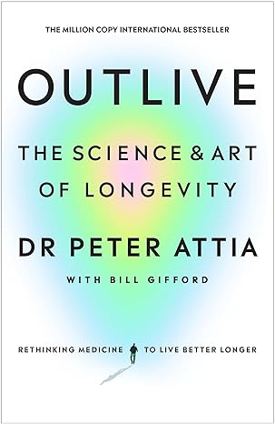
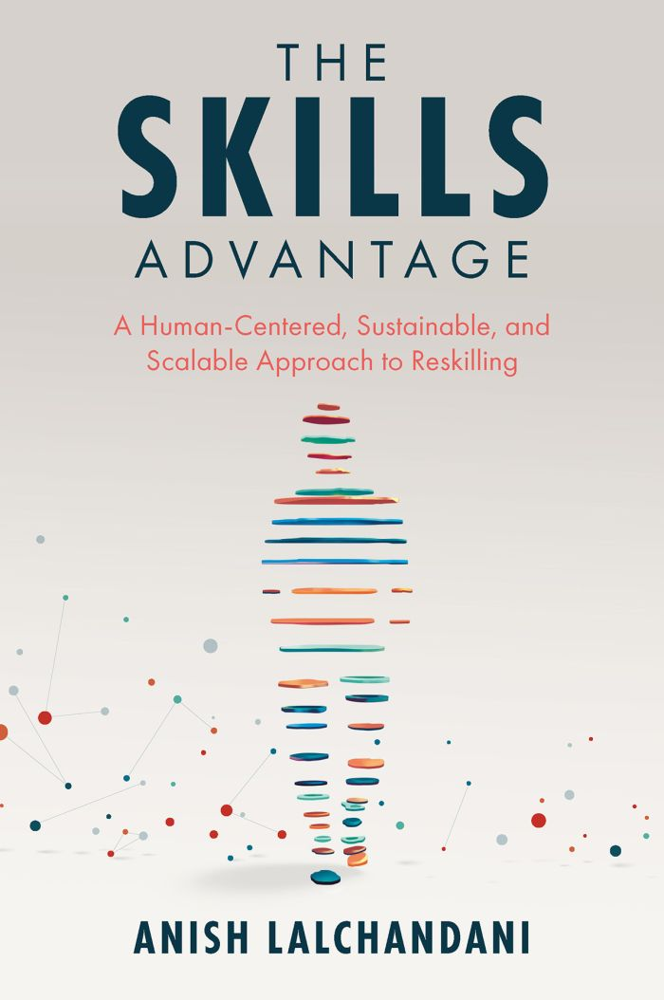
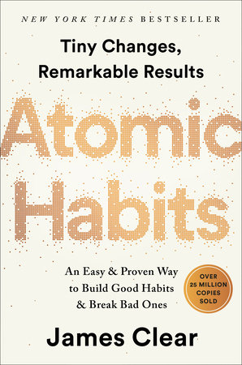
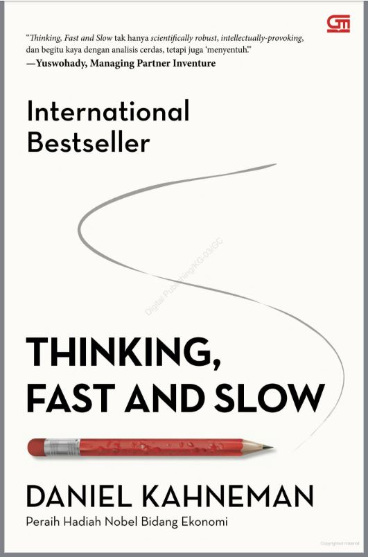
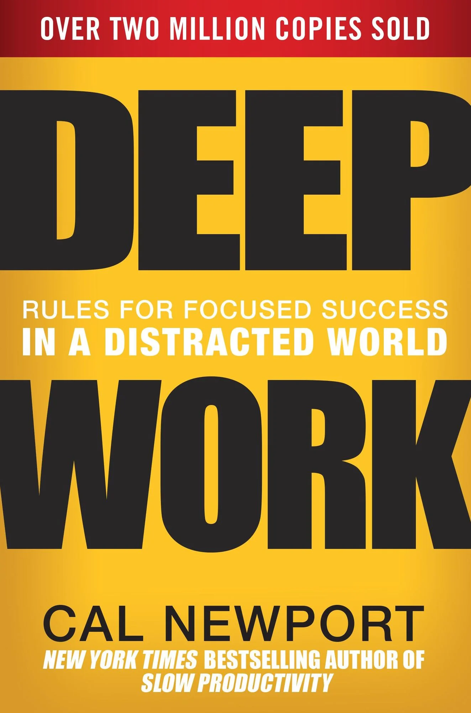

# Week 01 — Success Mindset (Mindset OS)

Part of the DevOps Micro Internship (DMI) Cohort 3 with Agentic AI

---

## Purpose (Read This First)

This week is not motivation homework.

This is you building your **Mindset OS** — the system you will use for the next 5 months (and honestly, for years).

### Expectations

* Be honest.
* Be specific.
* Be practical.
* Write like an adult professional: clear sentences, no one-liners.

You will reuse this in later weeks. So do it properly once.

---

# Assignment 1. What is something you believe to be true that most people around you would disagree with?

### Rules

* No "safe" answers.
* Must be your real belief (not copied from internet).
* Minimum 50 words.

**Hint:** What do you believe about career, money, learning, discipline, relationships, health, success, life, tech industry, etc. that most people don't agree with?

My belief that others, don not sgree with - especially those who condemn themselves or their wards; is that no one is born a failure, I often see people comparing themselves or their kids to other people's kids; and it has always struck upon me to note their wards could also be better and smarter if only same dedication, opportunity, guidance and resources are made available to their wards too, as was made available to the ones they are being compared with. Above all, the internet and resources like youtube has made education without borders and anyone can achieve success if dedication is put in.

---

# Assignment 2. What are the top 3 objective truths you discovered through experimentation and results?

### Definition

Objective truths do not depend on opinions. They hold true regardless of how people feel.

Write each truth in this format:

**Truth:** (1 sentence)

**Evidence from my life:** (2–4 lines: what you tried + what happened)

---

## Truth #1

### Truth

Anything at rest remains at rest:

### Evidence from my life

Looking for a  pay raise? I had to take on courses.  
I wanted to start a family? I had to get married.  
To stay fit, grow muscles and abs? I had to hit the gym

---

## Truth #2

### Truth

Matters Change Forms at different Temperatures

### Evidence from my life

Liquids change to Solid like Ice at 0°C  
Liquids change to Gas via Evaporation at 100°C

---

## Truth #3

### Truth

Time Reveals Everything

### Evidence from my life

Everybody will die some day 
Tomorrow will become Today and Today will become Yesterday   

---

# Assignment 3. What does your 2.0 version look like?

### Instructions

Write as if a journalist is writing about you **3 to 7 years from now** (not 20 years).

**Minimum 300 words.**

### Rules

* Write in past tense, like it already happened.
* Don't use "likes to / wants to / hopes to."
* Use specifics:

  * built
  * shipped
  * led
  * published
  * earned
  * relocated
  * contributed
* Include skills proof:

  * projects
  * portfolios
  * GitHub
  * blogs
  * certifications
  * job role
  * leadership
  * community contribution
* Add 1–3 images if you can (optional but powerful).

### Publish It Publicly On Any ONE

* LinkedIn
* Medium
* WordPress
* Blogspot
* Personal blog
* Portfolio page

Include this line:

> **P.S. This post is a part of DevOps Micro Internship with Agentic AI Cohort-3 by [Pravin Mishra](https://www.linkedin.com/in/pravin-mishra-aws-trainer/). You can start your DevOps journey by joining this [Discord community](https://discord.pravinmishra.com/) ( https://discord.pravinmishra.com/ ).**

## Your Article

*The Lagos Freelancer Who Taught AI to Speak Naija*  
_By Tosin Adebayo, TechCabal | April 2031_

Five years ago, Tope Davids as fondly called, was selling café tickets for people tending to surf the internet from a shop size café he managed with friends in Surulere. Today, his software built with AI tools run in 2000+ Nigerian POS shops and published on Playstore with over 8M users. 

His exponential jump is something worth the discourse. A builder of reliable and resilient systems.

*From Ticketer to Provider*  
Tope got tired of just being called the café boy, selling timer tickets and fixing systems that does not connect to the routers. He birthed, tested and published his ideas of business problems and automated solutions. He shipped 3 LangChain tools in one Streamlit app instead of selling and customizing tickets for internet browsers. He didn’t just read about about AI and DevOps practices — He deployed an app checker that helps verify the genuity of the app against other fraudster looka-alikes. 

App Publishers noticed his deployment, and appreciated the fact that with his platform; their users can ensure to have the right app installed on their mobile phones and not just another clone. This called in support and partnership with top businesses and multinationals.

*The 2028 Shift: “Build for One Problem” *  
Instead of chasing 10 industries, He went deep on finance only. His app checker and verifier was had followed compliance for PII and PCI. His codebase was also adapted for POS Commission Calculator and in 2030, Moniepoint & Opay (Nigeria’s giant fintechs) integrated it due to security level, the up-to-date delivery and deployment. Banks started licensing the code in their home-shipped app. 

“People don’t buy AI,” they told TechCabal last month. “They buy time. A POS agent saves 2 hours/day. A bank app user secures his/her balance access if they logged in securely to the right app.”

*What Changed in 3 Years*  
1. *Perspective*: Dropped selling tickets for café users. Built a B2B and B2C solution that resolved banks and user pain points.
2. *Credibility*: Every tool now ships with “Security I added” notes — PII redaction, API key vaults, input validation, 1024bit encryption, etc. That’s what got them into 3 fintech accelerator programs.
3. *Income*: One product, many solutions. Same app codebase logic powers the app verifier and POS calculator.
The source code can be forked and cloned from his Github portfolio.

*The Quote That Stuck*  
“I’m not an ‘AI expert’,” they said, fixing a timeout error live on stage at Lagos Startups Week. “I’m a Nigerian who got tired of bad tools and learned to build better ones.”

### Public Link

https://www.linkedin.com/posts/topedavids_the-lagos-freelancer-who-taught-ai-to-speak-share-7477685794443538432-EmvN/?utm_source=share&utm_medium=member_desktop&rcm=ACoAAAySvXcBSksEGgTHjx1oRy7rOmDlzNAFmEA

---

# Assignment 4. Have you ever cut corners (unethical / dishonest / shortcut behavior — not necessarily illegal)? If yes, how did it make you feel?

### Important

You don't need to write the full story.

Focus on the feeling:

* guilt
* fear
* shame
* stress
* regret
* numbness
* etc.

This is about self-awareness, not judgment.

**Yes / No**

If Yes:

**What emotion did you feel?** (minimum 50–100 words)

I once cut corners trying to by-pass a particular cost of something that got spoiled in my vehicle. It was my headlamp switch that went bad one evening while in transit home, so the roadside autoelectrician told me to buy the recommended switch, but to cut cost he told me I can adapt a low standard switch used in tricycles just for the meantime, which I accepted to be able to use the vehicle as the night falls.  I regretted that decision as the switch was not designed to take the headlamp load amperage without a relay. My car wires burned due to resistance mismatch ,my brainbox got an issue as it couldnt detect the component fixed. I spent huge far beyond the switch cost to get the car back to functional state. I got to realise looking similar does not mean it is the same. 

---

# Assignment 5. What are 10 non-fiction books you plan to read in the next 1 year?

### Rules

* Mention **Title + Author**
* Any language allowed
* No fiction novels

### Tip

Choose books that improve:

* mindset
* communication
* productivity
* health
* money
* career
* leadership

## Book List

1. Art of Spending by Morgan Housel 

2. Slow Productivity by Cal Newport  

3. Lead With Intent by Hermann Du Plessis 

4. Right Kind of Wrong by Amy Edmondson 

5. Outlive by Peter Attia 

6. Skills Advantage by Anish Lalchandani 

7. Power of Now by Eckhart Tolle 

8. Atomic Habits by James Clear 

9. Thinking Fast and Slow by Daniel Kahmena 

10. Deep Work by Cal Newport 

---

# Assignment 6. What are the things you will measure regularly in your life and career?

### Rules

List topics only. No need to share numbers.

### Must Include

* Learning / skill
* Output / proof
* Health / energy
* Time / focus
* Money / finance (personal or business)

### Example

* Learning hours per week
* Deep work sessions per week
* Projects shipped / documented
* Steps / workouts
* Sleep hours
* Spending tracker

## My Metrics

* Earning Hours not just Learning Sprints
* My number of steps and vovered distance each day
* password/credential security to stay cybersecure
* My eight hours sleep
* Productive hours tracking (developing/building, testing, deploying)
* Reducing screen time/distractions.
* Save more, reduce expenditure
* track meetings with clients and not just spending time prospecting unsure leads
* Health tracking, minimizing stree that could increase blood pressure or sugar levels

---

# Assignment 7. Brain Dump + 5-Month System Plan

## Step 1: Brain Dump (Private)

Do a brain dump of everything in your mind into a notebook.

Examples:

* Bills
* Tasks
* Worries
* Goals
* Pending messages
* Ideas
* Responsibilities

### Did You Do It?

**Yes / No**

Attempting week1 assignment of DMI; 
Balance Payment of children school fees  
Patching client website  
My paused project  

---

## Step 2: Your 5-Month Routine + Focus Blocks

Create a simple plan you can realistically follow for the next 5 months.

### Weekly Routine

Example:

* Mon–Thu: 60 min deep work
* Sat: DMI session
* Sun: Weekly review

#### My Weekly Routine

* Mon: Reading and Trying Labs
* Tue: Attempting my assignments
* Wed: Perfecting posts and articles
* Thu: Available for co-mentor sessions
* Fri: Ensuring I have met deadlines and submitted all works
* Sat: DMI live class/session
* Sun: Light Recess and recap

---

### Focus Blocks

#### When Will You Do DMI Work? (Days + Time)

Aside Saturday Marathon class; I will do DMI classes by 9pm - 11pm althrough the week

#### How Many Sessions Per Week?

Five sessions to build consistency and confidence.

---

### Distraction Rules

Examples:

* Phone rules
* Social media rules
* Environment setup

#### My Distraction Rules

* No movies/screen time
* No family distraction (sleep time)
* No calls and phones
* No late night hangout with friends

---

# Reflection – Week 1

### Biggest insight I got about myself this week

Engineers follow instructions thoroughly and doing is the real learning, not just consuming books and courses. Just in this week that we started, I have understand beyond theory why we FORK someone's project (like a Manager)  to our profile, CLONE to our local machine, and how to connect my github to VScode; and also push my updates from local to remote.
Also keeping track of my progress in the main Readme.md file makes me simulate processes projects go through from in the pipeline, Start to In-Progress to Completion.

### My biggest weakness/loop I noticed

I keep consuming courses and I do less practices that makes one perfect and confident. So now, am seeing myself doing and it helps my theory solidify.

### One system I will implement from this week (exact habit + time)

Keeping up with my Learning Journal and postings to keep myself as an authority in DevOps. My postings would be done before noon daily.

### LinkedIn Post

Paste your LinkedIn post link here:

`https://www.linkedin.com/posts/topedavids_the-lagos-freelancer-who-taught-ai-to-speak-share-7477685794443538432-EmvN/?utm_source=share&utm_medium=member_desktop&rcm=ACoAAAySvXcBSksEGgTHjx1oRy7rOmDlzNAFmEA`

---

## 10. Proof of Work

- LinkedIn Post URL: **[My LinkedIn post](https://www.linkedin.com/posts/topedavids_the-lagos-freelancer-who-taught-ai-to-speak-share-7477685794443538432-EmvN/?utm_source=share&utm_medium=member_desktop&rcm=ACoAAAySvXcBSksEGgTHjx1oRy7rOmDlzNAFmEA)**  
- Blog / Medium : **[My Medium Post](https://medium.com/@tope.adedavids/my-devops-micro-internship-journey-c6fef43de015?sharedUserId=tope.adedavids)**  

---

## 📌 About DMI & CloudAdvisory

DevOps Micro Internship (DMI) is a project-based DevOps program run by Pravin Mishra (The CloudAdvisory) focused on real-world execution, systems thinking, and career readiness.

It helps learners build strong DevOps foundations with hands-on experience.

## 📌 Resources

- 🌐 **DMI Official Website:** https://pravinmishra.com/dmi  
- 🎓 **DevOps for Beginners (Udemy):** https://www.udemy.com/course/devops-for-beginners-docker-k8s-cloud-cicd-4-projects/  
- 🎓 **Ultimate Agentic AI DevOps with Clude Code** https://www.udemy.com/course/ultimate-agentic-ai-devops-with-claude-code/?referralCode=448389767BC96284087B
- 🎓 **DevOps with Claude Code: Terraform, EKS, ArgoCD & Helm** https://www.udemy.com/course/devops-with-claude-code-terraform-eks-argocd-helm/?referralCode=1C5B734505D65A010FA3
- ▶️ **YouTube Playlist (DMI Cohort 3):** https://www.youtube.com/playlist?list=PLFeSNDtI4Cho  
- 🔗 **Pravin Mishra (LinkedIn):** https://www.linkedin.com/in/pravin-mishra-aws-trainer/  
- 🏢 **CloudAdvisory (LinkedIn):** https://www.linkedin.com/company/thecloudadvisory/

---

*This submission is part of DevOps Micro Internship (DMI) Cohort 3 — Agentic AI Track*
