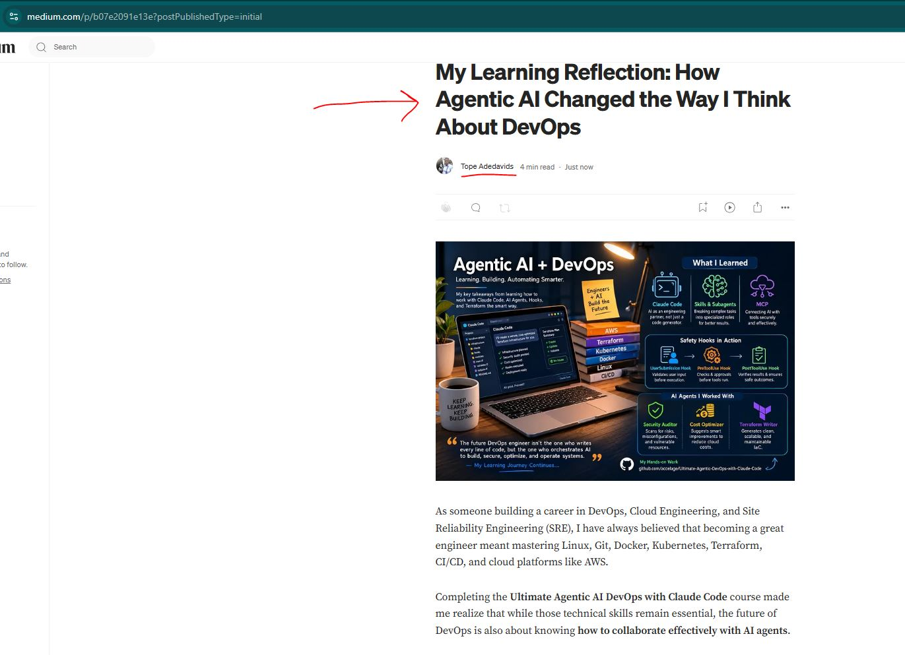
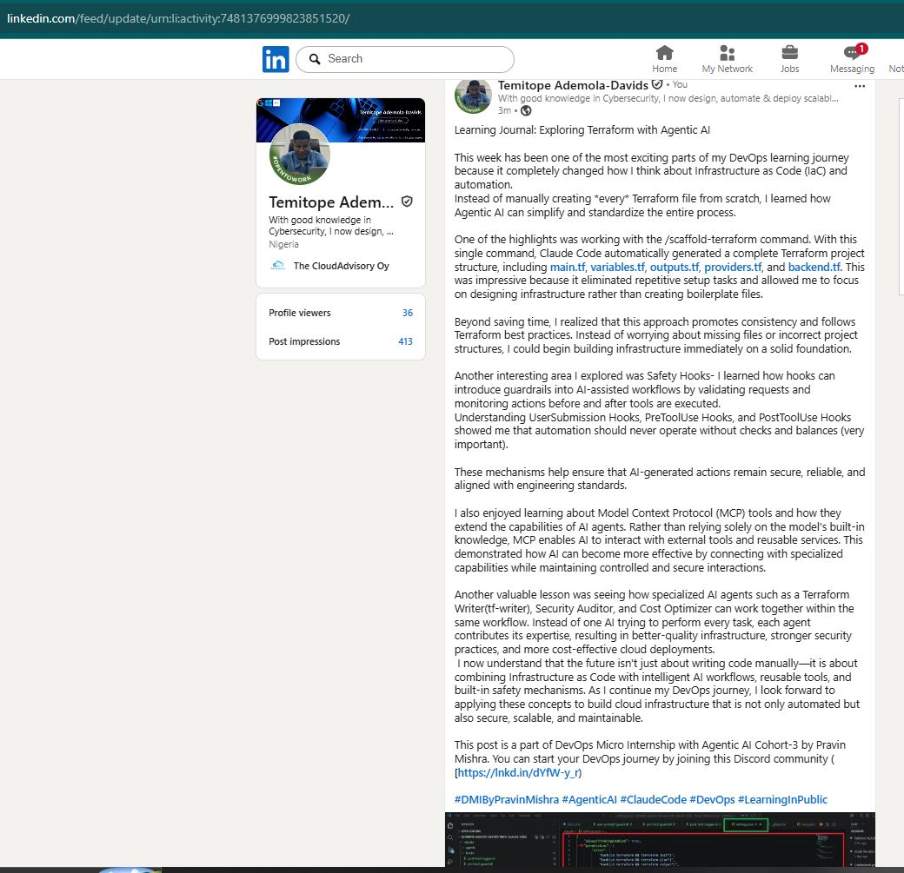

# Assignment 8 — Week 2 Reflection Blog

Part of the DevOps Micro Internship (DMI) Cohort 3 with Agentic AI

---

# Purpose

In this assignment, you will reflect on your Week 2 learning journey and write a short blog capturing your experience working with Agentic AI tools such as Claude Code, Skills, Subagents, MCP, Hooks, Permissions, and Memory.

You will also publish a LinkedIn post summarizing your learning and share both links for evaluation.

---

# Task 1 — Write Your Reflection Blog

## Goal

Write a reflection blog covering your Week 2 learning experience.

### Blog Requirements

Your blog must include:

* Title: **Reflection – Week 2**
* Minimum 300 words
* At least 2–3 topics from Week 2 (Claude Code, Skills, Subagents, MCP, Hooks, Permissions, Memory)
* Honest personal reflection (learning, challenges, mindset)
* One habit/system you plan to implement
* Your full name clearly visible

### Allowed Platforms

You can publish your blog on:

* Hashnode
* Medium
* Dev.to
* LinkedIn Article
* GitHub Markdown file
* Substack

---

### Evidence

#### Screenshot 1 — Blog published and visible



---

### Submission Field

Blog Link:

https://medium.com/@tope.adedavids/my-learning-reflection-how-agentic-ai-changed-the-way-i-think-about-devops-b07e2091e13e

---

# Task 2 — Create LinkedIn Post

## Goal

Share your Week 2 learning publicly on LinkedIn.

---

### LinkedIn Post Requirements

Your post must include:

* One screenshot from any Week 2 assignment
* Short reflection (what you learned or built)
* Required P.S. line exactly as given below

---

### Required P.S. Line (Must Include Exactly)

> **P.S. This post is a part of DevOps Micro Internship with Agentic AI Cohort-3 by [Pravin Mishra](https://www.linkedin.com/in/pravin-mishra-aws-trainer/). You can start your DevOps journey by joining [DMI waiting list](https://forms.gle/3hvrWJBDzsDeJoPs6) (https://forms.gle/3hvrWJBDzsDeJoPs6).**

---

### Suggested Hashtags

#DMIByPravinMishra #AgenticAI #ClaudeCode #DevOps #LearningInPublic

---

### Evidence

#### Screenshot 2 — LinkedIn post published



---

### Submission Field

LinkedIn Post Content (copy-paste here):

```
Learning Journal: Exploring Terraform with Agentic AI

This week has been one of the most exciting parts of my DevOps learning journey because it completely changed how I think about Infrastructure as Code (IaC) and automation. 
Instead of manually creating *every* Terraform file from scratch, I learned how Agentic AI can simplify and standardize the entire process.

One of the highlights was working with the /scaffold-terraform command. With this single command, Claude Code automatically generated a complete Terraform project structure, including main.tf, variables.tf, outputs.tf, providers.tf, and backend.tf. This was impressive because it eliminated repetitive setup tasks and allowed me to focus on designing infrastructure rather than creating boilerplate files.

Beyond saving time, I realized that this approach promotes consistency and follows Terraform best practices. Instead of worrying about missing files or incorrect project structures, I could begin building infrastructure immediately on a solid foundation.

Another interesting area I explored was Safety Hooks- I learned how hooks can introduce guardrails into AI-assisted workflows by validating requests and monitoring actions before and after tools are executed. 
Understanding UserSubmission Hooks, PreToolUse Hooks, and PostToolUse Hooks showed me that automation should never operate without checks and balances (very important). 

These mechanisms help ensure that AI-generated actions remain secure, reliable, and aligned with engineering standards.

I also enjoyed learning about Model Context Protocol (MCP) tools and how they extend the capabilities of AI agents. Rather than relying solely on the model's built-in knowledge, MCP enables AI to interact with external tools and reusable services. This demonstrated how AI can become more effective by connecting with specialized capabilities while maintaining controlled and secure interactions.

Another valuable lesson was seeing how specialized AI agents such as a Terraform Writer(tf-writer), Security Auditor, and Cost Optimizer can work together within the same workflow. Instead of one AI trying to perform every task, each agent contributes its expertise, resulting in better-quality infrastructure, stronger security practices, and more cost-effective cloud deployments.
 I now understand that the future isn't just about writing code manually—it is about combining Infrastructure as Code with intelligent AI workflows, reusable tools, and built-in safety mechanisms. As I continue my DevOps journey, I look forward to applying these concepts to build cloud infrastructure that is not only automated but also secure, scalable, and maintainable.

This post is a part of DevOps Micro Internship with Agentic AI Cohort-3 by Pravin Mishra. You can start your DevOps journey by joining this Discord community ( [https://lnkd.in/dYfW-y_r)

#DMIByPravinMishra #AgenticAI #ClaudeCode #DevOps #LearningInPublic
```

---

### LinkedIn Post Link:

https://www.linkedin.com/posts/topedavids_dmibypravinmishra-agenticai-claudecode-share-7481376996703256576-7KLp/?utm_source=share&utm_medium=member_desktop&rcm=ACoAAAySvXcBSksEGgTHjx1oRy7rOmDlzNAFmEA

---

# Submission Instructions

* Blog must be publicly accessible
* LinkedIn post must be visible (public or unlisted where applicable)
* All required fields must be filled
* Screenshot proofs must be added to GitHub repository
* Do not include sensitive information in blog or post

---

# Completion Checklist

* [ ] Blog written with required structure
* [ ] Blog includes at least 2–3 Week 2 topics
* [ ] Blog is publicly accessible
* [ ] LinkedIn post created
* [ ] Required P.S. line included
* [ ] LinkedIn post content copied in submission field
* [ ] Blog link added
* [ ] LinkedIn post link added
* [ ] Screenshots added to GitHub repo

---

# About DMI & CloudAdvisory

DevOps Micro Internship (DMI) is a project-based DevOps program run by Pravin Mishra (The CloudAdvisory), focused on real-world execution, systems thinking, and agentic AI workflows.

It helps learners build strong DevOps foundations through hands-on experience.

---

# Resources

* 🌐 DMI Official Website: [https://pravinmishra.com/dmi](https://pravinmishra.com/dmi)
* 🎓 DevOps for Beginners (Udemy): [https://www.udemy.com/course/devops-for-beginners-docker-k8s-cloud-cicd-4-projects/](https://www.udemy.com/course/devops-for-beginners-docker-k8s-cloud-cicd-4-projects/)
* 🎓 Agentic AI DevOps with Claude Code: [https://www.udemy.com/course/ultimate-agentic-ai-devops-with-claude-code/](https://www.udemy.com/course/ultimate-agentic-ai-devops-with-claude-code/)
* 🎓 DevOps with Claude Code: Terraform, EKS, ArgoCD & Helm: [https://www.udemy.com/course/devops-with-claude-code-terraform-eks-argocd-helm/](https://www.udemy.com/course/devops-with-claude-code-terraform-eks-argocd-helm/)
* ▶️ YouTube Playlist: [https://www.youtube.com/playlist?list=PLFeSNDtI4Cho](https://www.youtube.com/playlist?list=PLFeSNDtI4Cho)
* 🔗 Pravin Mishra (LinkedIn): [https://www.linkedin.com/in/pravin-mishra-aws-trainer/](https://www.linkedin.com/in/pravin-mishra-aws-trainer/)
* 🏢 CloudAdvisory (LinkedIn): [https://www.linkedin.com/company/thecloudadvisory/](https://www.linkedin.com/company/thecloudadvisory/)

