# Assignment 3 — Production Maintenance Drill (OPS Checklist)

Part of the DevOps Micro Internship (DMI) Cohort 3 with Agentic AI

---

## Purpose

In this assignment, you will treat your already deployed React application (on Ubuntu VM with Nginx) as a live production system. You will perform structured operational checks covering network validation, service health, log analysis, resource monitoring, configuration verification, and incident simulation with recovery — mirroring real on-call DevOps responsibilities.

---

# Task 1 — Server Access & Networking Validation

## Goal

Verify that the deployed React application is reachable from the browser and confirm basic network connectivity of the Ubuntu VM.

### Evidence

#### Screenshot 1 — Browser showing the React app with your Full Name visible on the UI

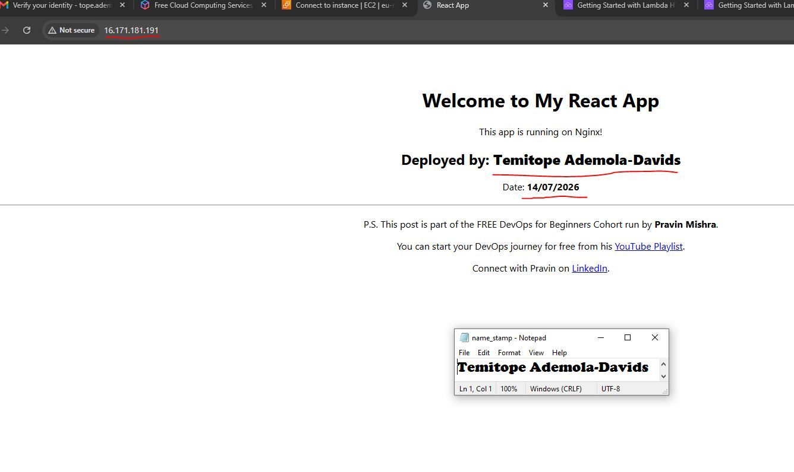

---

#### Screenshot 2 — Output of `ip a`

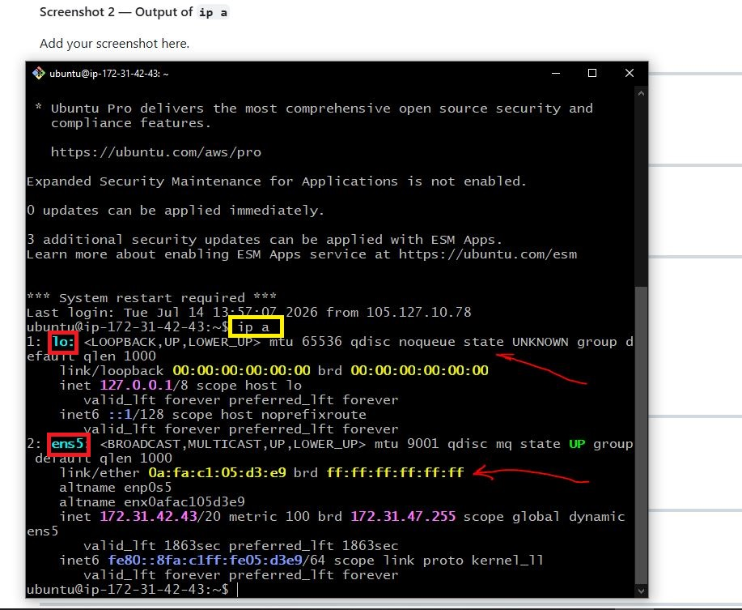

---

#### Screenshot 3 — Output of `sudo ss -tulpen`

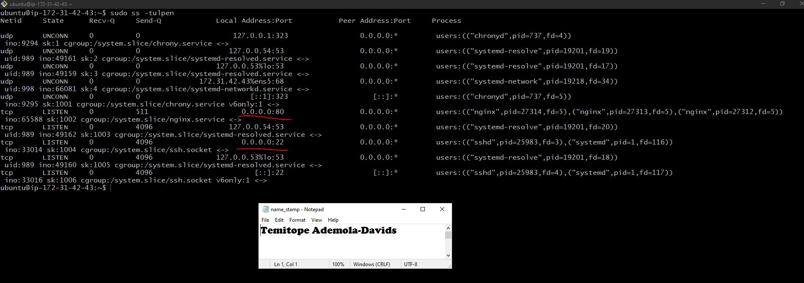

---

#### Screenshot 4 — Output of `sudo ufw status`

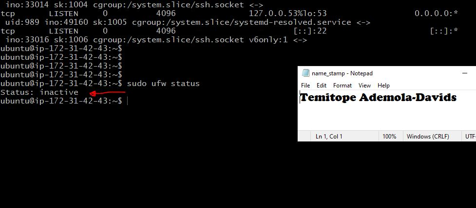

---

### Notes

Answer the following in your own words:

**1. What proves Nginx is listening on 0.0.0.0:80?**

Listening on 0.0.0.0 means there is a binding to all network interfaces connected to the system, not just the localhost. So Nginx is the process name using port 80 and therefore can accept HTTP connections from anywhere.  

---

**2. What proves SSH is active on port 22?**

The SSHd (daemon) is bounded to port 22, thereby listening across network interfaces via the(0.0.0.0:22) and thereby accepting or denying remote access/login 

---

**3. Did you find any unexpected open ports? Explain briefly.**

None found, except for the chronyd which is the daemon for time synchronization and systemd-resolve which resolves DNS requests, and they are both bound to the loopback address 127.0.0.X which is only internally accessible.

---

# Task 2 — Service Health & Systemd Validation (Nginx)

## Goal

Verify that Nginx is properly installed, running, enabled at boot, and safely configured.

### Evidence

#### Screenshot 1 — Output of `systemctl status nginx --no-pager`

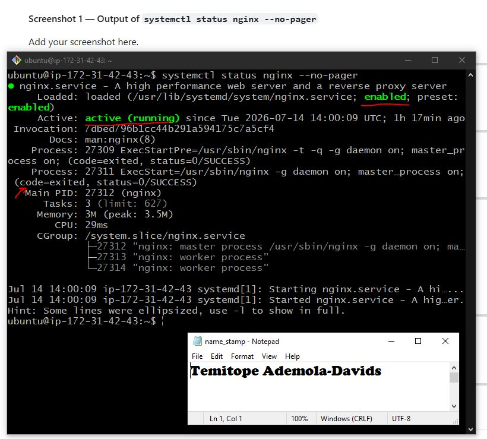

---

#### Screenshot 2 — Output of `sudo nginx -t`

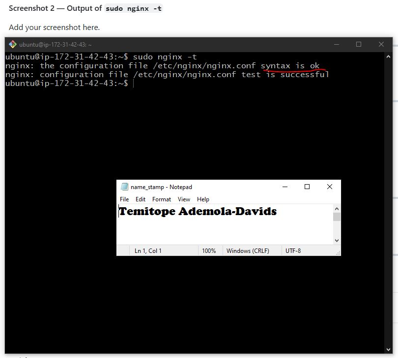

---

#### Screenshot 3 — Output of `sudo ss -lptn '( sport = :80 )'`

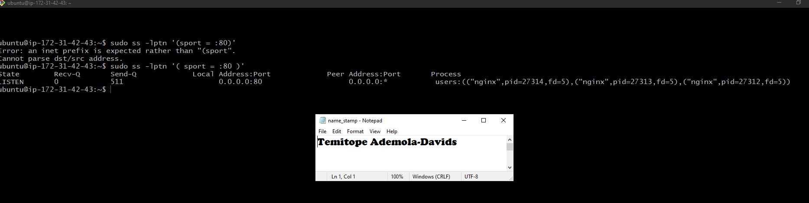

---

### Notes

Answer the following in your own words:

**1. What happens if Nginx fails to restart in production?**

Failure to restart simply means downtime for processes/services that requires nginx to function, like HTTP traffic. As we can see that Nginx is the only process listening on port 80, then it simply means websites hosted would be inaccessible.

---

**2. What's your basic rollback plan?**

As best practices, its best to always have a backup of a known good state, so as to be able to restore or recover from. Also, keeping the command sudo nginx -t, confirms and validates syntax which could halt startup process.

---

# Task 3 — Logs & Request Trace

## Goal

Verify real traffic flow and analyze logs to understand system behavior and errors.

### Evidence

#### Screenshot 1 — Output of `sudo tail -n 30 /var/log/nginx/access.log`

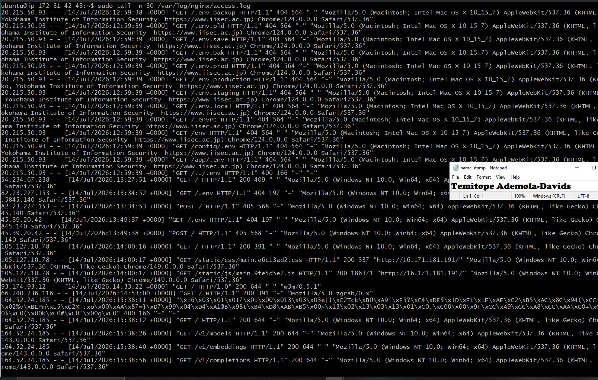

---

#### Screenshot 2 — Output of `sudo tail -n 30 /var/log/nginx/error.log`

---

#### Screenshot 3 — Output of `sudo journalctl -u nginx --no-pager -n 50`

---

### Notes

Answer the following in your own words:

**1. Were there any errors in the logs?**

- If yes, mention 1–2 example error lines from the logs and explain what each one means in simple terms.
- If no, explain what it means if the error log is empty or shows no recent errors during your check.

No errors found as there was no output in the error log.

---

**2. If there were no errors, what does that indicate about the system?**

Empty error log indicates that Nginx did not encounter any issue or problem . This simply informs us of a good working state within the period traced.

---

**3. Based on the access logs, were your curl requests visible in the log entries? What does that prove about traffic flow?**

Yes it was visible as a GET request and it had a status 200 OK. This simply tells us that the system is communicating properly end-to-end, as traffic and packets leave a source to destination.

---

# Task 4 — System Resource Health Check (Capacity Red Flags)

## Goal

Assess server capacity and detect potential performance or failure risks.

### Evidence

#### Screenshot 1 — Output of `uptime`

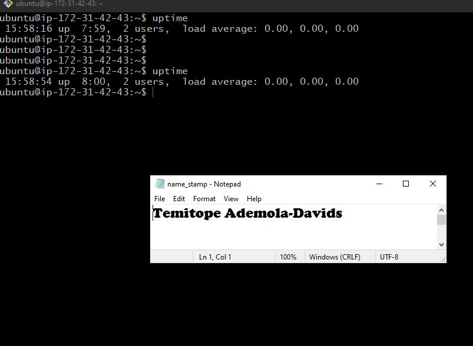

---

#### Screenshot 2 — Output of `free -h`

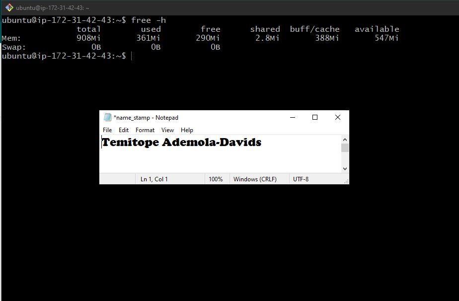

---

#### Screenshot 3 — Output of `df -h`

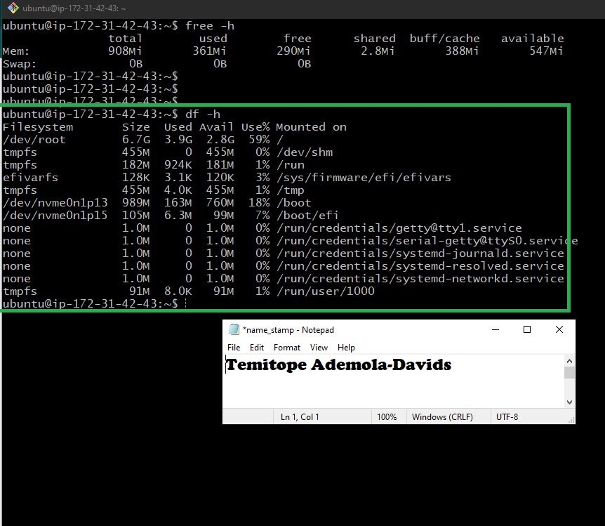

---

#### Screenshot 4 — Output of `sudo du -sh /var/* | sort -h`

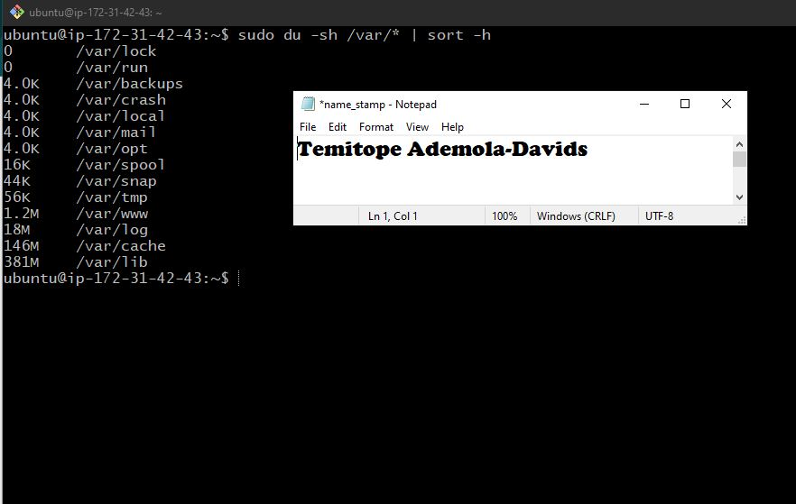

---

### Notes

Answer the following in your own words:

**1. Which resource looks most critical right now? (CPU/load, memory, or disk) Explain why.**

All three resources seem running optimally as none show any critical signal at the moment, but usage and processes are bound to be dynamic. So at the moment with the current capture, none shows critical signal

---

**2. What happens if disk becomes 100% full in a production server?**

If disk becomes full in a production server,  the system can fail or crash due to Read/Write error (from the OS, applications or databases), and these or whatever errors can not be captured as logs to help easily detect and troubleshoot the issue, from event manager.

---

# Task 5 — Configuration & Deployment Verification

## Goal

Ensure the correct React build is deployed and Nginx is serving it properly.

### Evidence

#### Screenshot 1 — Output of `ls -lah /var/www/html | head -n 20`

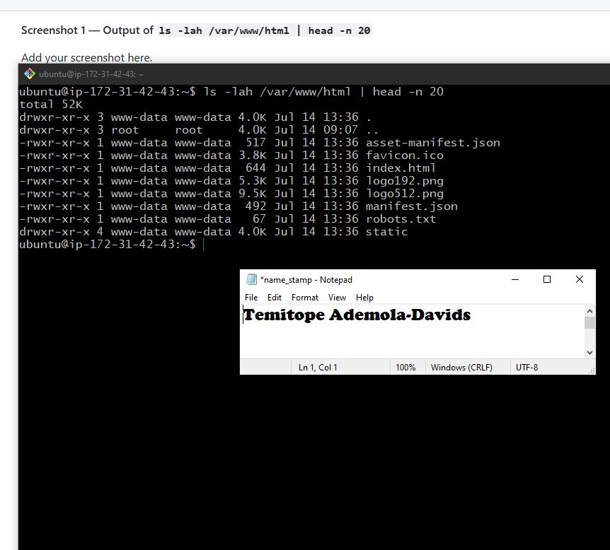

---

#### Screenshot 2 — Output of `grep -R "Deployed by" -n /var/www/html 2>/dev/null | head`

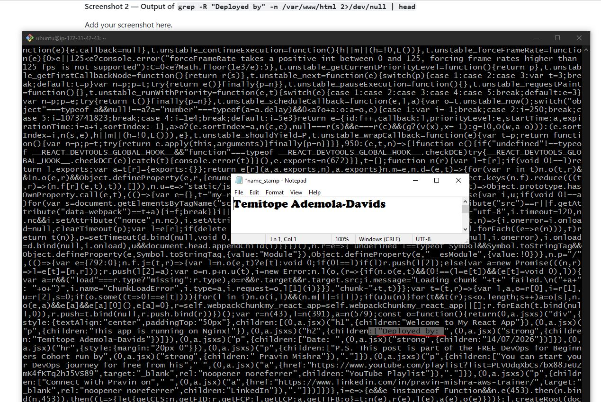

---

#### Screenshot 3 — Output of `grep -n "try_files" /etc/nginx/sites-available/default`

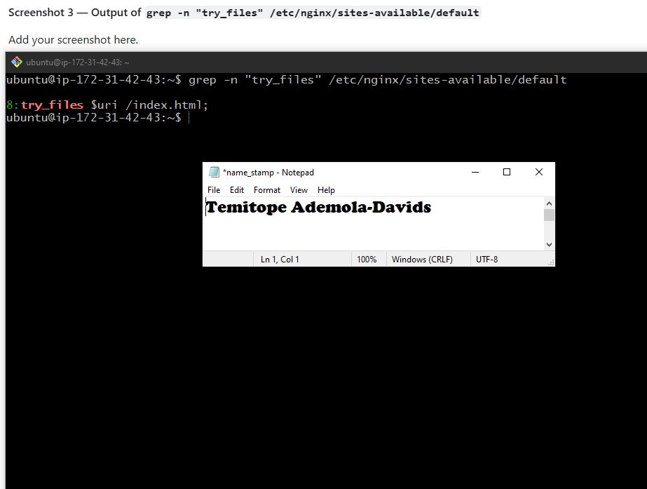

---

### Notes

Answer the following in your own words:

**1. How do you confirm that the correct version of the application is deployed?**

The grep -R "Deployed by" confirms the identifying text was found on the served page, this search keyword could be made more unique so as to serve only a word present in the updated page.

The curl command showed the live server returning this exact index.html content over HTTP — tying the on-disk files to what's genuinely being served to real users. 

---

# Task 6 — Nginx Configuration Failure Simulation

## Goal

Simulate a real-world Nginx misconfiguration and recover the service safely.

### Evidence

#### Screenshot 1 — Output of `sudo nginx -t` showing the syntax error (broken config)

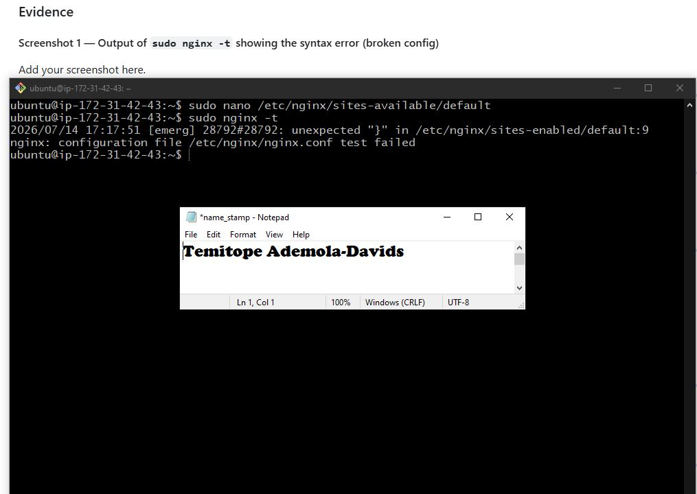

---

#### Screenshot 2 — Output of `sudo nginx -t` showing syntax ok (fixed config)

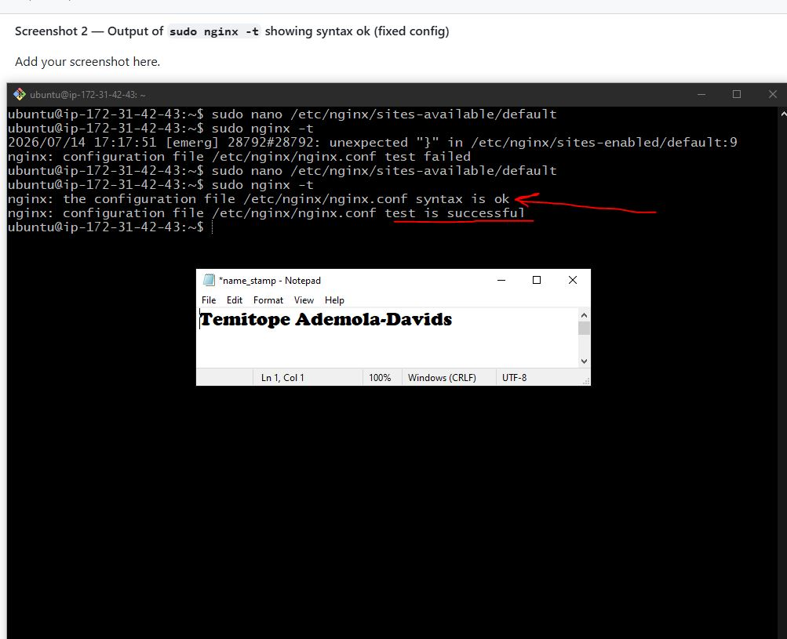

---

#### Screenshot 3 — Output of `curl -I http://<public-ip>` confirming recovery (200 OK)

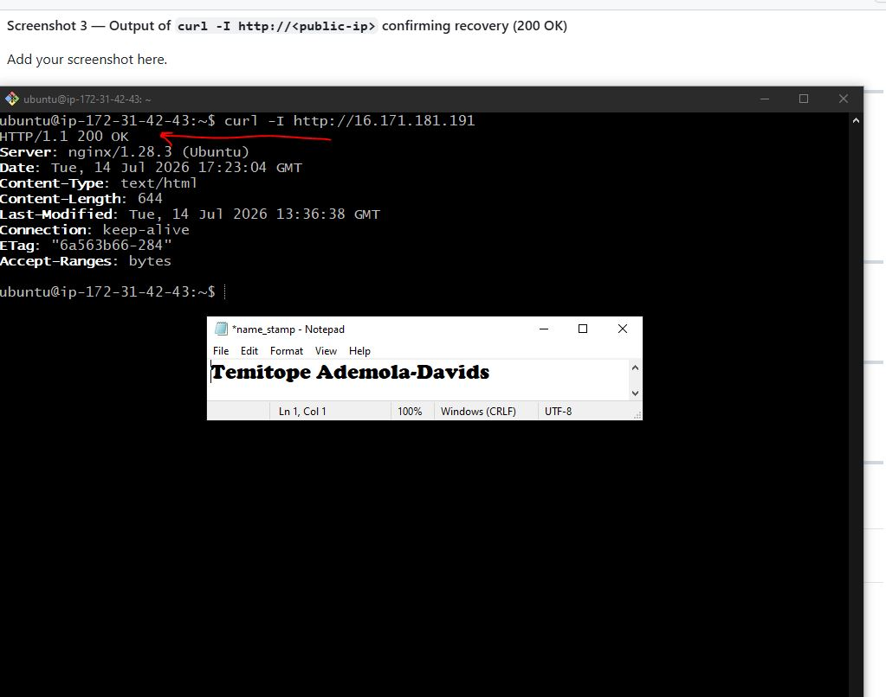

---

### Notes

Answer the following in your own words:

**1. What caused the configuration failure?**

Missing semicolons as instructed to be removed to simulate syntax error caused the Nginx parser to halt, as it was unable to to correctly interprete the block of code.

---

**2. How did you fix the issue?**

The config file was debugged and the missing semicolon was included in the right place. So running sudo nginx -t returned successful which showed that the syntax is now ok, and I restarted the server, and the application ran correctly.

---

**3. How can you avoid this kind of issue in real production systems?**

It is of great importance to imbibe the practice of using sudo nginx -t, after configuration edit.
Use a staging environment as a playground to test config changes before pushing to production.
Nginx config files should be version controlled, so incase of a misconfiguration, the last known good or known good state can be restored

---

# Task 7 — Web Application Failure Simulation

## Goal

Simulate missing deployment content and recover the application safely.

### Evidence

#### Screenshot 1 — Output of `curl -I http://<public-ip>` showing failure (non-200 response)

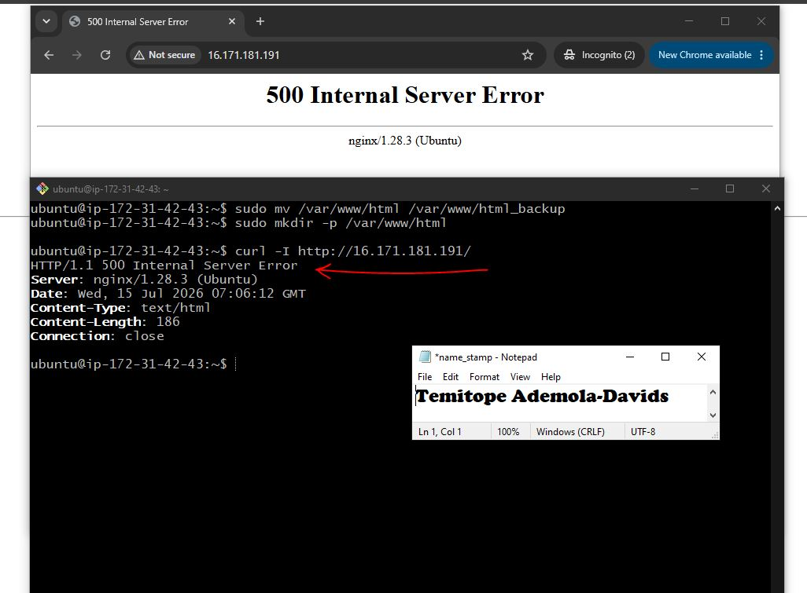

---

#### Screenshot 2 — Output of `curl -I http://<public-ip>` confirming recovery (200 OK)

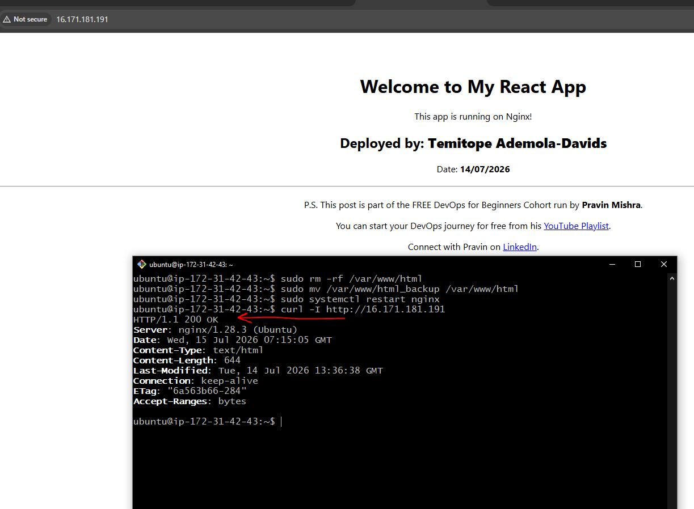

---

### Notes

Answer the following in your own words:

**1. What caused the application to break in this scenario?**

The files in the web root where Nginx server pulls contents from was purged of all files and as thus there was nothing to serve visitors, this caused an Internal error. 

---

**2. How did you fix the issue and restore the application?**

I resolved this issue by restoring the web root content from a backup file of the same web root file. So this restored the folder to a working state that serves content. I also restarted Nginx to purge it of its cache files. The restore was confirmed with the curl -I which returned a 200 OK HTTP status.

---

**3. What steps would you take to prevent this kind of issue in real production systems?**

I will provision an automated pre-deployment backup to always back up known good working state.
Deploying to a versioned, separate directory and automically switching a symlink (e.g., /var/www/current) to point to it, rather than overwriting the live directory in place — this way a failed deploy never leaves the live path empty or half-written.
Implementing a CI/CD pipeline check that verifies that deployment actually succeeded (e.g., confirming index.html exists and is non-empty) before marking the release complete.
---

# Task 8 — Security & Reliability Review

## Goal

Review and reflect on the security and reliability practices applied during this assignment.

### Security & Reliability Notes

Answer the following in your own words:

**1. Why is SSH key-based authentication more secure than sharing passwords?**

SSH is more secure because its keys are not transferred over the network to the server, as thus a Man-in-the-Middle attack cannot sniff the keys and decode it. SSH key cannot be guessed.

---

**2. Why should only required ports be open on a production server?**

Ports as the name suggests are entry and exit points to a system; and for security reasons they should be kept to a manageable minimum to limit the attack surface(reduced risk and few exploit).
Only required ports ensures that the system can only accept and respond through ports it needs for operation(control).

---

**3. Why is it important for Nginx to be enabled on boot?**

Nginx enabled on boot ensures that the server can come back up to operational status in the eventualities that there was a restart, thereby reducing downtime, etc.

---

**4. What are the risks of sharing secrets, keys, or credentials publicly?**

Secrets, keys or credentials are the ways a service authenticates the right ful user. If it is publicly shared then---
Owner can be impersonated to cause Account/Service takeover
Identity and Data theft
Financial loss...

---

**5. Why should cloud resources be stopped or terminated when they are no longer needed?**

Cloud resources should be stopped or terminated to lower or avoid unexpected bill.
Unused servers miss security updates and this makes them vullnerable and susceptible to hackers.
It reduces your quota clutter.

---

# LinkedIn Post (Required)

## Evidence

#### LinkedIn Post URL

Paste your LinkedIn post URL here:

https://www.linkedin.com/pulse/week-3-devops-micro-internship-dmi-thinking-like-ademola-davids-yv3ef

---

#### Screenshot — Published LinkedIn post

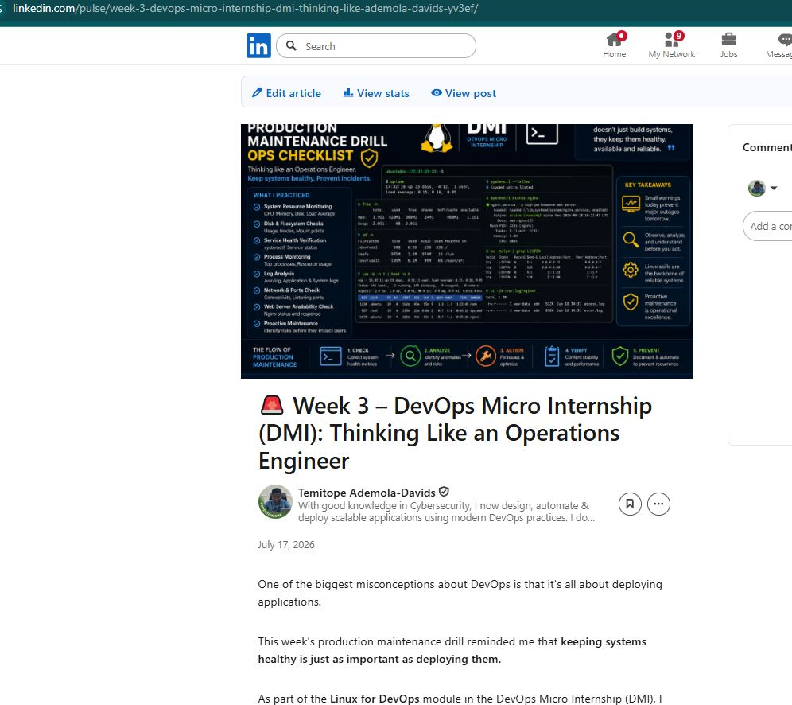

---

# Submission Instructions

- Add all required screenshots in your submission
- Full name must be visible in required screenshots
- Do not expose sensitive information (keys, passwords, account IDs)

---

# Completion Checklist

- [ ] Task 1: Screenshots (browser, ip a, ss -tulpen, ufw status) + Notes answered
- [ ] Task 2: Screenshots (nginx status, nginx -t, ss port 80) + Notes answered
- [ ] Task 3: Screenshots (access log, error log, journalctl) + Notes answered
- [ ] Task 4: Screenshots (uptime, free -h, df -h, du -sh) + Notes answered
- [ ] Task 5: Screenshots (ls html, grep deployed by, grep try_files) + Notes answered
- [ ] Task 6: Screenshots (nginx -t fail, nginx -t pass, curl recovery) + Notes answered
- [ ] Task 7: Screenshots (curl failure, curl recovery) + Notes answered
- [ ] Task 8: Security & Reliability Notes answered
- [ ] LinkedIn post published and URL submitted
- [ ] Full Name visible in all required screenshots
- [ ] No sensitive data exposed

---

## 📌 About DMI & CloudAdvisory

DevOps Micro Internship (DMI) is a project-based DevOps program run by Pravin Mishra (The CloudAdvisory) focused on real-world execution, systems thinking, and career readiness.

It helps learners build strong DevOps foundations with hands-on experience.

---

## 📌 Resources

- 🌐 DMI Official Website: https://pravinmishra.com/dmi  
- 🎓 DevOps for Beginners (Udemy): https://www.udemy.com/course/devops-for-beginners-docker-k8s-cloud-cicd-4-projects/  
- 🎓 Agentic AI DevOps with Claude Code: https://www.udemy.com/course/ultimate-agentic-ai-devops-with-claude-code/  
- 🎓 DevOps with Claude Code: Terraform, EKS, ArgoCD & Helm: https://www.udemy.com/course/devops-with-claude-code-terraform-eks-argocd-helm/  
- ▶️ YouTube Playlist: https://www.youtube.com/playlist?list=PLFeSNDtI4Cho  
- 🔗 Pravin Mishra (LinkedIn): https://www.linkedin.com/in/pravin-mishra-aws-trainer/  
- 🏢 CloudAdvisory (LinkedIn): https://www.linkedin.com/company/thecloudadvisory/

---

*This submission is part of DevOps Micro Internship (DMI) Cohort 3 — Agentic AI Track.*