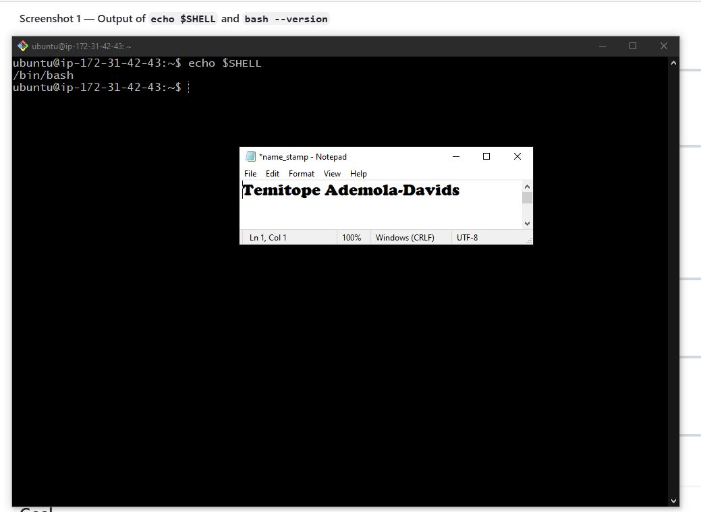
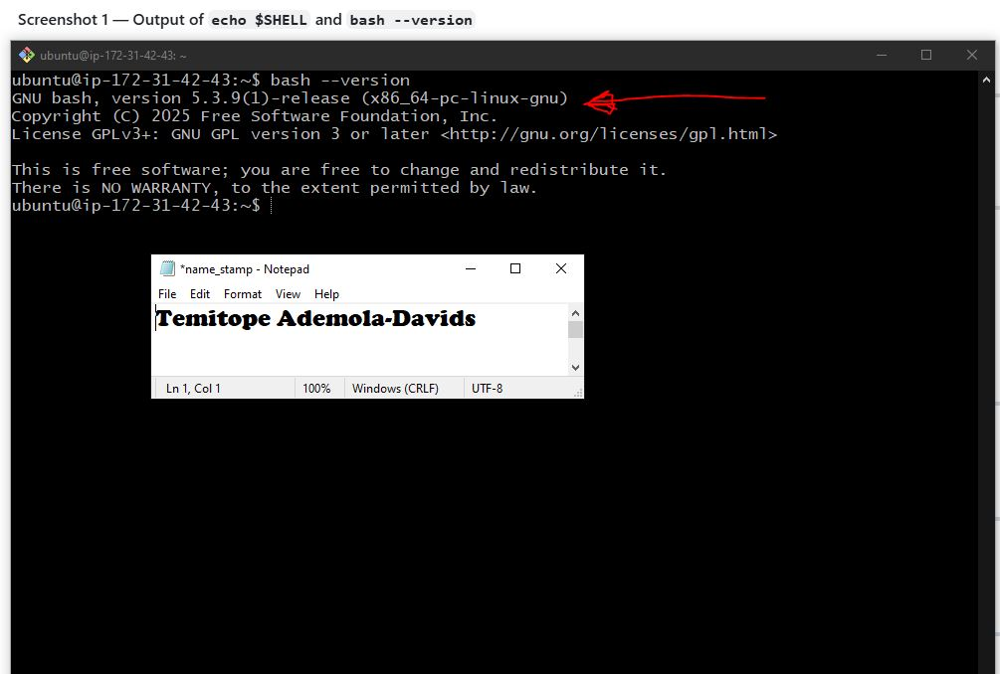
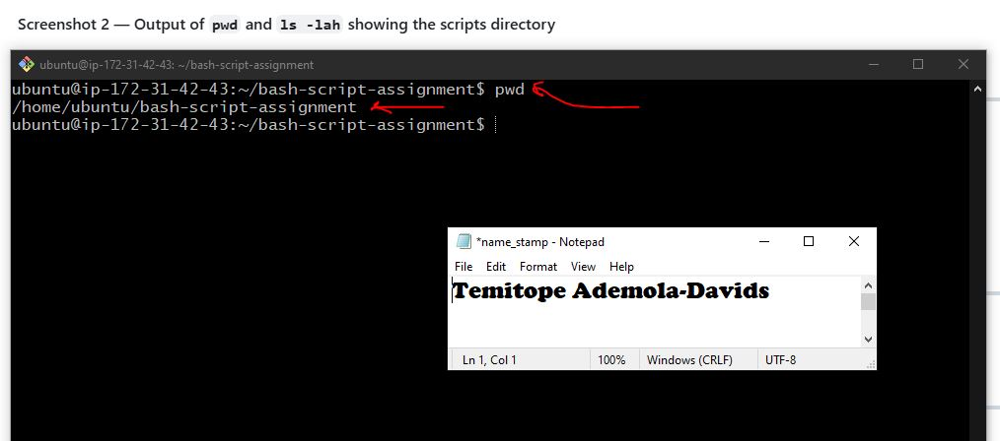
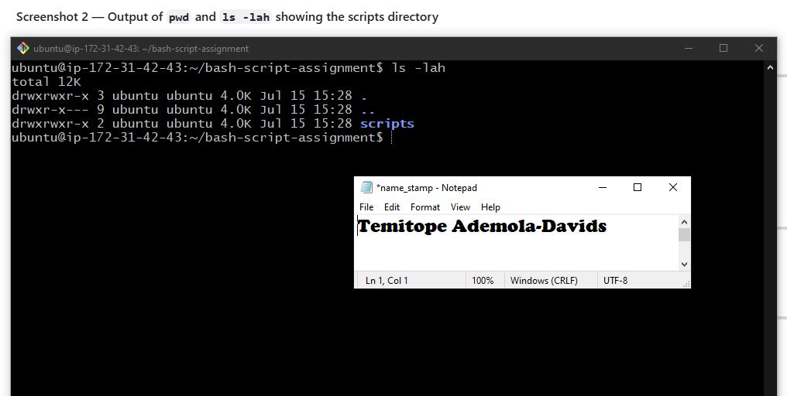
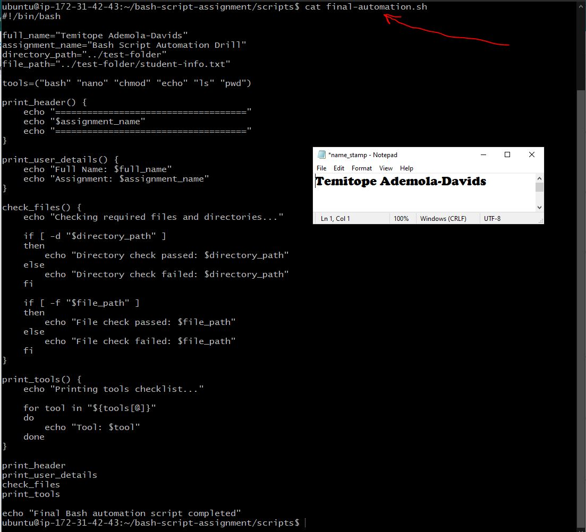
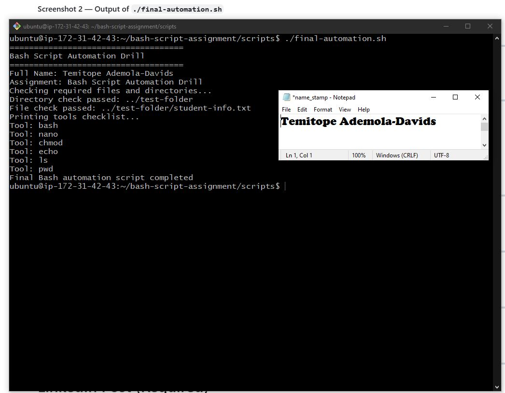
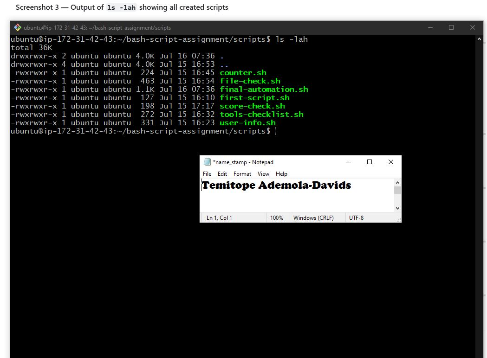
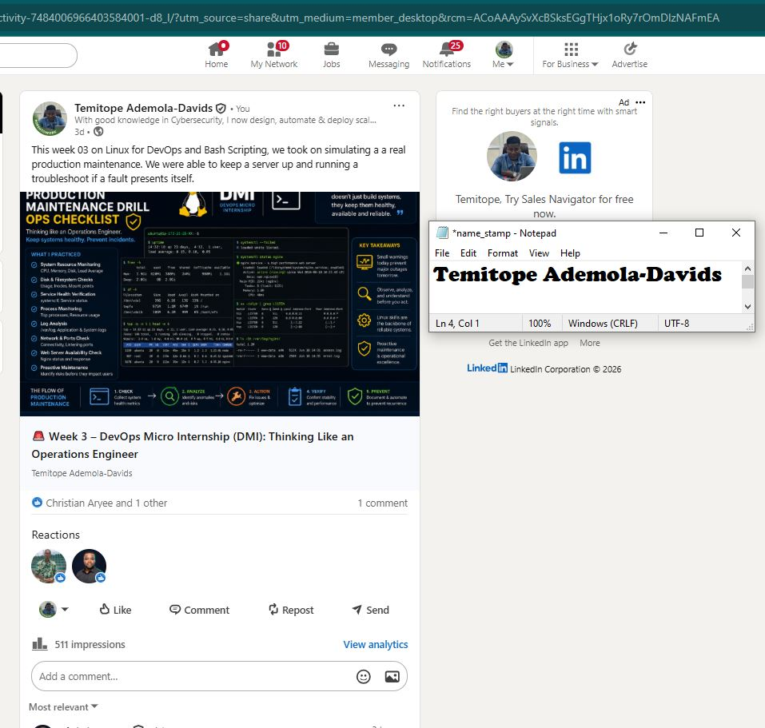

# Assignment 5 — Bash Script Automation Drill (OPS Checklist)

Part of the DevOps Micro Internship (DMI) Cohort 3 with Agentic AI

---

## Purpose

In this assignment, you will practice Bash scripting by building a series of small automation scripts covering environment setup, variables, arrays, loops, file conditionals, if-else logic, and functions. These scripts form the foundation of real-world Linux automation used in DevOps, cloud, and production support environments.

---

# Task 1 — Bash Environment & Workspace Setup

## Goal

Verify that Bash is available on your system and create a clean workspace for this assignment.

### Evidence

#### Screenshot 1 — Output of `echo $SHELL` and `bash --version`

---

#### Screenshot 2 — Output of `pwd` and `ls -lah` showing the scripts directory

---

### Notes

Answer the following in your own words:

**1. What is Bash?**

Bash is a command line utility or interface that allows you to communicate with your computer using text instead of mouse clicks used in a GUI.

---

**2. What is the difference between shell and Bash?**

While Bash is the interface to communicate in text with the computer, the Shell is the interpreter, the program that runs the command that you have entered in the Bash interface.

---

**3. Why is it important to confirm the Bash version before writing scripts?**

Confirming the Bash version helps us to prevent syntax errors that can be caused by version-specific features, like some syntax could have been deprecated, and when used in scripting it can break the code.

---

# Task 2 — Your First Bash Script

## Goal

Create your first Bash script, make it executable, and run it from the terminal.

### Evidence

#### Screenshot 1 — Content of `first-script.sh`

.JPG)

---

#### Screenshot 2 — Output of `./first-script.sh`

.JPG)

---

#### Screenshot 3 — Output of `ls -l first-script.sh` showing executable permission

.JPG)

---

### Notes

Answer the following in your own words:

**1. What is the purpose of `#!/bin/bash`?**

The shebang or hashbang is used in bash scripting header to tell the computer's operating sytem which program to use or call to run the script.

---

**2. Why do we use `chmod +x` before running a script?**

chmod +x is used to update the file's permission to be executable; as Linux/unix-based systems require files to have executable permission before the operating system will allow it to run as a program.

---

**3. What is the difference between running a script using `./script.sh` and `bash script.sh`?**

The ./script.sh must contain a hashbang or shebang line and also an execute permission to be able to run, while a bash script.sh is being enforced to be run using bash bypassing the shebang and only needs read permission.

---

# Task 3 — Variables: User Information Script

## Goal

Use variables to store and display user-related information.

### Evidence

#### Screenshot 1 — Content of `user-info.sh`

.JPG)

---

#### Screenshot 2 — Output of `./user-info.sh`

.JPG)

---

### Notes

Answer the following in your own words:

**1. What is a variable in Bash?**

A variable is a container in memory that is used to store data- which could be strings, integers, etc, that a shell session can access and modify during execution. 

---

**2. Why should we avoid spaces around the `=` sign when creating variables?**

You should avoid spaces around the "=" sign because shell uses spaces  to seperate commands from their arguments, as such it won't assign the variable to the data.

---

**3. How do you access the value stored inside a Bash variable?**

In order to access the value stored in a Bash variable, you must prefix the variable name with a dollar sign.

---

# Task 4 — Arrays & Loops: Tools Checklist Script

## Goal

Use arrays and loops to print a checklist of tools used in Bash scripting.

### Evidence

#### Screenshot 1 — Content of `tools-checklist.sh`

.JPG)

---

#### Screenshot 2 — Output of `./tools-checklist.sh`

.JPG)

---

### Notes

Answer the following in your own words:

**1. What is an array in Bash?**

Array  in Bash is a data structure that can be used to store multiple values in a single variable name and can hold a mix of different data types.

---

**2. Why are arrays useful in scripts?**

Arrays allow us to store, organize and manipulate related values under a single variable name instead of creating multiple individual variables to store different values.
It allows in-built manipulation using index numbers.
It prevents code bloat.

---

**3. What does `"${tools[@]}"` mean?**

It means we should expand all the items in the array called tools into sepearte, different words.

---

**4. What is the purpose of the `for` loop in this script?**

the for loop allows us to iterate a repetitve task multiple times- like the counting the number of steps from 1 to 5.

---

# Task 5 — Loops: Number Counter Script

## Goal

Use loops to repeat a task multiple times.

### Evidence

#### Screenshot 1 — Content of `counter.sh`

.JPG)

---

#### Screenshot 2 — Output of `./counter.sh`

.JPG)

---

### Notes

Answer the following in your own words:

**1. What is a loop?**

Loop is a control structure that helps us to run a particular block of codes repeatedly until a particular condition is met or a list of items is exhausted.

---

**2. Why do we use loops in Bash scripting?**

We use loops to automate repetitive tasks efficiently by executing a specific block of codes multiple times. It helps us reduce code and also helps us automates redious tasks that could be maually labour intensive..

---

**3. How many times did the loop run in your script?**

The loop ran 5 times.

---

**4. What would you change if you wanted the loop to run 10 times?**

I will only change the END value in the curly braces to 10.

---

# Task 6 — Files & Conditionals: File Validation Script

## Goal

Use file checks and conditionals to verify whether files and directories exist.

### Evidence

#### Screenshot 1 — Output of `ls -lah ../test-folder`

.JPG)

---

#### Screenshot 2 — Content of `file-check.sh`

.JPG)
---

#### Screenshot 3 — Output of `./file-check.sh`

.JPG)

---

### Notes

Answer the following in your own words:

**1. What does `-d` check in Bash?**

The -d checks if a specified path exists and is a directory, as thus it returns true, else it returns falls if any of the two conditions fail.

---

**2. What does `-f` check in Bash?**

The -f checks if a specified path exists and is a regular file, as thus it returns true, else it returns falls if any of the two conditions fail.

---

**3. Why should file and directory paths be stored in variables?**

Storing file and directory paths in variables is good practice as it  prevents code from breaking when folders move (portability). It makes your code reusable, and easy to update. If you need to change a path, you only update it once in the variable instead of searching through your whole script.

---

**4. What happens if the file does not exist?**

When the program tries to open or read a file that is missing or non-existent, the operating system stops your program and throws a File Not Found error.

---

# Task 7 — Conditionals: Pass or Retry Script

## Goal

Use if-else conditionals to make decisions based on a variable value.

### Evidence

#### Screenshot 1 — Content of `score-check.sh` with `score=85`

.JPG)

---

#### Screenshot 2 — Output showing `Result: Pass`

.JPG)

---

#### Screenshot 3 — Content of `score-check.sh` with `score=55`

.JPG)

---

#### Screenshot 4 — Output showing `Result: Retry`

.JPG)

---

### Notes

Answer the following in your own words:

**1. What is the purpose of if-else in Bash?**

The purpose is to allow our program/scripts to make decisions, handle conditions and control the flow of the program based on whether a given condition evaluates to true or false. 

---

**2. What does `-ge` mean?**

It means greater than or equal to...and it is used to compare integer numbers in a conditional statement.

---

**3. Why should conditions be tested with different values?**

It should be tested because scripts are prone to edge-case bugs.

---

**4. How can conditionals help in automation scripts?**

Conditionals can help in automation scripting as it can help the program take a specified path if condition is true and also take a different path if false. They prevent the scripts from failing when things change.

---

# Task 8 — Functions: Final Bash Automation Script

## Goal

Create a final Bash script using functions to organize reusable code.

### Evidence

#### Screenshot 1 — Content of `final-automation.sh`

---

#### Screenshot 2 — Output of `./final-automation.sh`

---

#### Screenshot 3 — Output of `ls -lah` showing all created scripts

---

### Notes

Answer the following in your own words:

**1. What is a function in Bash?**

A function is a reusable block of code that is  grouped under a single name. It allows you to write a sequence of operations once and execute them multiple times, reducing code repetition

---

**2. Why are functions useful in scripts?**

Code readability
Code Maintainability
Code can be modularized.

---

**3. Which functions did you create in this script?**

print_header(),
print_user_details(),
check_files(), and 
print_tools()

---

**4. How does this final script combine variables, arrays, loops, conditionals, files, and functions?**

It uses the array name tools to store multiple tools.
It uses the full_name as a variable to store user name.
It uses loops to iterate between the items in the array, echoing different values at different parse.
It uses conditionals to make decision of file and directory existence.
It uses fuctions to group block of codes that can be run modularly together

---

# LinkedIn Post (Required)

## Evidence

#### LinkedIn Post URL

Paste your LinkedIn post URL here:

https://www.linkedin.com/posts/topedavids_this-week-03-on-linux-for-devops-and-bash-activity-7484006966403584001-d8_I?utm_source=share&utm_medium=member_desktop&rcm=ACoAAAySvXcBSksEGgTHjx1oRy7rOmDlzNAFmEA
`Add your URL here`

---

#### Screenshot — Published LinkedIn post

---

# Submission Instructions

- Add all required screenshots in your submission
- Full name must be visible in required screenshots
- All script files must be created and run successfully
- Required notes must be answered clearly for every task
- Do not expose sensitive information (keys, passwords, credentials)

---

# Completion Checklist

- [ ] Task 1: Environment setup verified, workspace created (Screenshots 1–2, Notes answered)
- [ ] Task 2: First script created, executed, permissions verified (Screenshots 1–3, Notes answered)
- [ ] Task 3: Variables script created and run (Screenshots 1–2, Notes answered)
- [ ] Task 4: Arrays and loops script created and run (Screenshots 1–2, Notes answered)
- [ ] Task 5: Counter loop script created and run (Screenshots 1–2, Notes answered)
- [ ] Task 6: File validation script created and run (Screenshots 1–3, Notes answered)
- [ ] Task 7: Pass/Retry conditional script tested with both values (Screenshots 1–4, Notes answered)
- [ ] Task 8: Final automation script created and run (Screenshots 1–3, Notes answered)
- [ ] All scripts run without errors
- [ ] Full Name visible in all required screenshots
- [ ] LinkedIn post published and URL submitted
- [ ] No sensitive data exposed

---

## 📌 About DMI & CloudAdvisory

DevOps Micro Internship (DMI) is a project-based DevOps program run by Pravin Mishra (The CloudAdvisory) focused on real-world execution, systems thinking, and career readiness.

It helps learners build strong DevOps foundations with hands-on experience.

---

## 📌 Resources

- 🌐 DMI Official Website: https://pravinmishra.com/dmi  
- 🎓 DevOps for Beginners (Udemy): https://www.udemy.com/course/devops-for-beginners-docker-k8s-cloud-cicd-4-projects/  
- 🎓 Agentic AI DevOps with Claude Code: https://www.udemy.com/course/ultimate-agentic-ai-devops-with-claude-code/  
- 🎓 DevOps with Claude Code: Terraform, EKS, ArgoCD & Helm: https://www.udemy.com/course/devops-with-claude-code-terraform-eks-argocd-helm/  
- ▶️ YouTube Playlist: https://www.youtube.com/playlist?list=PLFeSNDtI4Cho  
- 🔗 Pravin Mishra (LinkedIn): https://www.linkedin.com/in/pravin-mishra-aws-trainer/  
- 🏢 CloudAdvisory (LinkedIn): https://www.linkedin.com/company/thecloudadvisory/

---

*This submission is part of DevOps Micro Internship (DMI) Cohort 3 — Agentic AI Track.*