# Assignment 6 — Build an AI-Assisted Linux Health Check (AI-Assisted Linux Incident Triage)

Part of the DevOps Micro Internship (DMI) Cohort 3 with Agentic AI

---

## Purpose

In this assignment, you will build a read-only Bash triage script that checks the health of your Ubuntu server and Nginx application, connect it to Claude Code as a reusable `/linux-triage` skill, simulate a controlled Nginx incident, use the skill to gather and analyze evidence, recover the service manually, and verify recovery. The workflow follows the Agentic Loop: Gather → Analyze → Human Act → Verify.

---

# Task 1 — Confirm the Healthy Baseline and Create the Workspace

## Goal

Confirm that Nginx and the React application are healthy before building the automation.

### Evidence

#### Screenshot 1 — Output of `systemctl is-active nginx`, `ss -ltn | grep ':80'`, and `curl -I http://localhost`

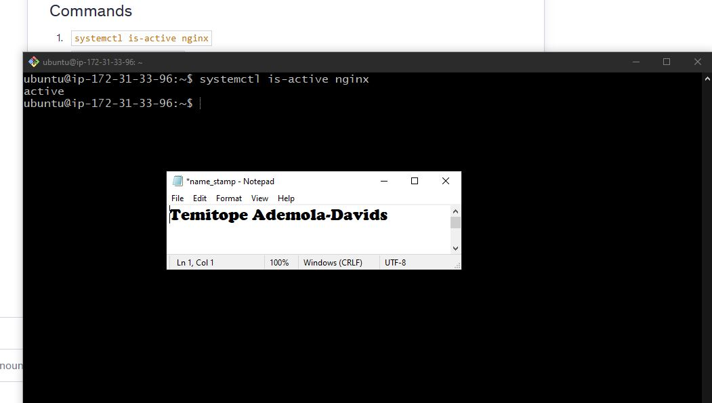
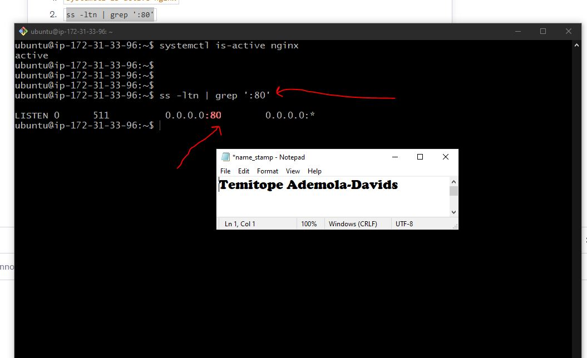
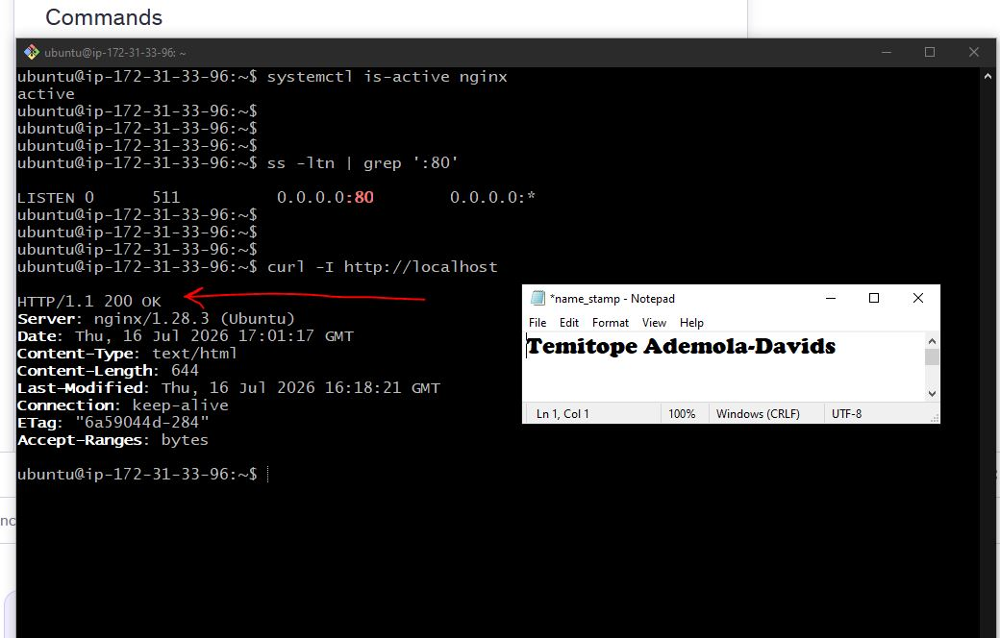

---

#### Screenshot 2 — Output of `pwd` and `find . -maxdepth 4 -type d | sort` showing the workspace folder structure

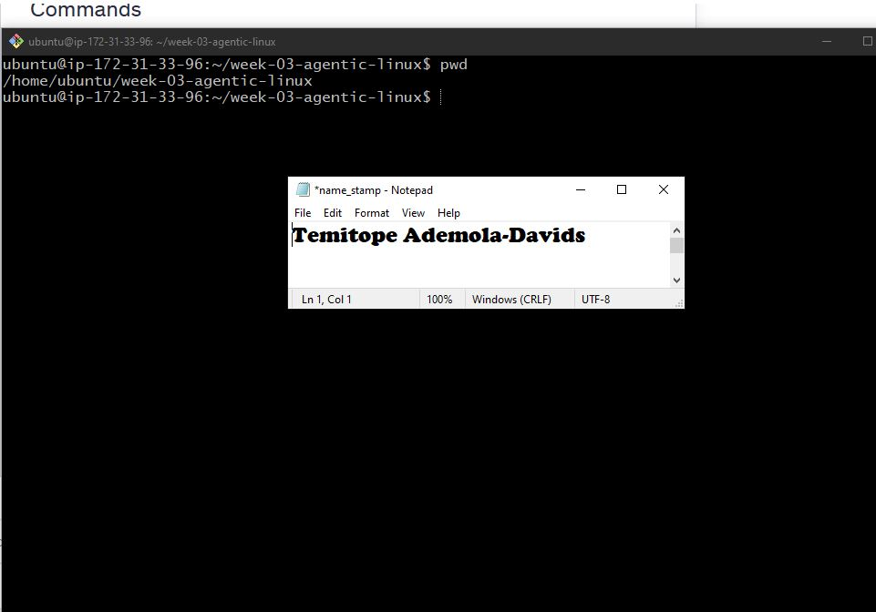
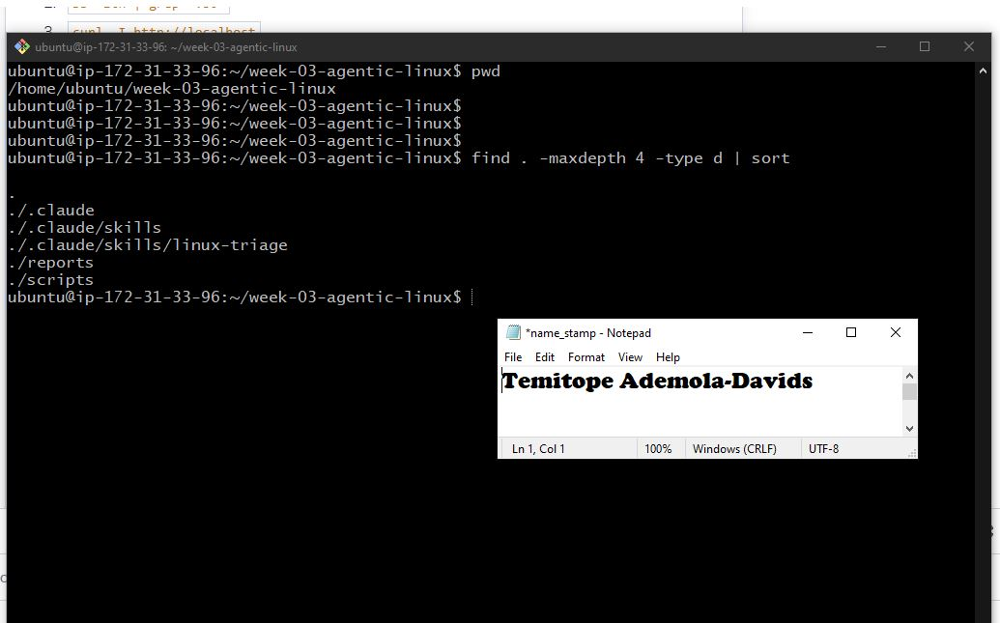

---

### Notes

Answer the following in your own words:

**1. What proves that Nginx is running?**

By running the systemctl nginx active command, the result returned ACTIVE. This shows that nginx service is running. 

---

**2. What proves that the server is listening for HTTP traffic?**

The ss -ltn | grep " :80" returned that the sevice is listening for HTTP traffic on all netwrork interfaces 0.0.0.0:80

---

**3. Why must you capture a healthy baseline before simulating an incident?**

Healthy Baseline sets a standard for what an operational system condition looks like in production, so that there is a comparison basis to know when something deviates. You can only improve what you measure.

---

# Task 2 — Create Project Context and Safety Rules in CLAUDE.md

## Goal

Tell Claude exactly what this project does and what it is not allowed to do.

### Evidence

#### Screenshot 3 — CLAUDE.md open in VS Code showing all four sections (Project Overview, Incident Workflow, Safety Rules, Output Rules)

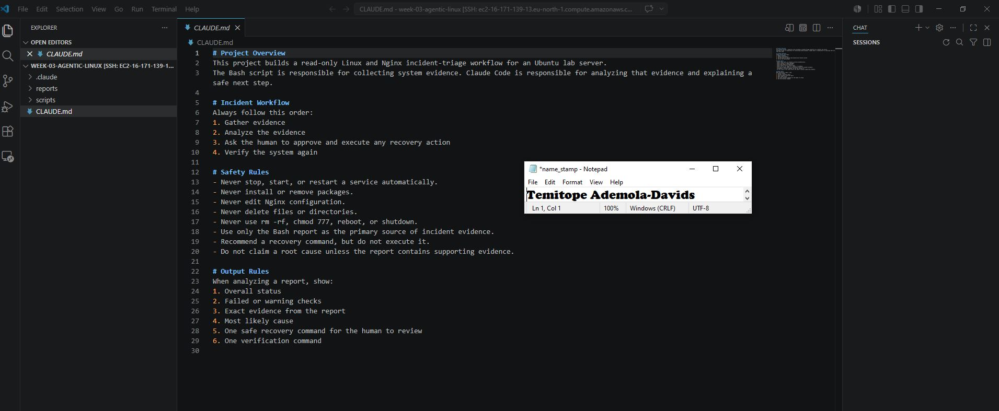

---

### Notes

Answer the following in your own words:

**1. Why should Claude receive project-specific operational rules?**

Claude should receive project-specific operational rules to give claude specific context of the project, so it has a good understanding of what it should do and not do.

---

**2. Why is the human required to execute the recovery command?**

The human-in-the-loop is required to run recovery commands because the human has a better understandingof the context than the AI.

---

**3. Which rule prevents Claude from making an unsupported diagnosis?**

The Safety Rules keep it from doing unsupported diagnosis, thereby keeping it within check.

---

# Task 3 — Use Agentic AI to Plan Before Writing the Script

## Goal

Use Claude Code to inspect the environment and produce a read-only plan before creating any Bash code.

### Evidence

#### Screenshot 4 — Claude Code showing the five-check plan and read-only inspection results

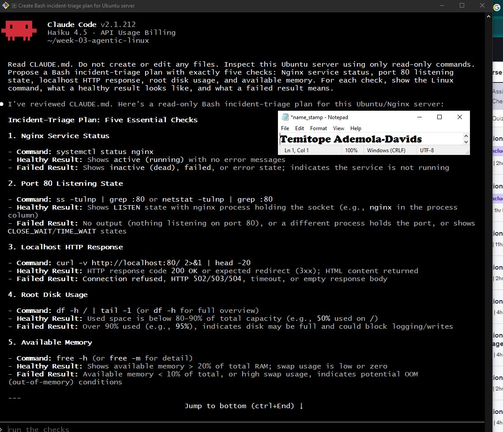

---

### Notes

Answer the following in your own words:

**1. Which part of this task represents the Gather phase?**

The results gathered be it HEALTHY result or the FAILED result and reason

---

**2. Did Claude follow the instruction not to create files? How did you verify this?**

Yes, it followed the instructions by not creating new files. It showd that it was Read-Only

---

**3. Why is planning before coding useful in DevOps automation?**

Planning ensures your automation aligns with business goals. In DevOps, it maps out the system architecture and workflows before any coding begins. This prevents deployment failures, cuts down on wasted time, and aligns developer and IT

---

# Task 4 — Build the Linux Triage Bash Script

## Goal

Create one Bash script that gathers consistent Linux and Nginx health evidence.

### Evidence

#### Screenshot 5 — Top section of `linux-triage.sh` showing variables, thresholds, and the checks array

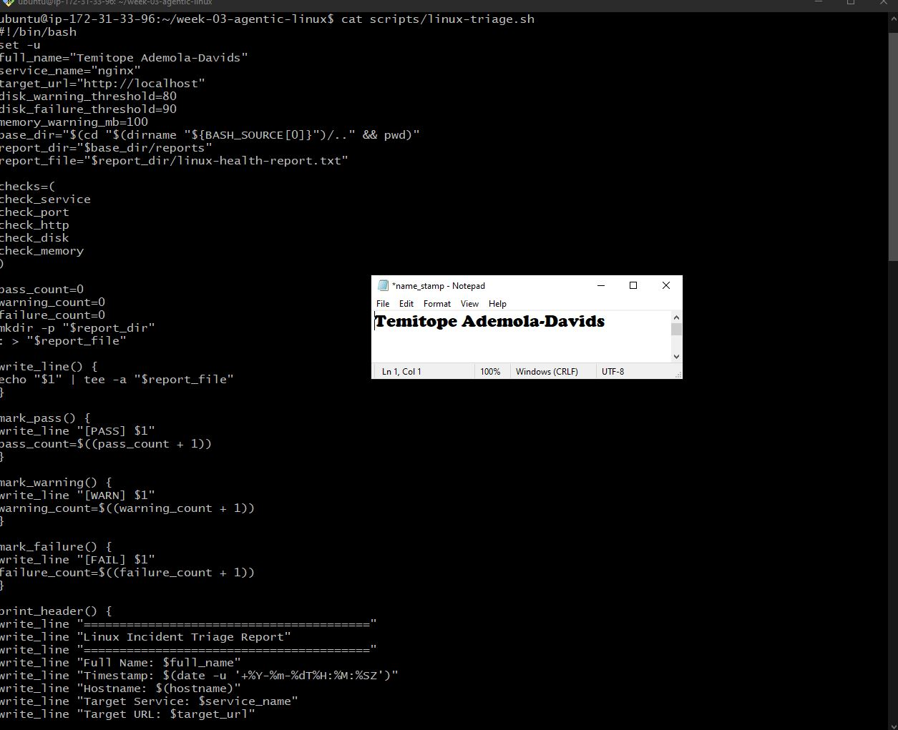

---

#### Screenshot 6 — Middle section showing check functions and conditionals

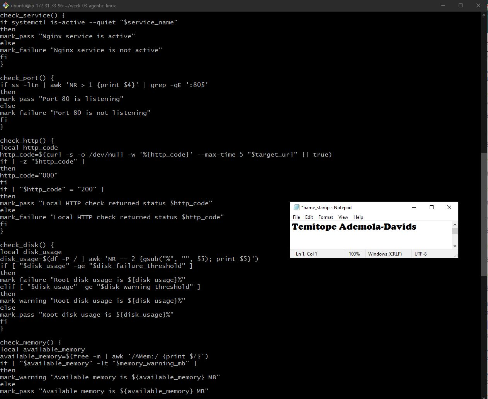

---

#### Screenshot 7 — Bottom section showing the loop, summary function, and exit behavior

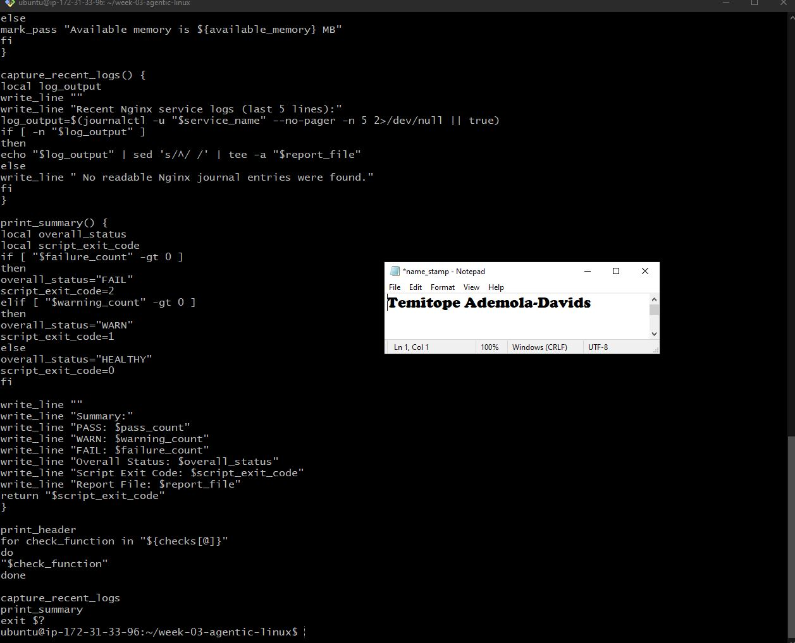
---

#### Screenshot 8 — Output of `bash -n scripts/linux-triage.sh` (no syntax errors) and `ls -l scripts/linux-triage.sh` showing executable permission

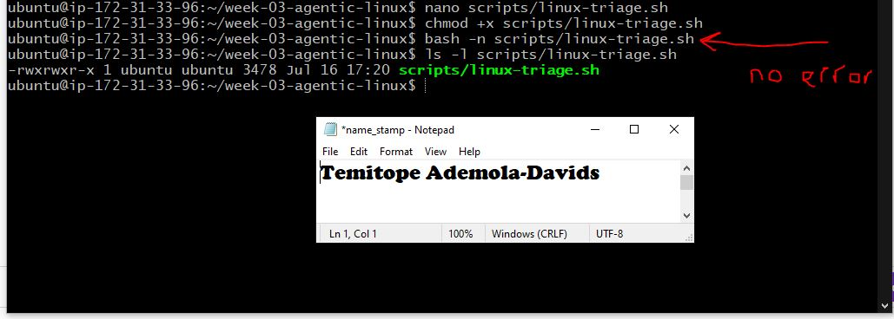
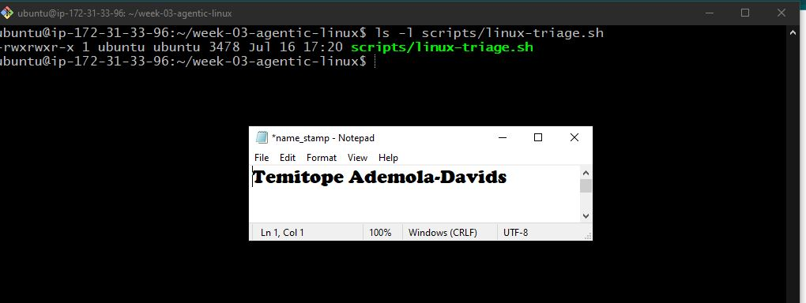

---

### Notes

Answer the following in your own words:

**1. What is stored in the checks array?**

The checks array stores function names. This allow us to run multiple processes/steps in a specific order.

---

**2. How does the `for` loop use that array?**

The for loop uses this checks array, so as to run each function iteratively. This means it runs the check_service, then runs the check_port through the for loop.

---

**3. Why are the health checks separated into functions?**

The health checks are seperated into functions, so they can be modular, they can be run independently.

---

**4. What is the purpose of `$(...)` in this script?**

So that the output of what is in the parenthesis (the command) can be returned and used.

---

**5. Why does the script use different exit codes for HEALTHY, WARN, and FAIL?**

The script uses different exit codes, so as to differentiate the different conditions for the test results. Furthermore, when the script runs and the status needs to be printed, the return exit code value can be mapped to any of the three values.
---

# Task 5 — Run and Understand the Healthy-State Report

## Goal

Run the Bash script against the healthy server and verify that it creates a report.

### Evidence

#### Screenshot 9 — Output of `./scripts/linux-triage.sh` showing your Full Name and all five check results

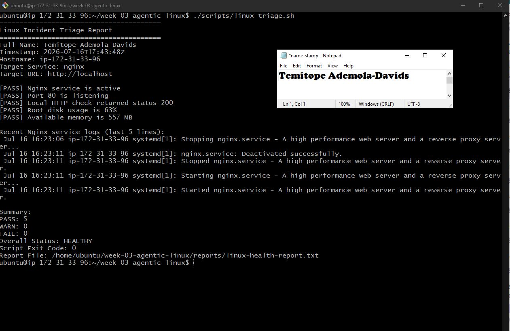

---

#### Screenshot 10 — Output showing the captured exit code and final summary

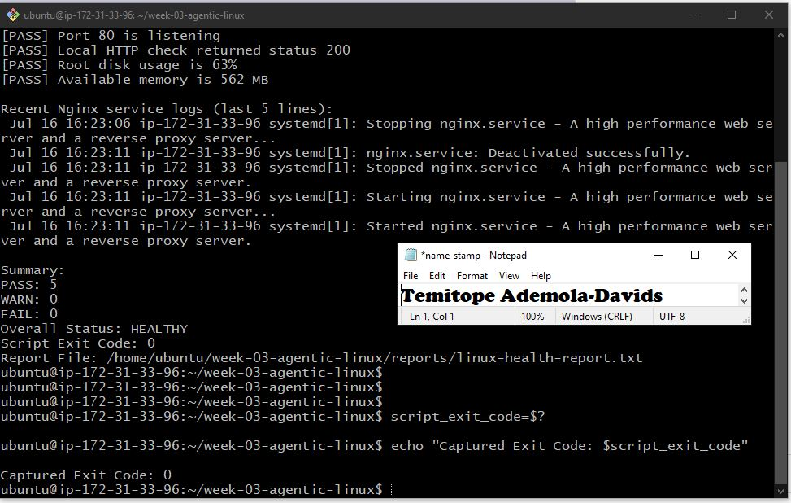
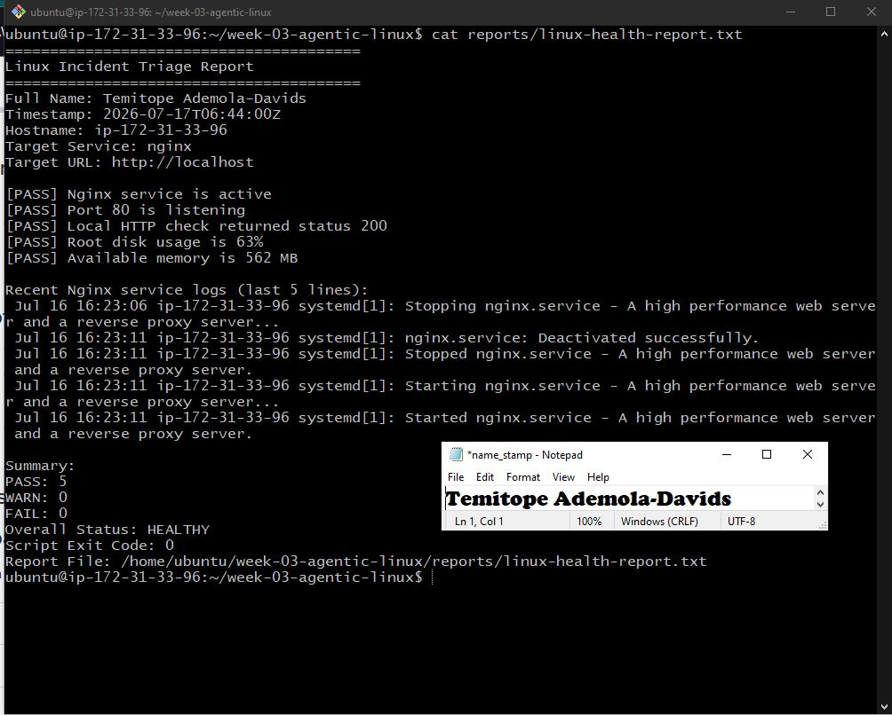

---

### Notes

Answer the following in your own words:

**1. What is the overall status of your healthy baseline?**

The overall status of my healthy baseline shows HEALTHY and this was because all checks Passed, there was no count for Failures and Warnings.

---

**2. Which exact Linux evidence proves the application is serving traffic?**

Local HTTP check returned status 200

---

**3. Did your script return exit code 0 or 1? Explain why.**

My script returned exit code 0, because exit code 0 signifies the system test passed all checks and is within optimal working conditions.
---

**4. What is the difference between a warning and a failure in this script?**

The difference between a Warning and a Failure in this script, is that Failure is returned if just any of the checks fails, irrespective of the number of warnings and passes; while a Warning signifies that no Fails exists, also irrespective of the passes(as the code was scripted for any count -gt 0 should trigger wither the Fail or Warning, with Failure having precedence).

---

# Task 6 — Create and Run the /linux-triage Skill

## Goal

Turn the Bash script into a reusable, manually invoked Agentic AI workflow.

### Evidence

#### Screenshot 11 — `SKILL.md` showing the frontmatter, allowed tool restrictions, and safety rules

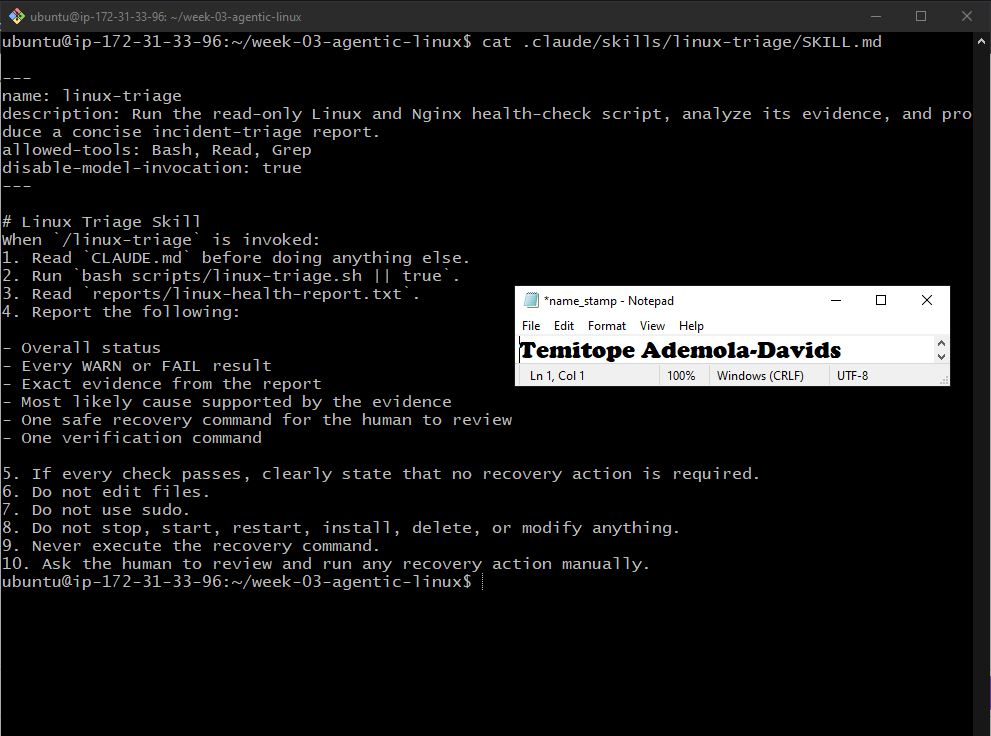

---

#### Screenshot 12 — `/linux-triage` output for the healthy server

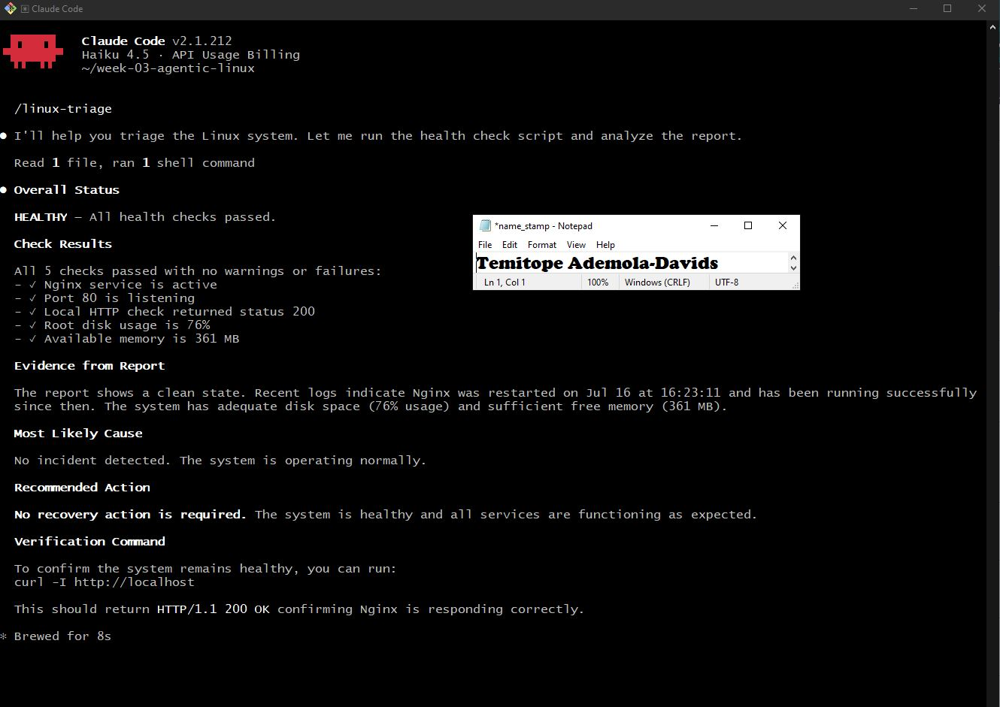

---

### Notes

Answer the following in your own words:

**1. Why does this skill have Bash, Read, and Grep, but not Write?**

It was explicitly given what it needs to do its job and nothing more. It only needs to read and run the script, but not edit files.
---

**2. Why is `disable-model-invocation: true` useful for this skill?**

With this frontmatter flag, you are restricting and preventing the agent from suggesting or triggering  a skill or unintended tool call.

---

**3. What part is performed by Bash, and what part is performed by Claude?**

Bash runs the shell script while Claude does the creation and reading of the CLAUDE.md while following the frontmatter described in the SKILL.md file.

---

**4. Why is this better than asking Claude "Is my server healthy?" without giving it evidence?**

Without a customized CLAUDE.md file, asking this question will generate a general response because we haven't told it what it needs to ingest about our environment and resources.

---

# Task 7 — Simulate an Nginx Incident and Let the Skill Diagnose It

## Goal

Create a controlled service failure, gather evidence through Bash, and let Claude analyze the evidence without taking recovery action.

### Evidence

#### Screenshot 13 — Output showing Nginx is inactive and the HTTP request fails

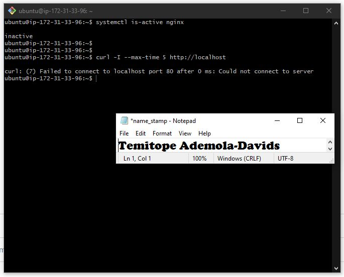

---

#### Screenshot 14 — `/linux-triage` output showing failed evidence, most likely cause, and a suggested recovery command

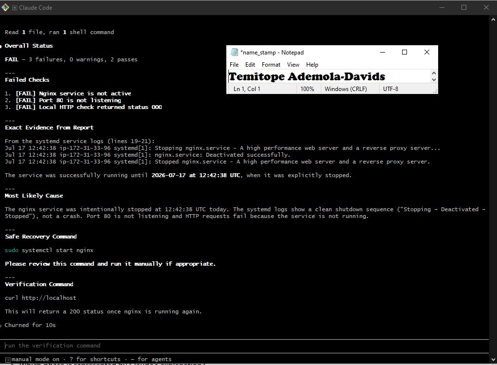

---

#### Screenshot 15 — `incident-failure-report.txt` showing the failed checks and your Full Name

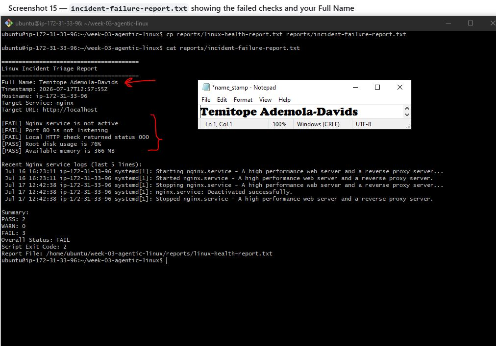

---

### Notes

Answer the following in your own words:

**1. Which three checks failed?**

check_sevice which checks if the nginx service is active, 
check_port which checks if the port 80 is listening
check_http which checks the HTTP traffic status returned whether 000 or not 200

---

**2. What evidence supports the conclusion that Nginx is unavailable?**

The FAILED result states that NGINX is not active, also connection to localhost failed.

---

**3. Did Claude execute the recovery command? Why is that important?**

NO, it only suggested the command to recover the service with. It presented this for the human in the loop to act on.

---

**4. Which phase of the Agentic Loop is represented by the Bash report?**

When it comes to reporting, it is more of verifying the status and condition of a comptation.

---

**5. Which phase is represented by Claude's explanation?**

Explanation of what is expected by Claude is more like the gathering sate.

---

# Task 8 — Recover Manually, Verify Again, and Write the Incident Summary

## Goal

Recover the service as the human operator and prove that the system is healthy again.

### Evidence

#### Screenshot 16 — Output showing Nginx is active and `curl -I http://localhost` returns 200 OK

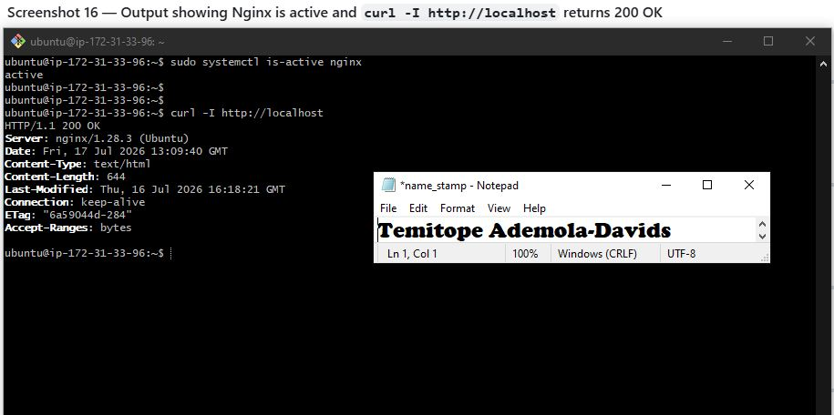

---

#### Screenshot 17 — Second `/linux-triage` output showing successful recovery with no FAIL results

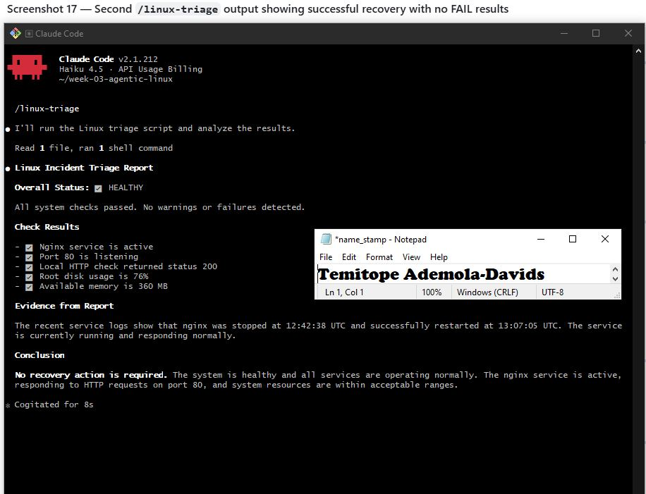

---

#### Screenshot 18 — Output of `ls -lah reports` showing both `incident-failure-report.txt` and `recovery-report.txt`

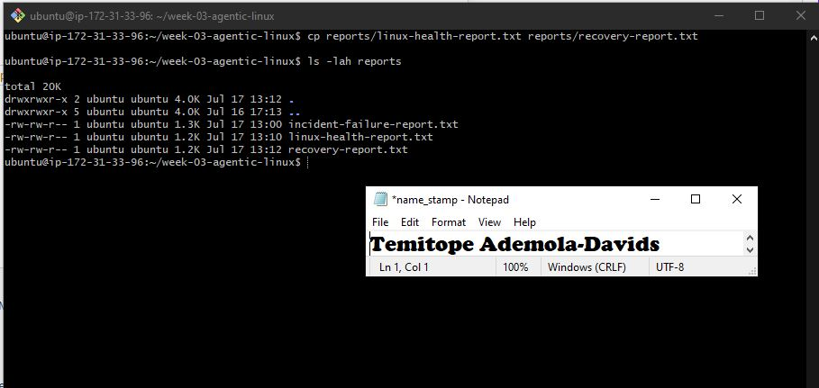

---

#### Screenshot 19 — `incident-summary.md` showing all required sections and your Full Name

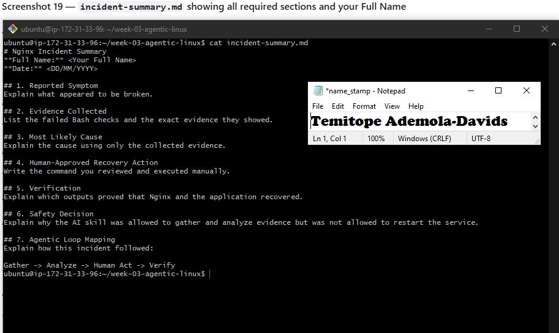

---

### Notes

Answer the following in your own words:

**1. What action did you execute manually?**

Manual execution starts with the skill you want to instruct claude to run and also the recovery steps to take.

---

**2. What evidence proves that the service recovered?**

The sudo systemctl in-ctive command that returns active shows that the system is active and recovered
---

**3. Why is the second triage run necessary?**

To push the stack execution to the Human in the loop for execution.

---

**4. What could go wrong if an AI agent automatically restarted every failed service?**

Ai agents do not need to automatically act, because a human needs to evaluate the conditions and act safely. Some services needs to be stopped to be well evaluated before it is restarted, if it was done automatically, then it can not be put down.

---

**5. In one sentence, explain the difference between using AI as a chatbot and using AI in this agentic workflow.**

Agenticworkflow goes through the workflow lifecycle- Gather Act and Verify

---

# Incident Summary

Fill in all seven sections below in your own words.

**Full Name:** Temitope Ademola-Davids

**Date:** 17/07/2026

---

**1. Reported Symptom**

Reported syptoms:
NGINX service is not active
Port 80 is not listening
Local HTTP check returned status 000
Root disk usage is 76%
Available memory is 366MB

---

**2. Evidence Collected**

The evidence collected are the list uploaded in the screenshots.

---

**3. Most Likely Cause**

NGINX is not  installed or properly configured to serve
Port 80 is not activated for the HTTP traffic, which causes error when port 80 is used.
These two are great reasons why the HTTP will return 000 as status.
---

**4. Human-Approved Recovery Action**

run the sudo systemctl start and also run the inactive status, so it can report the ACTIVE status.

---

**5. Verification**

task8sc16 screenshot shows that nginx is-active shows that the service is active, curl -I http localhost returns 200 OK showing that the network interfaces are running a listening mode on port 80 for nginx.
---

**6. Safety Decision**

The safety decision was that the AI should gather and analyze but not act, as the human loop has to evaluate and review the action and run it with respect to whatever business decision and econimic evaluation that the AI cannot do.
---

**7. Agentic Loop Mapping**

Gather -> Evidence collected
Analyze -> Most likely causes based on the gathered evidence
Act -> Human approved review and execution
Verify -> The evidence that showed that we are back in business. nginx restarted and active, and HTTP serving pages to requests
---

# LinkedIn Post (Required)

## Evidence

#### LinkedIn Post URL

Paste your LinkedIn post URL here:

https://www.linkedin.com/pulse/week-3-devops-micro-internship-dmi-building-linux-ademola-davids-okkre

---

#### Screenshot — Published LinkedIn post

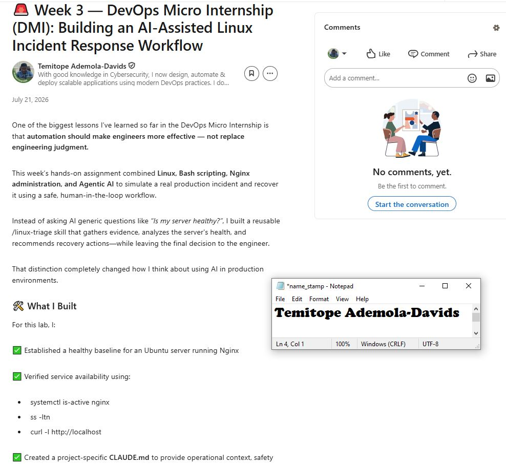

---

# GitHub Repository URL

Paste the URL of your GitHub folder or repository containing the assignment files here:

(https://github.com/accelage/devops-micro-internship-pravinmishra)

---

# Submission Instructions

- Add all required screenshots in your submission
- Full Name must be visible in required screenshots and the Bash report
- All written answers must be in your own words
- Do not expose sensitive information (keys, passwords, AWS account IDs, tokens)
- GitHub URL must be included in this document

---

# Completion Checklist

- [ ] Task 1: Healthy baseline confirmed, workspace created (Screenshots 1–2, Notes answered)
- [ ] Task 2: CLAUDE.md created with all four sections (Screenshot 3, Notes answered)
- [ ] Task 3: Five-check plan produced by Claude using read-only tools (Screenshot 4, Notes answered)
- [ ] Task 4: `linux-triage.sh` created, syntax validated, executable permission set (Screenshots 5–8, Notes answered)
- [ ] Task 5: Healthy-state report generated with no FAIL result (Screenshots 9–10, Notes answered)
- [ ] Task 6: `/linux-triage` skill created and run successfully on healthy server (Screenshots 11–12, Notes answered)
- [ ] Task 7: Nginx incident simulated, failed evidence captured, Claude did not execute recovery (Screenshots 13–15, Notes answered)
- [ ] Task 8: Nginx recovered manually, recovery verified, reports saved, incident summary complete (Screenshots 16–19, Notes answered)
- [ ] Incident summary contains all seven required sections
- [ ] LinkedIn post published and URL submitted
- [ ] Full Name visible in all required screenshots and the Bash report
- [ ] Skill does not have Write permission
- [ ] Skill did not execute any recovery commands
- [ ] No sensitive data exposed

---

## 📌 About DMI & CloudAdvisory

DevOps Micro Internship (DMI) is a project-based DevOps program run by Pravin Mishra (The CloudAdvisory) focused on real-world execution, systems thinking, and career readiness.

It helps learners build strong DevOps foundations with hands-on experience.

---

## 📌 Resources

- 🌐 DMI Official Website: https://pravinmishra.com/dmi  
- 🎓 DevOps for Beginners (Udemy): https://www.udemy.com/course/devops-for-beginners-docker-k8s-cloud-cicd-4-projects/  
- 🎓 Agentic AI DevOps with Claude Code: https://www.udemy.com/course/ultimate-agentic-ai-devops-with-claude-code/  
- 🎓 DevOps with Claude Code: Terraform, EKS, ArgoCD & Helm: https://www.udemy.com/course/devops-with-claude-code-terraform-eks-argocd-helm/  
- ▶️ YouTube Playlist: https://www.youtube.com/playlist?list=PLFeSNDtI4Cho  
- 🔗 Pravin Mishra (LinkedIn): https://www.linkedin.com/in/pravin-mishra-aws-trainer/  
- 🏢 CloudAdvisory (LinkedIn): https://www.linkedin.com/company/thecloudadvisory/

---

*This submission is part of DevOps Micro Internship (DMI) Cohort 3 — Agentic AI Track.*