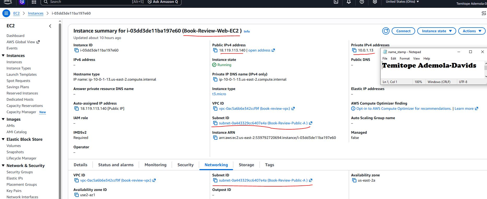
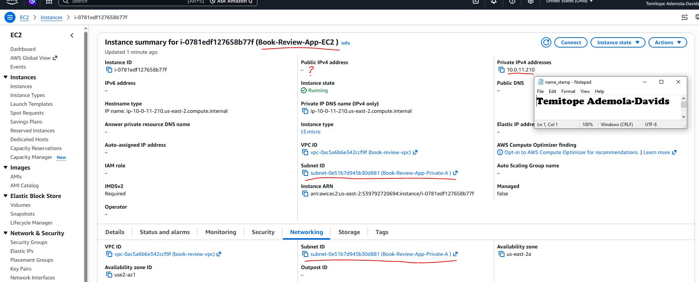
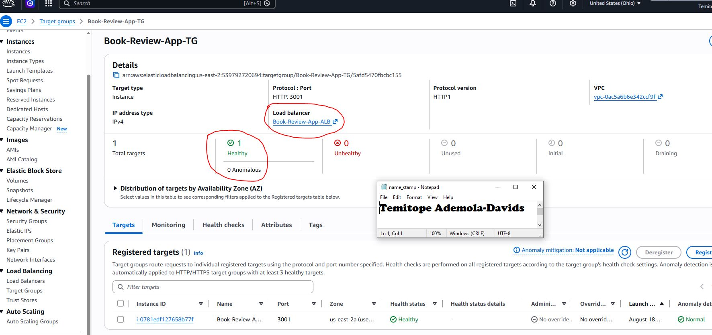
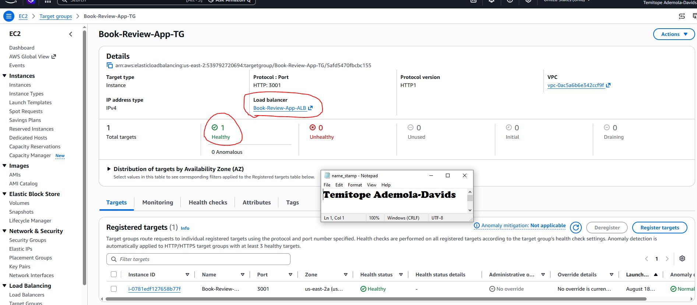
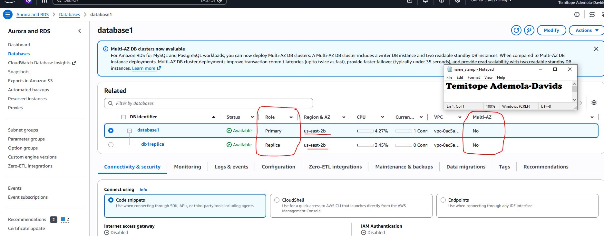
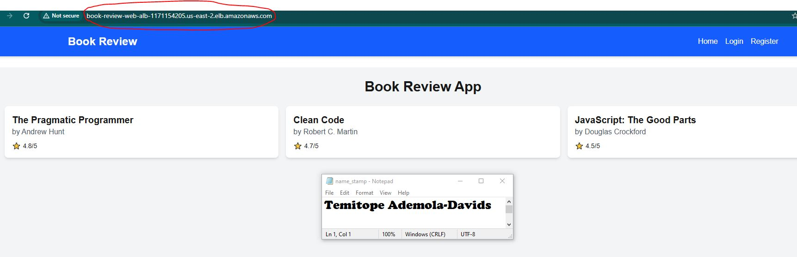
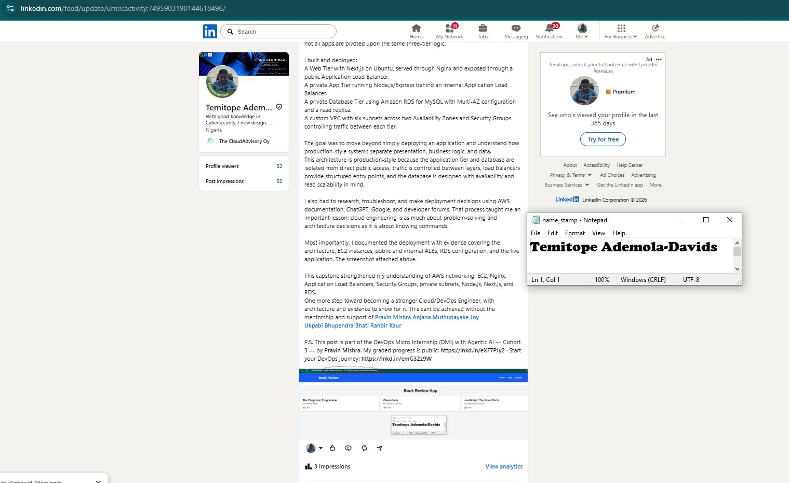

# Assignment 6 — Capstone Assignment — Deploy Book Review App (Three-Tier Architecture) on AWS

Part of the DevOps Micro Internship (DMI) Cohort 3 with Agentic AI

---

## Purpose

This is the most important assignment of the course. You will deploy the Book Review App in a fully production-style three-tier architecture on AWS: a Next.js Web Tier behind Nginx and a public ALB, a private Node.js/Express App Tier behind an internal ALB, and a private Multi-AZ MySQL RDS database with a read replica. You are expected to design, deploy, isolate, debug, and document the result independently.

---

# Task 1 — Architecture Diagram

## Goal

Create an architecture diagram showing the custom VPC (10.0.0.0/16), the six subnets across two Availability Zones (two public Web Tier, two private App Tier, two private Database Tier), the public ALB, Web Tier EC2/Nginx, internal ALB, private App Tier EC2, private Multi-AZ RDS with its read replica, and the permitted traffic flow.

### Evidence

#### Diagram image or link

Add your diagram image or link here.

---

# Task 2 — AWS Region & Services Used

## Goal

Record the AWS Region used and list every AWS service used across networking, compute, load balancing, security, and the database.

### Notes

**Region:**

For this project, I used the US-East-2 Region (Ohio). I usually use EU-NORTH-1(Stockholm) for previous projects but I experienced tons of Insufficient Instance Capacity recently while launching instances, AutoScaling Group, and Launch Templates.

---

**Services:**

The AWS services used for the Book Review App Project includes:

🌐 Networking

•	Amazon VPC (Virtual Private Cloud): The foundational isolated network used to host the entire application environment safely. Everything resides within a single VPC.

•	Public Subnets: Utilized to group together resources that are deployed  to be internet-facing, like the Internet Gateway, NAT Gateway and the Application Load Balancer.

•	Private Subnets: Utilized to isolate backend application servers and the core database from direct public internet exposure.

•	Internet Gateway (IGW): Connected to the VPC to enable communication between resources in public subnets and the internet.

•	NAT Gateway (Network Address Translation): Placed in the public subnet to allow backend instances in the private subnets to securely fetch updates from the internet without exposing them to inbound traffic.

•	Route Tables: Configured to control and direct network traffic flowing between subnets, the Internet Gateway, and the NAT Gateway

💻 Compute

•	Amazon EC2 (Elastic Compute Cloud): Virtual servers running Linux/Ubuntu used to host the application runtime environments (Node.js/Express API servers and Nginx reverse proxies).

•	AWS Auto Scaling Groups (ASG): Configured to automatically scale the compute layer (EC2 instances) horizontally across multiple Availability Zones based on application traffic demands.

⚖️ Load Balancing

•	Application Load Balancer (ALB): Placed at the front of the compute layer to act as the single point of contact for clients. It safely routes incoming HTTP/HTTPS traffic evenly across the active EC2 compute instances distributed in multiple Availability Zones.

🔒 Security

•	AWS IAM (Identity and Access Management): Used to provision granular access permissions and roles for engineers and specific AWS services securely.

•	Security Groups: Act as instance-level virtual firewalls to control inbound and outbound traffic for the EC2 compute instances and the RDS database. 

•	Network Access Control Lists (NACLs): Configured to act as a subnet-level firewall layer for an added blanket of protection. 

🗄️ Database

•	Amazon RDS (Relational Database Service): Used to provision and manage a highly available MySQL database engine instance deployed directly inside the private subnets to store core application data (books, reviews, and user logs) safely

---

# Task 3 — Public Entry Point

## Goal

Confirm the Book Review App loads through the public ALB DNS name.

### Evidence

#### Public ALB DNS

Paste your public ALB DNS name here:

http://Book-Review-Web-ALB-1171154205.us-east-2.elb.amazonaws.com

---

# Task 4 — Evidence Screenshots

## Goal

Capture visual proof of every tier and load balancer.

### Evidence

#### Web EC2

---

#### App EC2

---

#### Public ALB

---

#### Internal ALB

---

#### RDS + Replica

---

#### App UI proof

---

# Task 5 — Summary

## Goal

Summarize what worked in the final deployment, the issues encountered and how each was fixed, and the tools or sources used to research and debug.

### Notes

**What worked:**

Mapping a Symlink in my site-available folder with the site-enabled folder for nginx to server when the url is requested.

---

**Issues + fixes:**

I had issues with my database name at first as I was getting ECONN and SequelizeError, but that was really fixed by checking my database name or creating the expected database name if it doesn't exist.

Another Issue I had was my public ALB was not loading the site, as I was getting 503 Service Temporarily Unavailable error, this was resolved as the Web EC2 instance was not placed in the Target Group

---

**Tools/sources used:**

ChatGPT and Gemini helped with my issues...and above all, my accountability partner.

---

# LinkedIn Post (Required)

## Goal

Publish a LinkedIn post sharing the capstone deployment, including the public ALB DNS (or a redacted screenshot), three to five lines on what you built and why it is production-style, and one proof screenshot.

## Evidence

#### LinkedIn Post URL

Paste your LinkedIn post URL here:

https://www.linkedin.com/posts/topedavids_as-a-cybersecurity-inclined-devops-engineer-share-7495903188508827649-0OoH/?utm_source=share&utm_medium=member_desktop&rcm=ACoAAAySvXcBSksEGgTHjx1oRy7rOmDlzNAFmEA

---

#### Screenshot of LinkedIn post

---

# Submission Instructions

- Add all required screenshots and links in your submission
- Do not expose passwords, RDS credentials, connection strings, private keys, or account IDs

---

# Completion Checklist

- [ ] Task 1: Architecture diagram completed
- [ ] Task 2: AWS Region and services documented
- [ ] Task 3: Public ALB DNS confirmed working
- [ ] Task 4: All six evidence screenshots captured (Web Tier, App Tier, both ALBs, RDS + replica, app UI)
- [ ] Task 5: Deployment summary completed (what worked, issues/fixes, tools/sources)
- [ ] LinkedIn post published and URL submitted
- [ ] App Tier and Database Tier confirmed not publicly accessible
- [ ] No sensitive data exposed

---

## 📌 About DMI & CloudAdvisory

DevOps Micro Internship (DMI) is a project-based DevOps program run by Pravin Mishra (The CloudAdvisory) focused on real-world execution, systems thinking, and career readiness.

It helps learners build strong DevOps foundations with hands-on experience.

---

## 📌 Resources

- 🌐 DMI Official Website: https://dmi.pravinmishra.com?utm_source=github&utm_medium=readme  
- 🎓 University: https://university.pravinmishra.com?utm_source=github&utm_medium=readme  
- 💬 Discord Community: https://discord.pravinmishra.com?utm_source=github&utm_medium=readme  
- 📝 Blog: https://dmi.pravinmishra.com/blog?utm_source=github&utm_medium=readme  
- ▶️ YouTube Playlist: https://www.youtube.com/playlist?list=PLFeSNDtI4Cho  
- 🔗 Pravin Mishra (LinkedIn): https://www.linkedin.com/in/pravin-mishra-aws-trainer/  
- 🏢 CloudAdvisory (LinkedIn): https://www.linkedin.com/company/thecloudadvisory/

---

*This submission is part of DevOps Micro Internship (DMI) Cohort 3 — Agentic AI Track.*