# Assignment 6 — Capstone: Deploy Book Review App (Three-Tier Architecture) on Azure

Part of the DevOps Micro Internship (DMI) Cohort 3 with Agentic AI

---

## Purpose

This is the most important assignment of the course. You will deploy the Book Review App in a production-ready, best-practice-compliant three-tier architecture on Azure: separated presentation, application, and database tiers, least-privilege network access, a controlled public entry point, protected secrets, and availability/monitoring evidence.

---

# Task 1 — Design the Azure Three-Tier Architecture

## Goal

Create an architecture diagram and implementation plan identifying the presentation, application, and database components, the chosen Azure services, the public entry point, and the internal traffic paths.

### Evidence

#### Screenshot 1 — Architecture diagram showing the public entry point, three tiers, network boundaries, and traffic flow

---

#### Screenshot 2 — Written architecture assumptions and selected Azure services

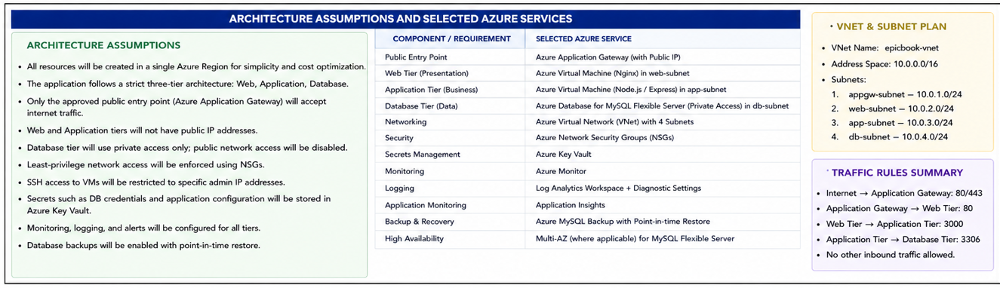

---

# Task 2 — Create the Azure Network Foundation

## Goal

Create a dedicated Resource Group and VNet with separate subnets for the web, application, and database tiers, keeping the application and database tiers without direct public access.

### Evidence

#### Screenshot 3 — Resource Group overview showing the assignment resources

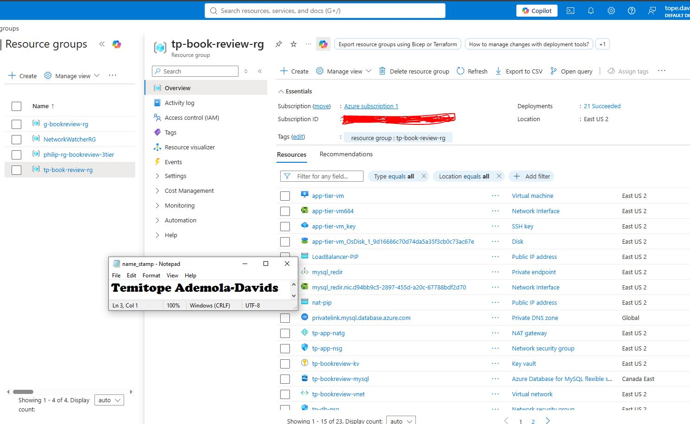

---

#### Screenshot 4 — VNet overview showing the address space and all required subnets

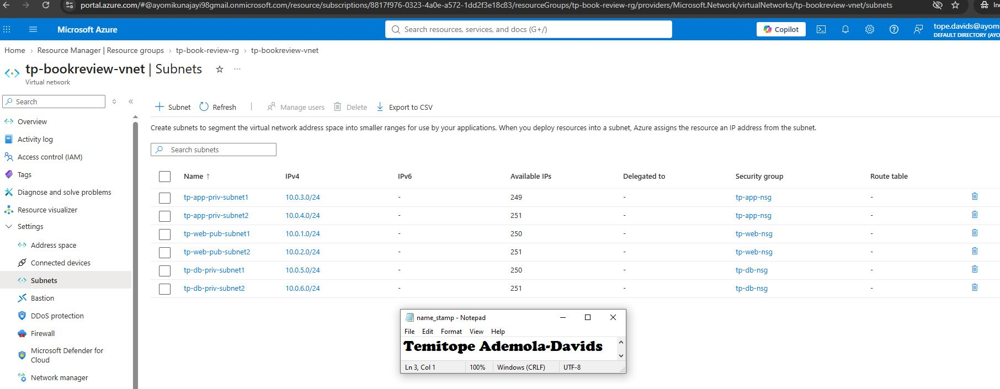

---

#### Screenshot 5 — Route-table or Private DNS evidence where applicable

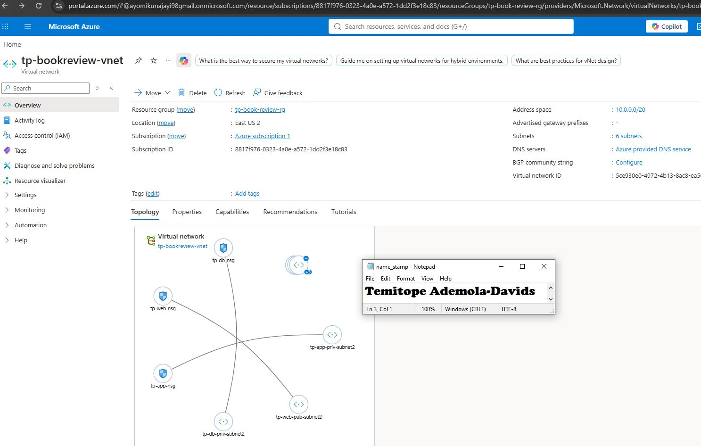

---

# Task 3 — Configure Security and Secret Management

## Goal

Apply least-privilege NSG rules so traffic flows Internet → public entry point → web tier → application tier → database tier, and store credentials in Azure Key Vault or another approved secure mechanism.

### Evidence

#### Screenshot 6 — NSG rules proving least-privilege access between the tiers

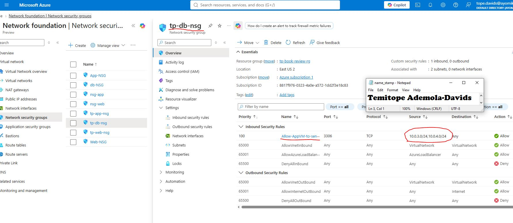

---

#### Screenshot 7 — Key Vault or approved secret-management configuration (without displaying secret values)

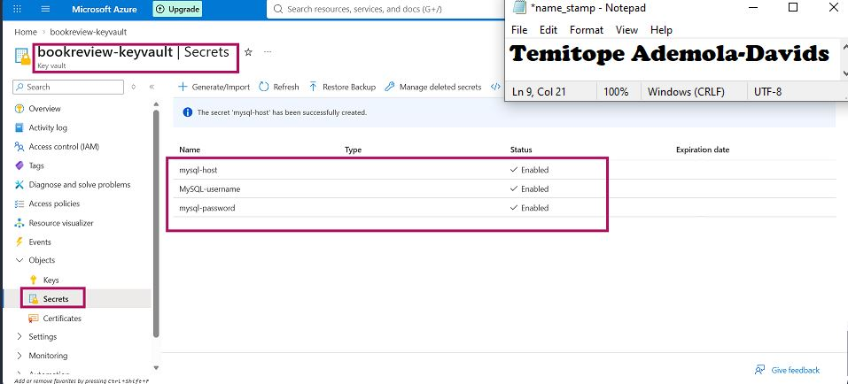

---

# Task 4 — Deploy the Presentation (Web) Tier

## Goal

Deploy the Book Review App presentation layer on the approved web-tier compute service, configured to route requests to the internal application-tier endpoint, and not directly exposed except through the public entry service.

### Evidence

#### Screenshot 8 — Web-tier compute overview showing subnet and availability configuration

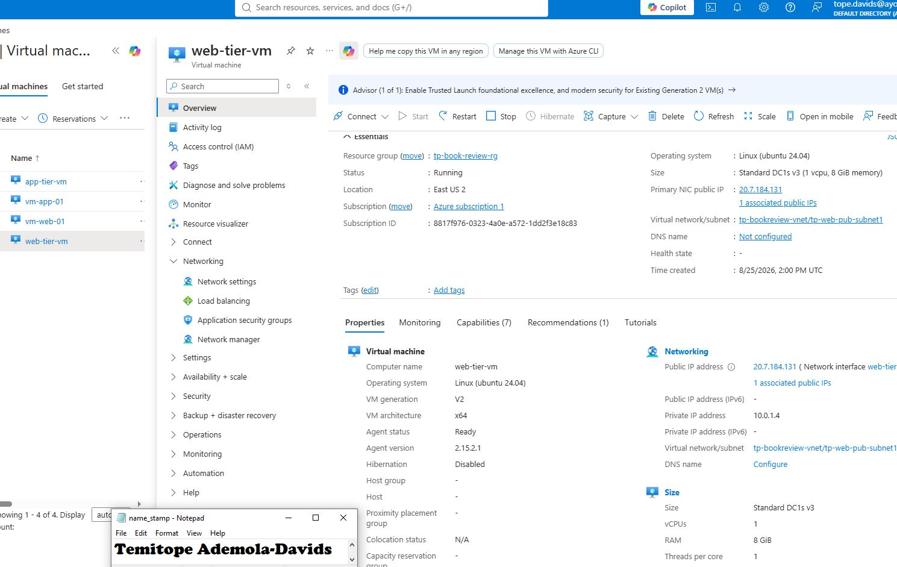

---

#### Screenshot 9 — Terminal or service output proving the presentation layer is running

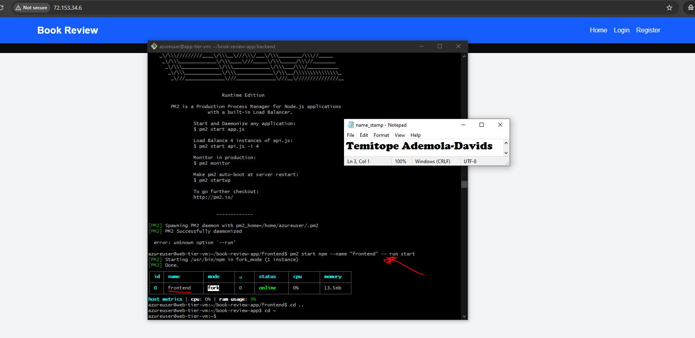

---

# Task 5 — Deploy the Business (Application) Tier

## Goal

Deploy the Book Review App backend privately in the application subnet, configured to use the private database endpoint and secured environment values, reachable only through its internal endpoint.

### Evidence

#### Screenshot 10 — Application-tier compute overview showing private subnet placement

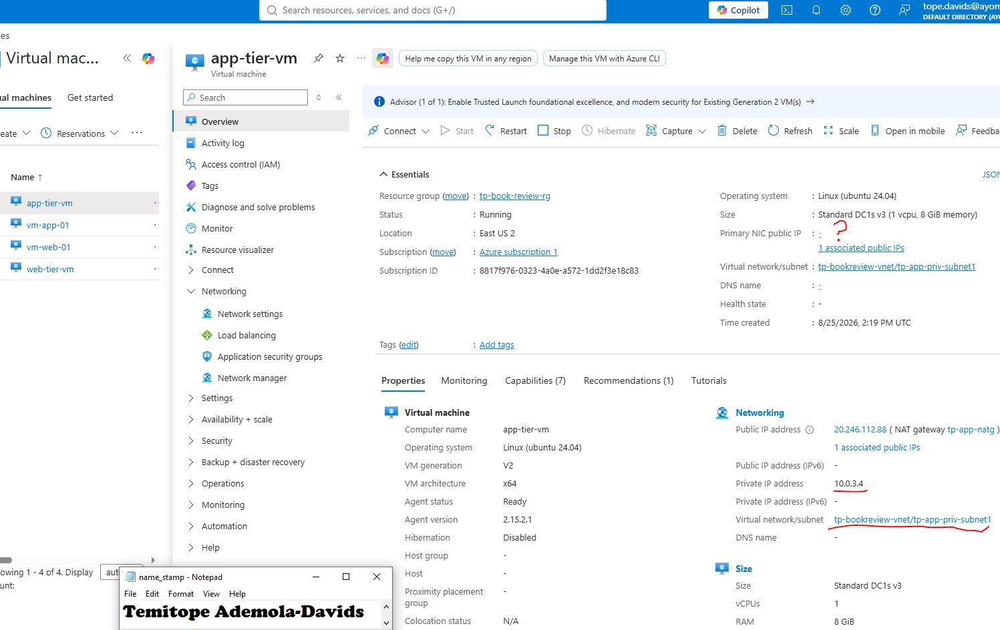

---

#### Screenshot 11 — Backend process, service, or listening-port evidence

---

#### Screenshot 12 — Internal health-check or API response (without exposing secrets)

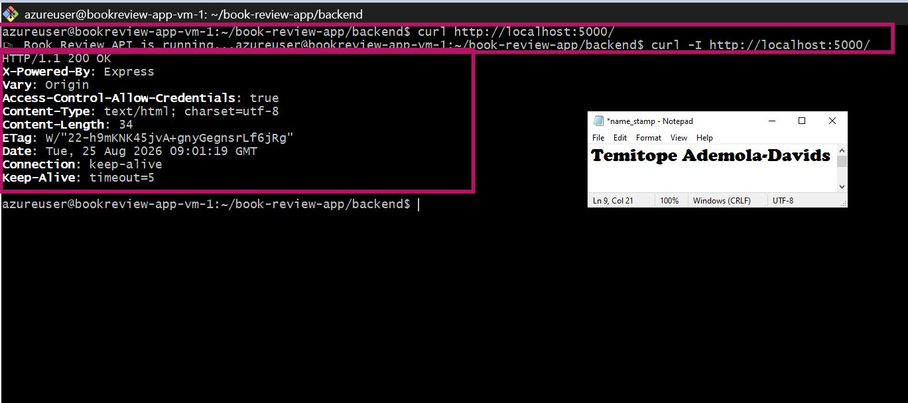

---

# Task 6 — Deploy the Managed Database Tier

## Goal

Create a private Azure managed database (public access disabled), with availability/backup/retention settings, the Book Review App schema imported, and access restricted to the application tier only.

### Evidence

#### Screenshot 13 — Database overview showing private connectivity and public access disabled

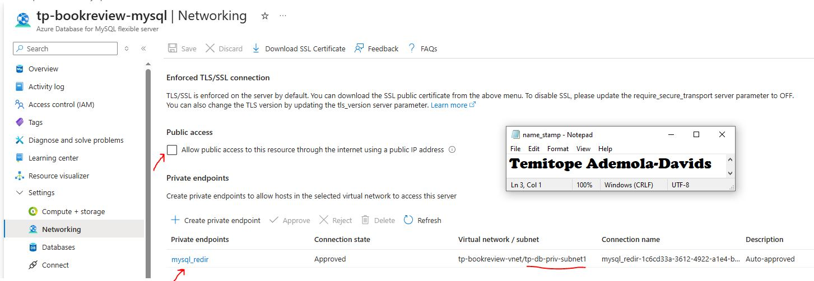

---

#### Screenshot 14 — Availability, backup, and retention configuration

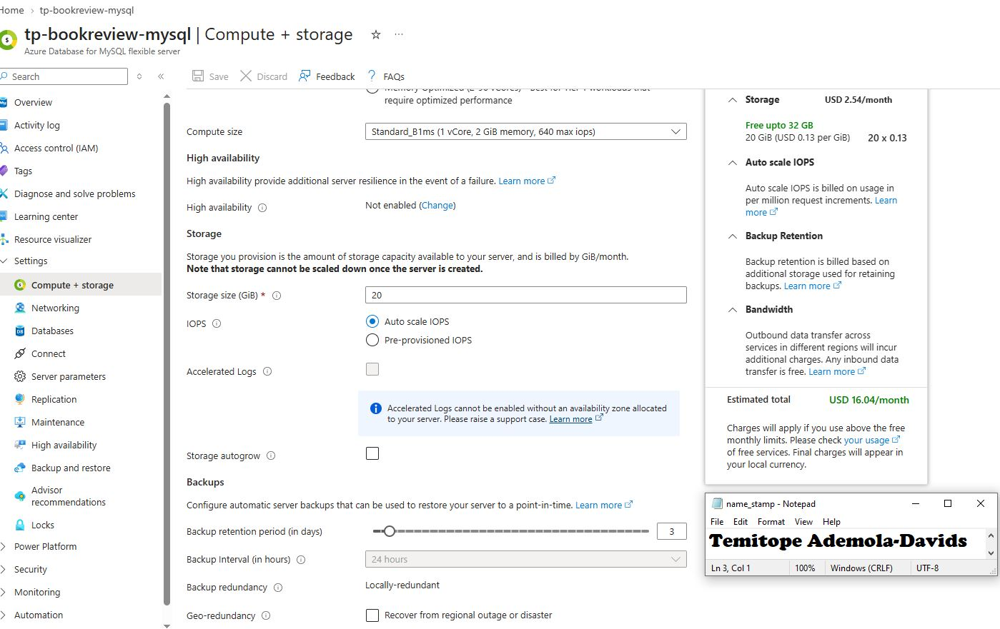

---

#### Screenshot 15 — Successful schema or connectivity verification (without exposing credentials)

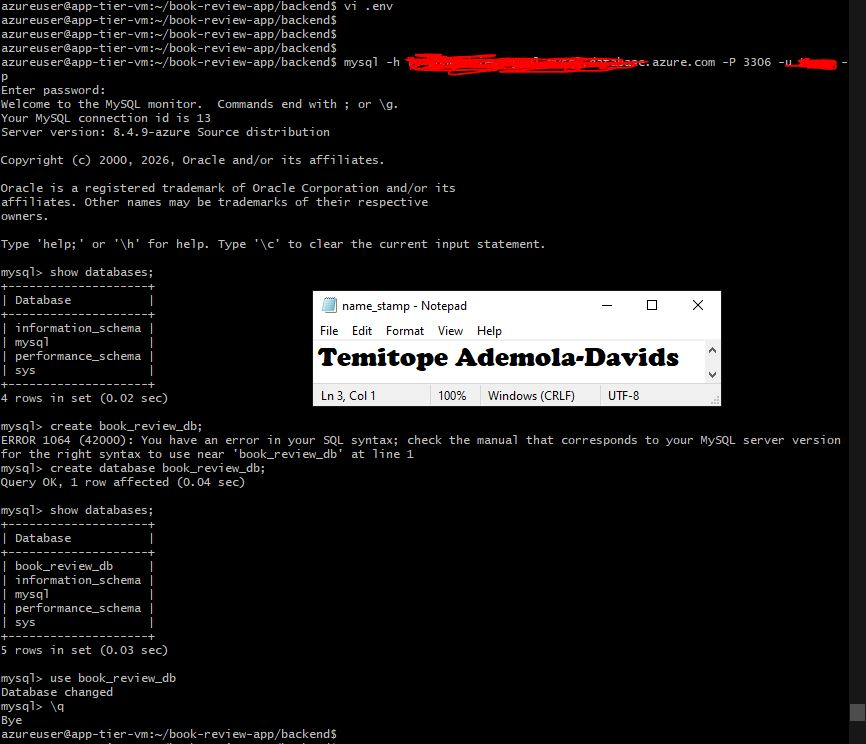

---

# Task 7 — Configure Traffic Management, Availability, and Monitoring

## Goal

Configure the approved public entry service with health probes and backend pools, internal routing for the application tier where required, and enable Azure Monitor/diagnostics/logs/alerts for the key resources.

### Evidence

#### Screenshot 16 — Public entry service showing listener, frontend endpoint, and healthy web targets

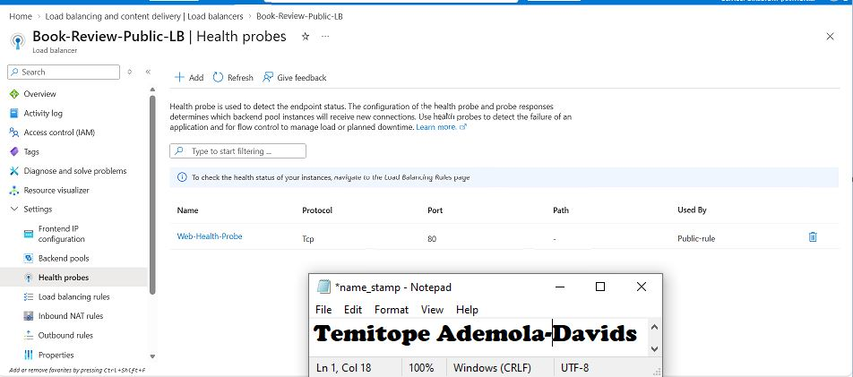

---

#### Screenshot 17 — Internal application-tier load-balancing or routing configuration where applicable

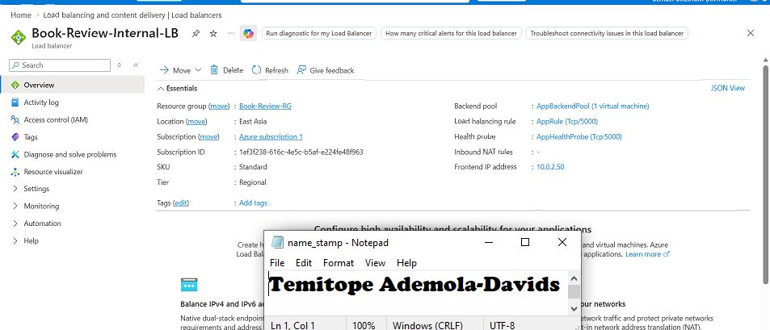

---

#### Screenshot 18 — Azure Monitor, diagnostic settings, logs, metrics, or alert evidence

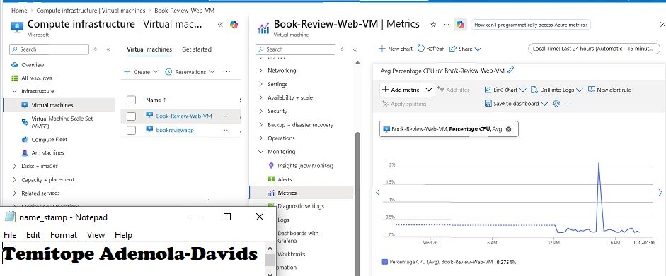

---

# Task 8 — Validate the Production-Style Deployment

## Goal

Confirm the Book Review App works end to end through the public endpoint, with at least one database read and one write, confirm private tiers are not internet-reachable, and complete a safe availability test.

### Evidence

#### Screenshot 19 — Browser showing the Book Review App through the public endpoint

---

#### Screenshot 20 — Proof of successful database-backed read and write operations

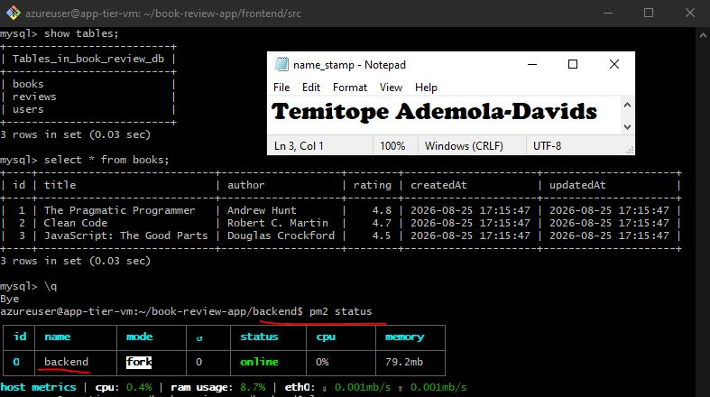

---

#### Screenshot 21 — Evidence that private tiers are not publicly accessible

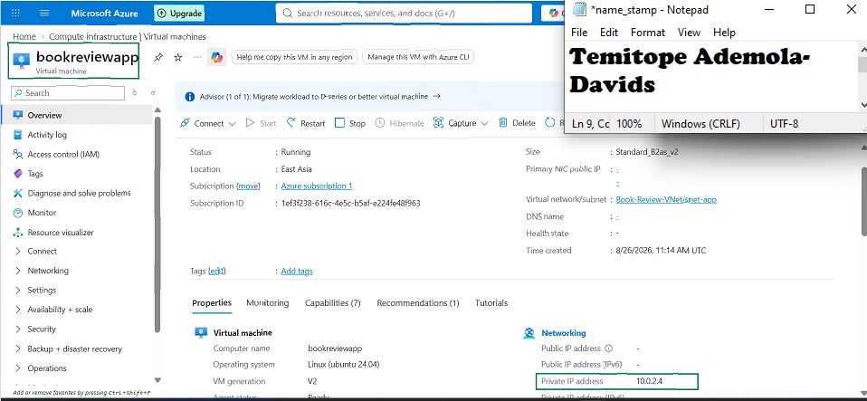

---

#### Screenshot 22 — Availability-test and healthy-target evidence

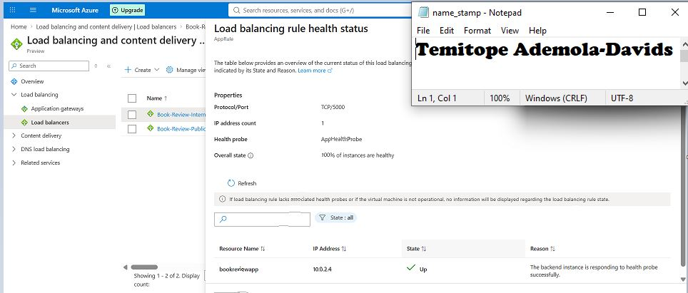

---

#### Public Endpoint

Paste your public endpoint URL here:

http://20.94.78.199/

---

### Notes

Summarize what worked, issues encountered and how they were fixed, and the availability/security/secrets/monitoring/backup choices made.

Architected and deployed a full-stack Book Review Application using Next.js, Express, and MySQL on a 5-subnet Azure Virtual Network. The traffic flows sequentially from a public Load Balancer to the web tier, through an internal Load Balancer to the app tier, and finally to a MySQL Flexible Server.

To keep the setup secure, neither the app nor the database tiers use public IP addresses, and Network Security Groups isolate traffic at every subnet level. The frontend and backend communicate with the database over a private, SSL-enforced connection. On startup, the backend automatically sets up its schema and seeds initial data, which was verified through API calls. The public endpoint handles login and registration pages as expected, and system diagnostics are set up to stream logs from both load balancers into a shared Log Analytics workspace. Credentials and JWT secrets are secured in Azure Key Vault using RBAC rules, while the compute layers remain stateless to simplify redeployments alongside automated MySQL backups.

Working within a strict 3-IP quota and tight timeline required a few specific workarounds during deployment:

Air-Gapped App Tier: Skipping a NAT Gateway to save IP quota left the private subnets without outbound internet access. To get around this without access to package managers or tools like pm2, the web VM was used as a jump host. Dependencies and the Node.js runtime were installed on the web VM first, then copied over the private network to the app tier, where the process was launched using nohup.

Environment Configuration: An initial database connection error was fixed by correcting a typo in the .env password file. The frontend missing an API URL environment variable temporarily blocks writes like registering or posting reviews through the public path, though read operations work normally.

Due to the single-VM setup per tier under current quota constraints, both load balancers rely on basic health probes rather than full multi-instance failover testing.

---

# Submission Instructions

- Add all required screenshots and links in your submission
- Do not expose passwords, keys, connection strings, or subscription IDs

---

# Completion Checklist

- [ ] Task 1: Architecture diagram and assumptions documented (Screenshots 1–2)
- [ ] Task 2: Network foundation created with isolated tiers (Screenshots 3–5)
- [ ] Task 3: Least-privilege security and secret management configured (Screenshots 6–7)
- [ ] Task 4: Presentation tier deployed (Screenshots 8–9)
- [ ] Task 5: Application tier deployed privately (Screenshots 10–12)
- [ ] Task 6: Managed database tier deployed privately (Screenshots 13–15)
- [ ] Task 7: Public entry, internal routing, and monitoring configured (Screenshots 16–18)
- [ ] Task 8: End-to-end validation and availability test completed (Screenshots 19–22, Public Endpoint, Notes)
- [ ] No sensitive data exposed

---

## 📌 About DMI & CloudAdvisory

DevOps Micro Internship (DMI) is a project-based DevOps program run by Pravin Mishra (The CloudAdvisory) focused on real-world execution, systems thinking, and career readiness.

It helps learners build strong DevOps foundations with hands-on experience.

---

## 📌 Resources

- 🌐 DMI Official Website: https://dmi.pravinmishra.com?utm_source=github&utm_medium=readme  
- 🎓 University: https://university.pravinmishra.com?utm_source=github&utm_medium=readme  
- 💬 Discord Community: https://discord.pravinmishra.com?utm_source=github&utm_medium=readme  
- 📝 Blog: https://dmi.pravinmishra.com/blog?utm_source=github&utm_medium=readme  
- ▶️ YouTube Playlist: https://www.youtube.com/playlist?list=PLFeSNDtI4Cho  
- 🔗 Pravin Mishra (LinkedIn): https://www.linkedin.com/in/pravin-mishra-aws-trainer/  
- 🏢 CloudAdvisory (LinkedIn): https://www.linkedin.com/company/thecloudadvisory/

---

*This submission is part of DevOps Micro Internship (DMI) Cohort 3 — Agentic AI Track.*
