# Assignment 03 — Deploy a Static Website to Multiple Servers Using a Multi-Play Ansible Playbook

Part of the DevOps Micro Internship (DMI) Cohort 3 with Agentic AI

---

## Purpose

In this assignment, you will create a multi-play Ansible playbook to install Nginx, deploy a static website to two Ubuntu servers, and verify that the website is accessible from both servers.

You may use either AWS EC2 instances or Azure Virtual Machines as your managed servers.

---

# Task 1 — Create the Project Structure

## Goal

Create the required folders and files for the Ansible project.

### Evidence

#### Screenshot 1 — Terminal or VS Code showing the complete `static-web` project structure

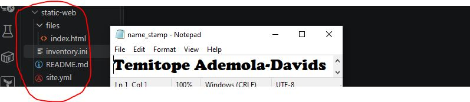

---

# Task 2 — Configure the Ansible Inventory

## Goal

Add both Ubuntu servers to the Ansible inventory.

### Evidence

#### Screenshot 2 — Output of `ansible-inventory -i inventory.ini --graph` showing `web1` and `web2`

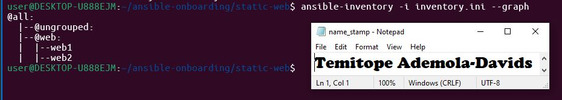

---

### Configuration File

Copy and paste the complete contents of your `inventory.ini` file below:

```ini
web1 ansible_host=44.200.55.89
web2 ansible_host=100.27.44.252

[web:vars]
ansible_user=ubuntu
ansible_ssh_private_key_file=~/.ssh/id_ed25519

---

# Task 3 — Verify Ansible Connectivity

## Goal

Confirm that the Ansible controller can connect to both servers.

## Evidence

### Screenshot 3 — Ansible ping output showing `SUCCESS` and `pong` for both servers


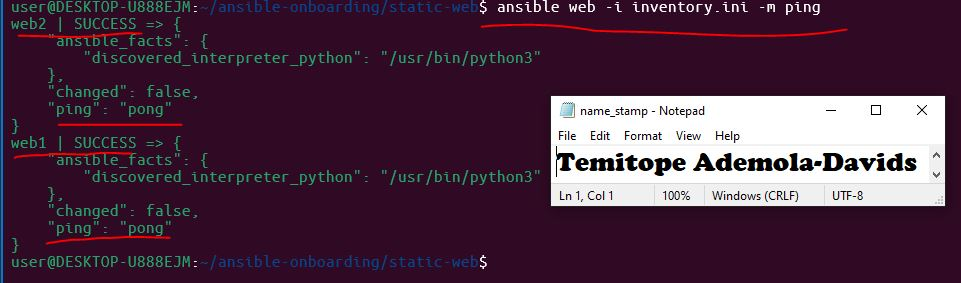
---

# Task 4 — Download and Personalize the Static Website

## Goal

Download `index.html` to the Ansible controller and personalize the website with your full name.

## Evidence

### Screenshot 4 — Edited `files/index.html` showing the footer line with your full name

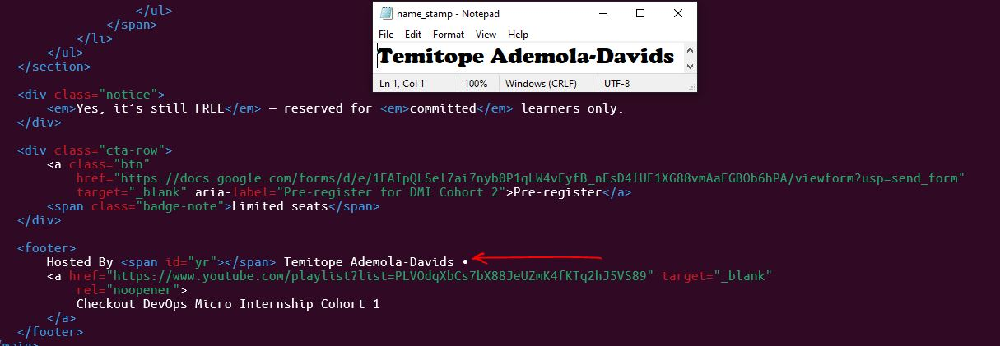

---

# Task 5 — Create the Multi-Play Ansible Playbook

## Goal

Create a single Ansible playbook containing separate plays for installation, deployment, and verification.

## Configuration File

Copy and paste the complete contents of your `site.yml` file below:


``` name: Play 1 - Install and Configure Nginx
hosts: web
become: true
tasks:

name: Update APT package cache
ansible.builtin.apt:
update_cache: yes

name: Install Nginx package
ansible.builtin.apt:
name: nginx
state: present

name: Start and enable Nginx service
ansible.builtin.service:
name: nginx
state: started
enabled: true

name: Play 2 - Deploy the Static Website
hosts: web
become: true
tasks:

name: Copy static website file to web server
ansible.builtin.copy:
src: files/index.html
dest: /var/www/html/index.html
owner: www-data
group: www-data
mode: "0644"
notify: Reload Nginx

handlers:

name: Reload Nginx
ansible.builtin.service:
name: nginx
state: reloaded

name: Play 3 - Verify Both Websites from Controller
hosts: localhost
connection: local
gather_facts: false
tasks:

name: Send HTTP GET request to web servers
ansible.builtin.uri:
url: "http://{{ hostvars[item].ansible_host }}"
status_code: 200
loop: "{{ groups['web'] }}"
register: website_checks

name: Assert that website status is 200
ansible.builtin.assert:
that:
- item.status == 200
success_msg: "{{ item.item }} returned HTTP 200"
loop: "{{ website_checks.results }}"

---

# Task 6 — Validate the Playbook Syntax

## Goal

Check the playbook for YAML or Ansible syntax errors before running it.

## Evidence

### Screenshot 5 — Successful syntax-check output showing `playbook: site.yml`

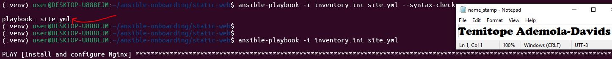

---

# Task 7 — Run the Multi-Play Playbook

## Goal

Install Nginx, deploy the website, and verify both servers in one playbook run.

## Evidence

### Screenshot 6 — Play 3 verification showing HTTP `200` for both servers

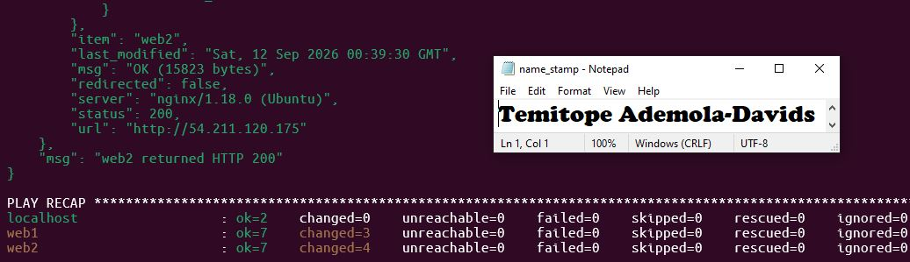

---

### Screenshot 7 — Final play recap showing `unreachable=0` and `failed=0` for `web1`, `web2`, and `localhost`

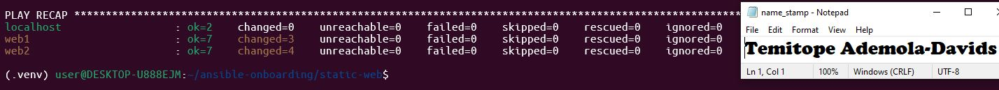

---

# Task 8 — Verify Idempotency

## Goal

Run the playbook again and confirm that it does not make unnecessary changes.

## Evidence

### Screenshot 8 — Second playbook run showing the play recap with `changed=0`, `unreachable=0`, and `failed=0` for both web servers

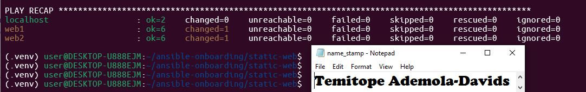

---

# Task 9 — Test Both Websites Manually

## Goal

Confirm that the static website is accessible from both public IP addresses.

## Evidence

### Screenshot 9 — `curl -I` output showing HTTP `200 OK` from both servers

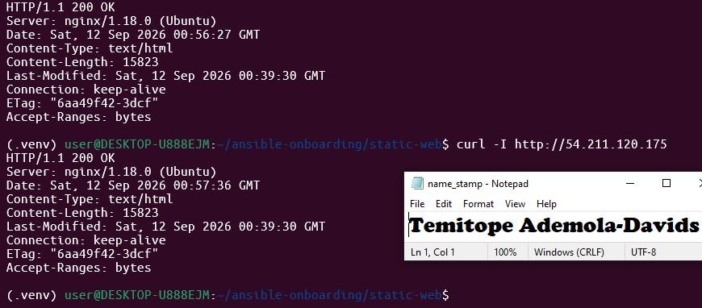
---

### Screenshot 10 — Browser showing the website from Server 1 with the public IP and your full name visible

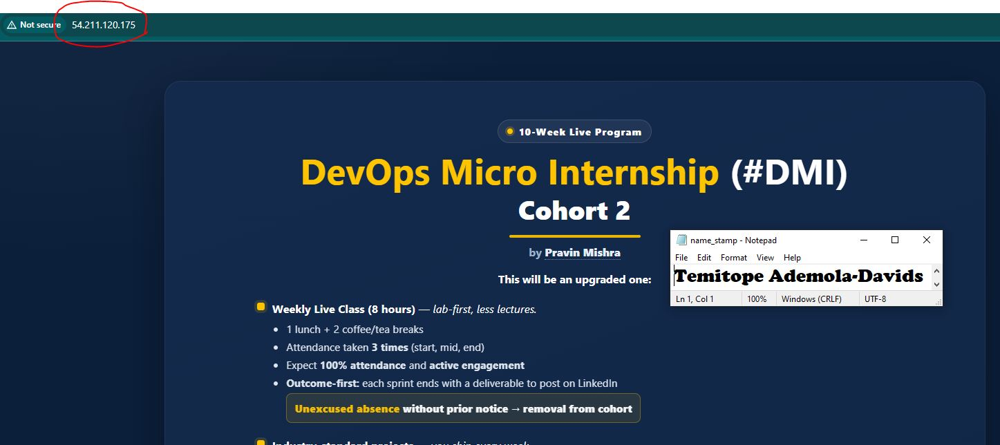


---

### Screenshot 11 — Browser showing the website from Server 2 with the public IP and your full name visible

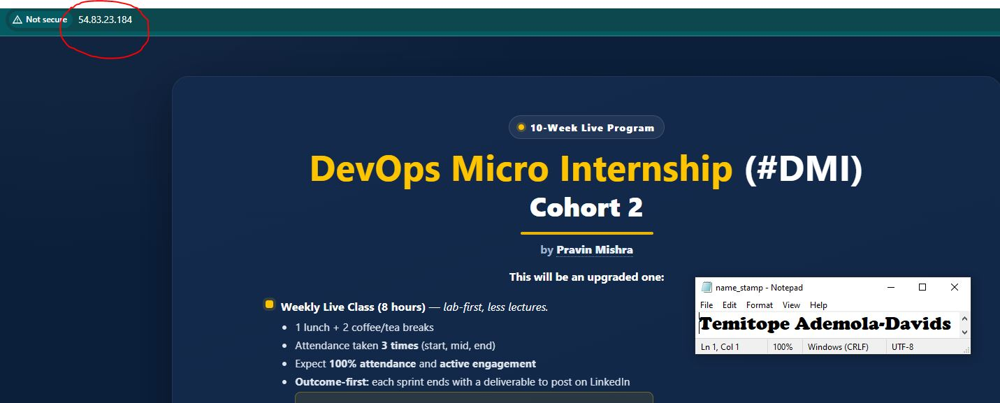

---

## Website URLs

Add both deployed website URLs below:


Server 1: http://44.200.55.89
Server 2: http://100.27.44.252