# Assignment 04 — Deploy Mini Finance on Azure Using Terraform and Ansible

Part of the DevOps Micro Internship (DMI) Cohort 3 with Agentic AI

---

## Purpose

In this assignment, you will provision Azure infrastructure using Terraform and deploy the Mini Finance website using an Ansible multi-play playbook.

Terraform will create the Azure Virtual Machine and networking resources. Ansible will install Nginx, clone the Mini Finance repository, deploy the website, and verify the deployment.

---

# Task 1 — Create the Project Structure

## Goal

Create separate directories and files for the Terraform infrastructure and Ansible configuration.

### Evidence

#### Screenshot 1 — Terminal or VS Code showing the complete `mini-finance` project structure

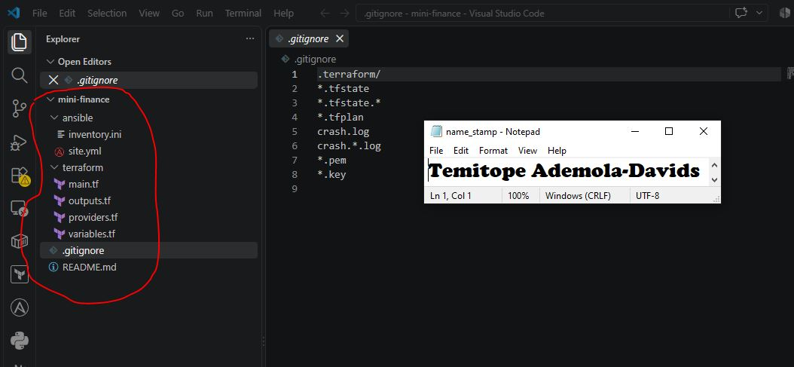

---

### Notes

Add your task notes here.

---

# Task 2 — Create the Azure Infrastructure Using Terraform

## Goal

Use Terraform to provision an Ubuntu Virtual Machine with the required Azure networking and security resources.

### Evidence

#### Screenshot 2 — Terraform code showing the `Allow-SSH` rule for port `22` and the `Allow-HTTP` rule for port `80`

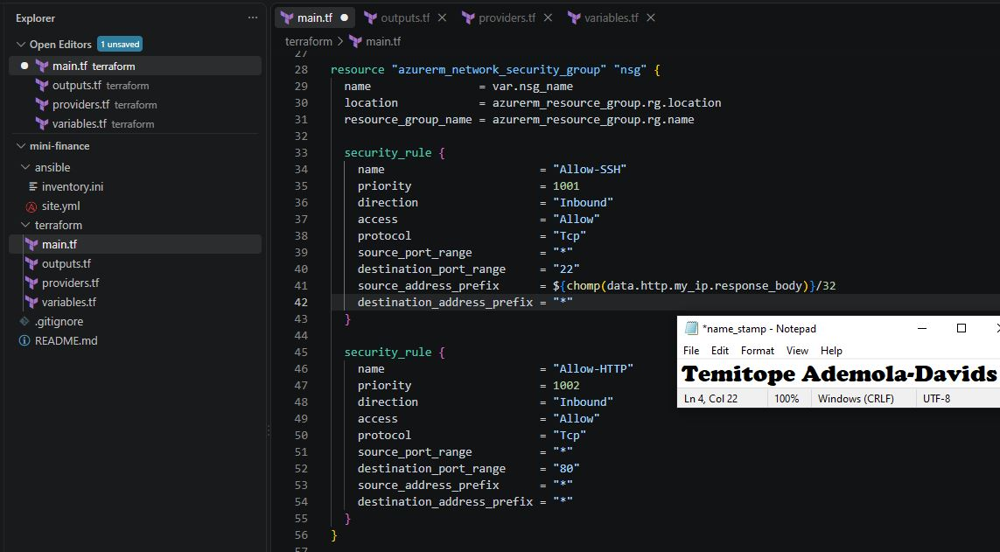

---

#### Screenshot 3 — Terraform code showing the association between `nsg-mini-finance` and `nic-mini-finance`

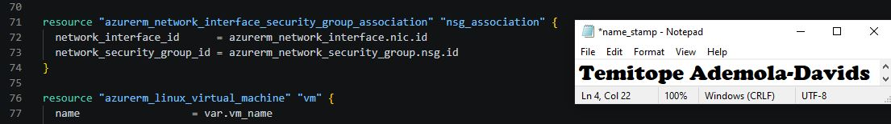

---

### Notes

Add your task notes here.

---

# Task 3 — Initialize and Apply the Terraform Configuration

## Goal

Format and validate the Terraform configuration, review the execution plan, and provision the Azure infrastructure.

### Evidence

#### Screenshot 4 — End of the `terraform apply` output showing `Apply complete!` with no errors

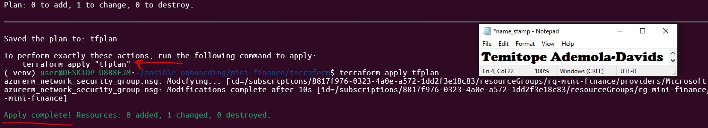

---

#### Screenshot 5 — Output of `terraform output public_ip` showing the VM’s public IP address

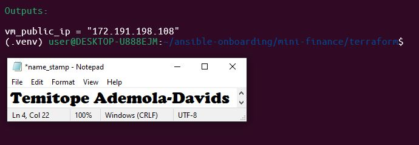

---

### Notes

Add your task notes here.

---

# Task 4 — Verify Passwordless SSH Access

## Goal

Confirm that the Ansible controller can connect to the Terraform-provisioned Azure VM using SSH key authentication.

### Evidence

#### Screenshot 6 — Passwordless SSH command and the returned `mini-finance` hostname

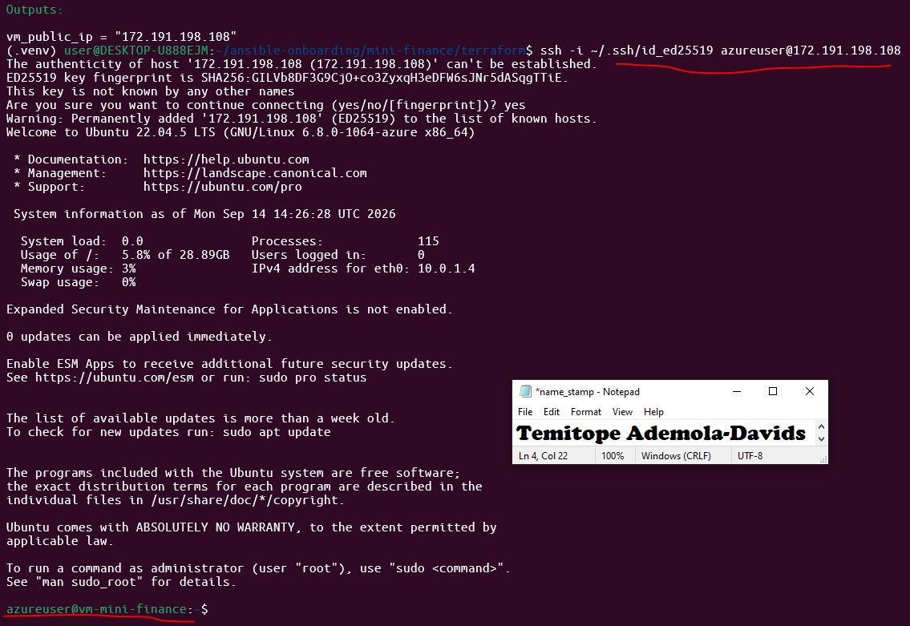

---

### Notes

Add your task notes here.

---

# Task 5 — Create the Ansible Inventory and Verify Connectivity

## Goal

Add the Terraform-provisioned Azure VM to the Ansible inventory and confirm that Ansible can connect to it.

### Evidence

#### Screenshot 7 — Ansible ping output showing `SUCCESS` and `pong` from the Azure VM

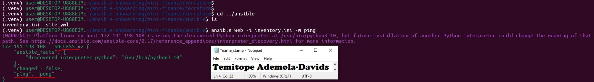

---

### Configuration File

Copy and paste the complete contents of your `ansible/inventory.ini` file below:

```ini
[web]
172.191.198.108

[web:vars]
ansible_user=azureuser
ansible_ssh_private_key_file=~/.ssh/id_ed25519


```

---

# Task 6 — Create the Multi-Play Ansible Playbook

## Goal

Create one Ansible playbook containing separate plays to install Nginx, deploy the Mini Finance website, and verify the deployment.

### Evidence

#### Screenshot 8 — `site.yml` showing Play 1 and the beginning of Play 2

Screenshot must show:

- Play 1 targeting the `web` group
- Installation of `nginx`, `git`, and `rsync`
- Nginx service configured as started and enabled
- Beginning of Play 2 with the Git repository URL and synchronization task

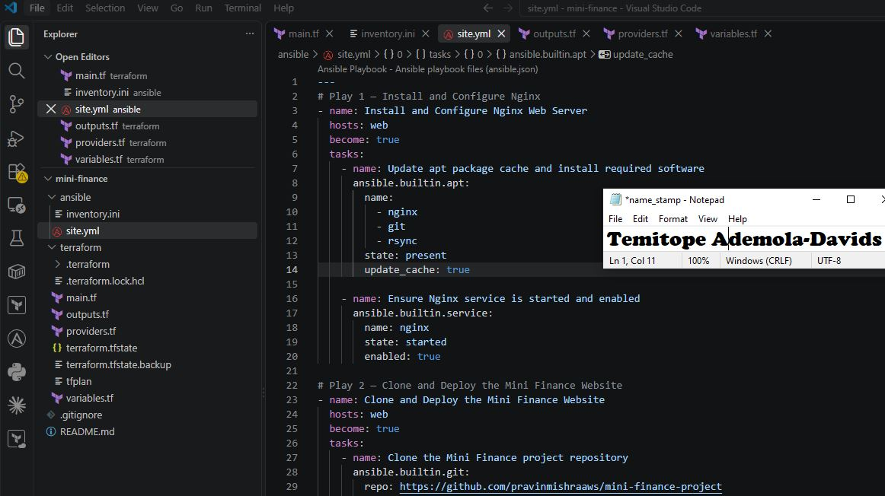

---

#### Screenshot 9 — `site.yml` showing the deployment destination, handler, and Play 3 verification

Screenshot must show:

- Website destination `/var/www/html/`
- Ownership set to `www-data:www-data`
- Nginx reload handler
- Play 3 targeting `localhost`
- The `uri` verification and `assert` condition

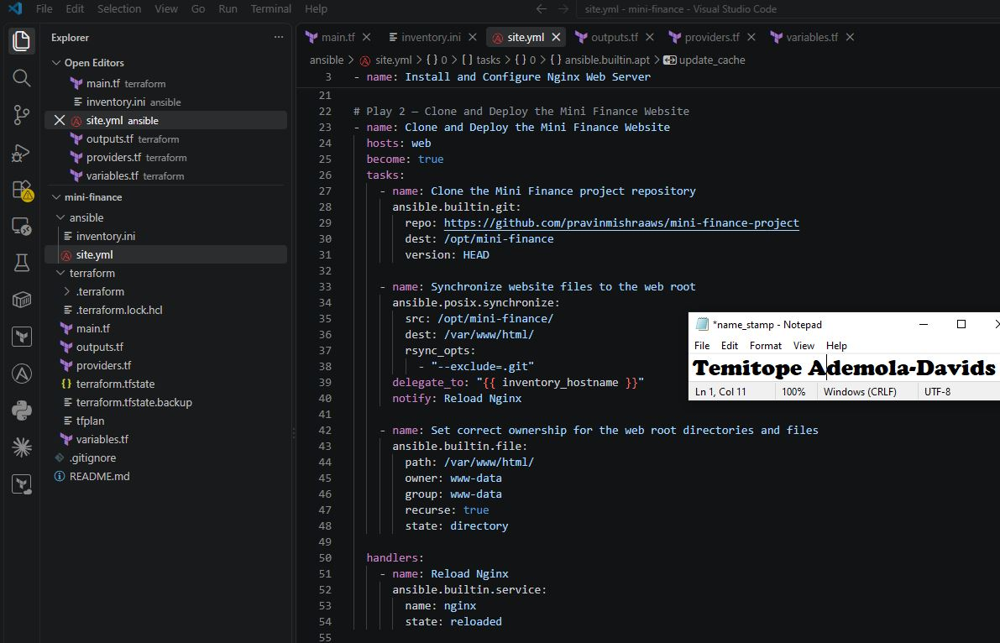

---

### Configuration File

Copy and paste the complete contents of your `ansible/site.yml` file below:

```yaml
---
- name: Play 1 - Install Web Server and Dependencies
  hosts: web
  become: true
  tasks:
    - name: Update apt cache and install dependencies
      apt:
        update_cache: yes
        name:
          - nginx
          - git
          - rsync
        state: present

    - name: Start and enable Nginx service
      service:
        name: nginx
        state: started
        enabled: true

- name: Play 2 - Deploy Mini Finance Website
  hosts: web
  become: true
  tasks:
    - name: Clone repository to destination directory
      ansible.builtin.git:
        repo: 'https://github.com/pravinmishraaws/mini_finance'
        dest: /opt/mini-finance
        version: main
        force: yes

    - name: Copy website files to web root
      ansible.builtin.command: cp -r /opt/mini-finance/. /var/www/html/
      notify: Reload Nginx

    - name: Set permissions on web root
      file:
        path: /var/www/html
        state: directory
        recurse: yes
        owner: www-data
        group: www-data

  handlers:
    - name: Reload Nginx
      service:
        name: nginx
        state: reloaded

- name: Play 3 - Verify Deployment
  hosts: localhost
  connection: local
  gather_facts: no
  tasks:
    - name: Check HTTP response from web server
      uri:
        url: "http://172.191.198.108/"
        return_content: yes
        status_code: 200
      register: web_check

    - name: Assert website is active
      assert:
        that:
          - web_check.status == 200

```

---

# Task 7 — Validate and Run the Ansible Playbook

## Goal

Validate the syntax of the multi-play Ansible playbook and run it to install Nginx, deploy the Mini Finance website, and verify the deployment.

### Evidence

#### Screenshot 10 — Successful playbook syntax check showing `playbook: site.yml`

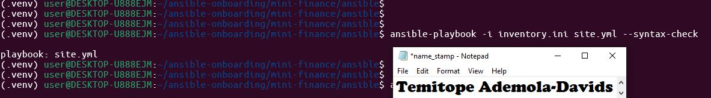

---

#### Screenshot 11 — Play 3 output showing the successful HTTP verification and assertion

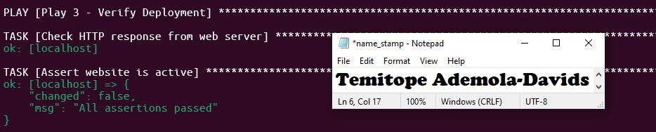

---

#### Screenshot 12 — Final `PLAY RECAP` showing `failed=0` and `unreachable=0`

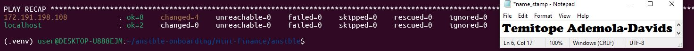

---

### Notes

Add your task notes here.

---

# Task 8 — Test the Mini Finance Website in a Browser

## Goal

Confirm that the Mini Finance website is publicly accessible through the Azure VM’s public IP address.

### Evidence

#### Screenshot 13 — Mini Finance website successfully loading in the browser, with the Azure VM’s public IP address visible in the address bar

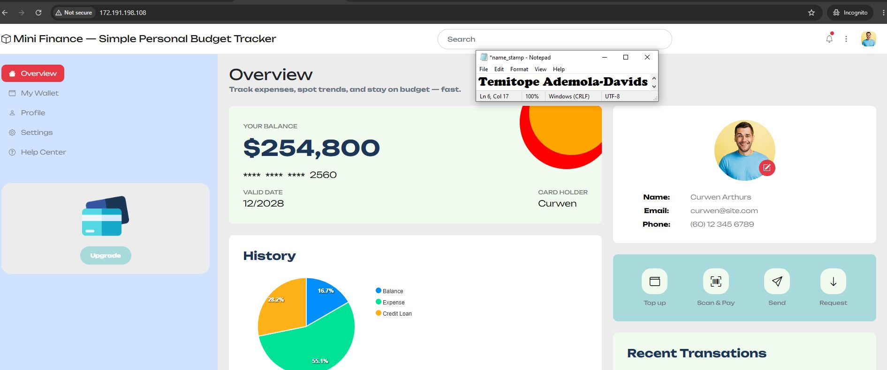

---

### Website URL

Add your deployed website URL below:

```text
http://<PUBLIC_IP>
```

---

# Task 9 — Create the Project README

## Goal

Create a `README.md` file to document the Mini Finance infrastructure and deployment project.

### Evidence

#### Screenshot 14 — Completed `README.md` displayed in the VS Code Markdown preview or terminal

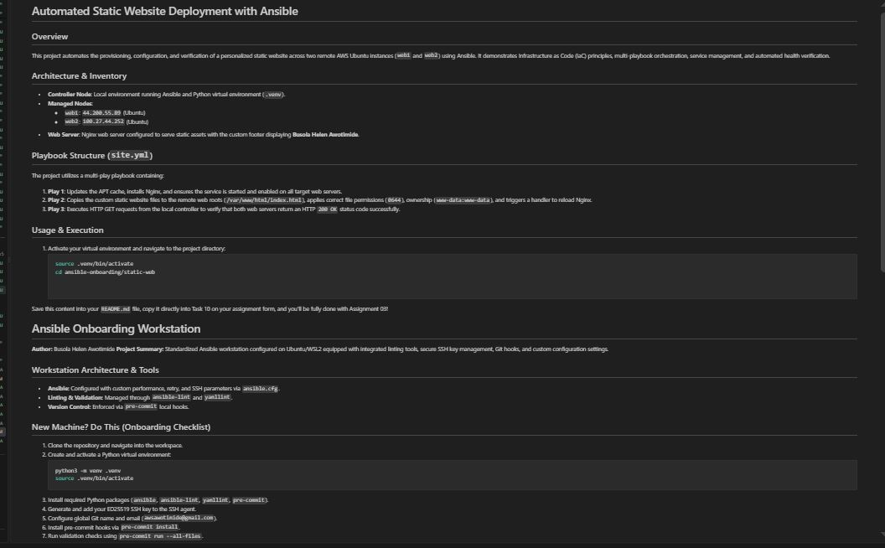

---

### README Content

Copy and paste the complete contents of your `README.md` file below:

```markdown
# Mini Finance Website Deployment with Terraform and Ansible

## Project Objective

This project demonstrates how to provision cloud infrastructure with Terraform on Microsoft Azure and use Ansible to configure the server and deploy a static Mini Finance website.

The deployment includes an Azure Ubuntu virtual machine running Nginx. Ansible automates the installation and configuration of Nginx, deployment of the Mini Finance website, and verification that the website is responding successfully.

## Tools and Technologies

* **Terraform** — Infrastructure as Code for provisioning Azure resources
* **Microsoft Azure** — Cloud platform hosting the infrastructure
* **Ansible** — Server configuration and application deployment automation
* **Nginx** — Web server used to serve the Mini Finance website
* **Git** — Version control for the project files
* **rsync** — Synchronization of website files to the Nginx web root

## Infrastructure Created

The Terraform configuration provisions the following Azure resources:

* **Resource Group** — Contains the project resources
* **Virtual Network** — Provides private network connectivity
* **Subnet** — Provides a network segment for the virtual machine
* **Network Security Group** — Controls inbound and outbound network traffic
* **Public IP Address** — Provides public access to the virtual machine
* **Network Interface** — Connects the virtual machine to the Azure network
* **Ubuntu Virtual Machine** — Hosts the Nginx web server and Mini Finance website

## Ansible Deployment Workflow

The Ansible playbook uses multiple plays to automate the deployment process.

### 1. Install and Configure Nginx

Ansible updates the package cache, installs the required packages, ensures that Nginx is running, and enables the service.

### 2. Clone and Deploy the Mini Finance Website

Ansible clones or updates the Mini Finance project repository and synchronizes the website files to the Nginx web root using `rsync`.

The website files are then assigned the appropriate ownership and permissions, and Nginx is reloaded.

### 3. Verify the Deployment

Ansible sends an HTTP request to the deployed website and verifies that the server returns HTTP status code `200`.

A successful verification confirms that the website is being served correctly by Nginx.

## Verification

The deployment was verified in two ways.

First, the Ansible playbook successfully completed all deployment tasks and returned the following verification message:

`Mini Finance website is responding with HTTP 200.`

The final Ansible recap also confirmed that there were no failed or unreachable hosts.

Second, the website was opened in a web browser using the Azure virtual machine's public IP address:

`http://<PUBLIC_IP>`

The Mini Finance website loaded successfully, confirming that Nginx was publicly serving the deployed website.

## Challenge and Solution

One important point checked during the deployment was ensuring that the Azure virtual machine was reachable through its public IP address and that HTTP traffic was permitted by the Network Security Group.

The deployment was verified by confirming that the required network access was available, Nginx was running, and the Ansible HTTP verification returned status code `200`.

## What I Learned

This project helped me understand how Terraform and Ansible can work together in a DevOps workflow.

Terraform was used to provision and manage the Azure infrastructure as code, while Ansible was used to configure the provisioned virtual machine and automate the website deployment.

I also learned how to use Ansible multi-play playbooks, inventory files, handlers, package management, Git repository deployment, `rsync`, and automated HTTP verification.

Overall, the project demonstrated how infrastructure provisioning and server configuration can be automated to create a repeatable and reliable deployment process.

```

---

# LinkedIn Post Required

## Evidence

#### Screenshot 15 — Published LinkedIn post showing the text and at least one deployment screenshot

Add your screenshot here.

---

#### LinkedIn Post URL

Paste your LinkedIn post URL here:

`Add your URL here`

---

### LinkedIn Submission Notes

**One challenge you faced and how you fixed it:**

During Play 2 of the Ansible execution, the git clone task stalled indefinitely because the repository URL provided in the instructions (mini-finance-project) did not exist, prompting the background Git process to wait indefinitely for user authentication. I aborted the hanging task, diagnosed the issue by checking HTTP responses and querying the GitHub API for the user's public repositories, and discovered the correct repository name was mini_finance. After updating site.yml with the valid repository URL and cleaning up the destination directory on the server, the playbook executed cleanly.

---

**One real-world example where you can use this learning:**

This approach can be used in a real-world web deployment environment where Terraform provisions cloud infrastructure and Ansible automatically configures servers and deploys applications. For example, a company could use Terraform to create Azure web servers and Ansible to install Nginx and deploy a website consistently across multiple environments.

---

# Assignment Questions

Answer the following in your own words:

**1. What did you provision using Terraform in this assignment?**

I used Terraform to provision the Azure infrastructure required to host the Mini Finance website. This included a Resource Group, Virtual Network, Subnet, Network Security Group, Public IP address, Network Interface, and Ubuntu Virtual Machine.

---

**2. What did Ansible configure and deploy in this assignment?**

Ansible updated the APT cache, installed the nginx, git, and rsync system packages, ensured Nginx was started and enabled on system boot, cloned the Mini Finance Git repository to /opt/mini_finance, synchronized the website files to /var/www/html/ with www-data ownership, triggered an Nginx reload handler, and verified site availability.

---

**3. Why is SSH access on port `22` restricted to your public IP address?**

SSH port 22 is restricted to my public IP address to reduce the risk of unauthorized access. This means that only my trusted network can connect to the server through SSH instead of exposing SSH access to the entire internet.

---

**4. Why is HTTP port `80` open to the internet?**

Port 80 serves standard, unencrypted web traffic to public end users. Because the server's purpose is hosting a public-facing static demonstration site, the security group must accept inbound HTTP requests from any IP address (0.0.0.0/0).

---

**5. What is the purpose of the Ansible inventory file?**

To define the target hosts, group them logically (such as under the web group), and specify connection variables (like remote user names, SSH keys, and IP addresses) so Ansible knows exactly where and how to run playbook commands.


---

**6. Why does the playbook use separate plays for install, deploy, and verify?**

It implements modularity and separation of concerns ensuring that infrastructure packages are fully installed and services are running before application code is deployed, and that deployment is verified only after everything is fully set up.


---

**7. Why is `rsync` useful when deploying website files?**

It efficiently transfers only new or modified files rather than re-copying the entire directory, preserves file permissions, and minimizes network overhead during updates.


---

**8. What does the Ansible `uri` module verify in this assignment?**

The Ansible uri module sends an HTTP request to the deployed website and checks the response. In this assignment, it verifies that the website is accessible and returns the expected HTTP status code 200.

---

**9. What issue did you face during this assignment, and how did you fix it?**

During Play 2, the git clone task hung indefinitely because the initial repository URL was missing or private, causing Git to wait on user credentials. I inspected the GitHub account via the API, identified the correct repository name (mini_finance instead of mini-finance-project), updated site.yml, and re-ran the playbook successfully.

---

**10. What did you learn from using Terraform and Ansible together?**

Learned how to combine Infrastructure as Code (Terraform) for provisioning immutable cloud resources with Configuration Management (Ansible) for software installation and deployment, establishing a complete and repeatable automation workflow.


---

# Required Files

Confirm that the following files are included in your assignment folder:

- [ ] `.gitignore`
- [ ] `README.md`
- [ ] `terraform/providers.tf`
- [ ] `terraform/main.tf`
- [ ] `terraform/variables.tf`
- [ ] `terraform/outputs.tf`
- [ ] `ansible/inventory.ini`
- [ ] `ansible/site.yml`

---

# Submission Instructions

- Add all required screenshots in the correct order.
- Full Name must be visible in required screenshots.
- Add the Azure VM public IP address.
- Add the final Mini Finance website URL.
- Paste `inventory.ini`, `site.yml`, and `README.md` as editable text.
- Answer all assignment questions clearly in your own words.
- Add your LinkedIn post URL.
- Do not expose SSH private keys, passwords, Azure credentials, subscription IDs, Terraform state contents, or other sensitive information.
- Submit only one Google Doc link.
- Ensure that anyone with the link can view the document.
- Test the Google Doc link in an incognito or private browser window before submitting.

---

# Completion Checklist

- [ ] Task 1: `mini-finance` project structure created
- [ ] Task 1: `.gitignore` created
- [ ] Task 2: Terraform Azure infrastructure code created
- [ ] Task 2: `Allow-SSH` rule configured for port `22`
- [ ] Task 2: `Allow-HTTP` rule configured for port `80`
- [ ] Task 2: NSG associated with the Network Interface
- [ ] Task 3: `terraform fmt` completed
- [ ] Task 3: `terraform init` completed
- [ ] Task 3: `terraform validate` completed successfully
- [ ] Task 3: `terraform apply` completed successfully
- [ ] Task 3: `terraform output public_ip` displayed the VM public IP
- [ ] Task 4: Passwordless SSH works from the Ansible controller
- [ ] Task 5: `inventory.ini` created
- [ ] Task 5: Ansible ping returns `SUCCESS` and `pong`
- [ ] Task 6: `site.yml` contains three separate plays
- [ ] Task 6: Play 1 installs Nginx, Git, and rsync
- [ ] Task 6: Play 2 clones and deploys the Mini Finance website
- [ ] Task 6: Play 3 verifies HTTP status code `200`
- [ ] Task 7: Playbook syntax check passes
- [ ] Task 7: Ansible playbook completes successfully
- [ ] Task 7: Final recap shows `failed=0` and `unreachable=0`
- [ ] Task 8: Mini Finance website loads in the browser
- [ ] Task 8: Azure VM public IP is visible in the browser screenshot
- [ ] Task 9: `README.md` completed
- [ ] Screenshots 1–15 are included
- [ ] `inventory.ini`, `site.yml`, and `README.md` are pasted as editable text
- [ ] Assignment questions are answered
- [ ] LinkedIn post published with Anyone visibility
- [ ] LinkedIn post URL added
- [ ] No sensitive information is exposed
- [ ] Google Doc is accessible

---

## About DMI & CloudAdvisory

DevOps Micro Internship (DMI) is a project-based DevOps program run by Pravin Mishra and The CloudAdvisory, focused on real-world execution, systems thinking, and career readiness.

It helps learners build strong DevOps foundations with hands-on experience.

---

## Resources

- DMI Official Website: [https://dmi.pravinmishra.com?utm_source=github&utm_medium=readme](https://dmi.pravinmishra.com?utm_source=github&utm_medium=readme)
- University: [https://university.pravinmishra.com?utm_source=github&utm_medium=readme](https://university.pravinmishra.com?utm_source=github&utm_medium=readme)
- Discord Community: [https://discord.pravinmishra.com?utm_source=github&utm_medium=readme](https://discord.pravinmishra.com?utm_source=github&utm_medium=readme)
- Blog: [https://dmi.pravinmishra.com/blog?utm_source=github&utm_medium=readme](https://dmi.pravinmishra.com/blog?utm_source=github&utm_medium=readme)
- YouTube Playlist: [https://www.youtube.com/playlist?list=PLFeSNDtI4Cho](https://www.youtube.com/playlist?list=PLFeSNDtI4Cho)
- Pravin Mishra LinkedIn: [https://www.linkedin.com/in/pravin-mishra-aws-trainer/](https://www.linkedin.com/in/pravin-mishra-aws-trainer/)
- CloudAdvisory LinkedIn: [https://www.linkedin.com/company/thecloudadvisory/](https://www.linkedin.com/company/thecloudadvisory/)

---

*This submission is part of DevOps Micro Internship (DMI) Cohort 3 — Agentic AI Track.*