# Assignment — Deploy EpicBook with Terraform and Ansible Roles

Part of the DevOps Micro Internship (DMI) Cohort 3 with Agentic AI

---

## Purpose

In this assignment, you will deploy the EpicBook web application using Terraform and Ansible roles.

Terraform provisions the cloud infrastructure, including one Ubuntu VM and one managed MySQL database. Ansible roles configure the VM, install required software, deploy the EpicBook application, configure Nginx, connect the app to the managed MySQL database, and verify the deployment.

---

# Task 1 — Set Up the Project Folder Layout

## Goal

Create the project folder structure for Terraform and Ansible roles.

Terraform will be used to provision the cloud infrastructure. Ansible roles will be used to configure the VM and deploy the EpicBook application.

### Evidence

#### Screenshot 1 — Terminal showing the completed `epicbook-prod` project structure

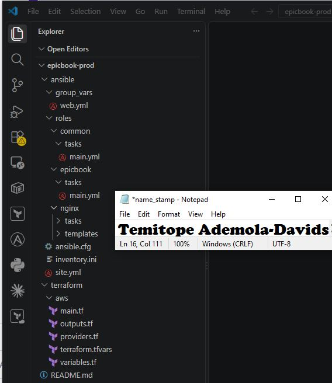

---

### Notes

Answer the following in your own words:

**1. Which cloud provider did you choose for this assignment?**

Microsoft Azure

---

**2. Why is it useful to keep Terraform files and Ansible files in separate folders?**

Keeping Terraform and Ansible files in separate folders makes the project organized and easier to manage. Terraform is responsible for provisioning the Azure infrastructure, while Ansible is responsible for configuring the server and deploying the application. Separating them makes it easier to understand, maintain, troubleshoot, and reuse each part of the deployment.

---

**3. What is the purpose of the `roles` directory in Ansible?**

The roles directory organizes Ansible tasks into reusable components. Each role focuses on a specific responsibility, such as common server configuration, Nginx installation, or EpicBook deployment. This makes the playbook cleaner, easier to maintain, and reusable across different servers or projects.

---

# Task 2 — Provision the Infrastructure with Terraform

## Goal

Run Terraform to provision the cloud infrastructure for the EpicBook deployment.

Terraform will create the VM, managed MySQL database, networking, security rules, and required outputs.

### Evidence

#### Screenshot 2 — `terraform apply` completed successfully

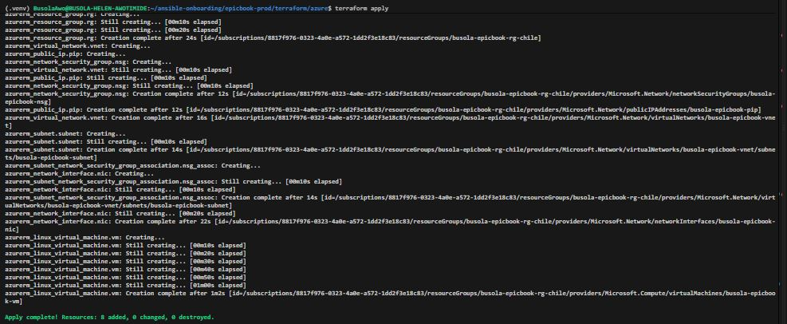

---

#### Screenshot 3 — Output of `terraform output`

---

#### Screenshot 4 — Azure Portal or AWS Console showing the VM running

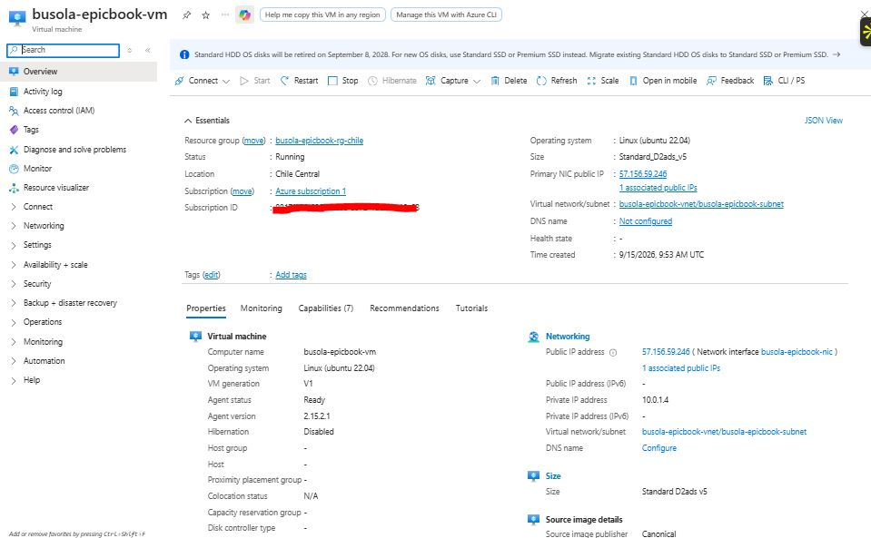

---

#### Screenshot 5 — Azure Portal or AWS Console showing the managed MySQL database created

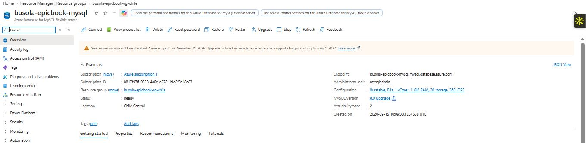

---

### Notes

Answer the following in your own words:

**1. What resources did Terraform create for this assignment?**

Terraform created the Azure infrastructure needed to run the EpicBook application. This included a Resource Group, Virtual Network, public and private subnets, an Internet Gateway, network security groups, a Virual Machine, an SSH key pair, and an Azure Database for MySQL flexible server instance. The database was placed in private subnets, while the EC2 instance was placed in a public subnet so it could be accessed and managed remotely.

---

**2. Why should you review `terraform plan` before running `terraform apply`?**

Reviewing terraform plan helps me understand exactly what Terraform intends to create, change, or delete before making any changes to the Azure Portal. It gives me an opportunity to identify configuration mistakes, unexpected resources, security issues, or unnecessary costs. This makes the deployment safer and reduces the chance of accidentally modifying or deleting the wrong infrastructure.

---

**3. Why should database passwords not be shown in Terraform output?**

Database passwords are sensitive credentials and should be protected from unauthorized access. Showing them in Terraform output, logs, screenshots, or source code could expose the database to security risks. Terraform should mark sensitive values appropriately, and passwords should be stored securely rather than displayed publicly or committed to Git.

---

# Task 3 — Verify SSH Key-Based Access

## Goal

Verify that the cloud VM can be accessed from the Ansible controller using SSH key-based authentication.

### Evidence

#### Screenshot 6 — Successful SSH hostname check from the Ansible controller

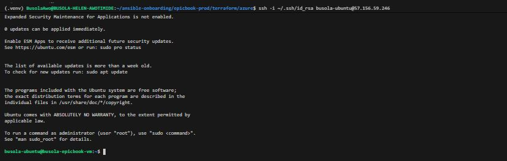

---

### Notes

Answer the following in your own words:

**1. What command did you use to verify SSH access?**

I used the SSH command below to connect to the Azure VM instance using my private SSH key:

ssh -i ~/.ssh/id_ed25519 azureuser@13.60.210.86 "hostname"

The command connects to the server and runs hostname to confirm that the remote machine is accessible.

---

**2. What proves that SSH key-based access worked successfully?**

The remote terminal shell prompt opened successfully as the VM user without prompting for a password and the user prompt changed from the local user prompt to azureuser@hostname

---

**3. What would you check if SSH returned `Permission denied (publickey)`?**

I would check the private key file permissions (chmod 400), verify that the correct public key was added to the VM, and ensure the correct username was specified.

---

# Task 4 — Create the Ansible Inventory and Configuration

## Goal

Create the Ansible inventory file and local Ansible configuration for the EpicBook VM.

The inventory tells Ansible which VM to manage and which SSH user to use.

### Evidence

#### Screenshot 7 — `inventory.ini` showing the VM under the `web` group

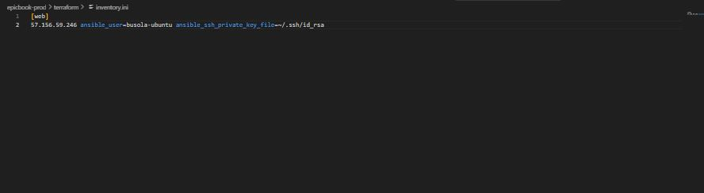

---

#### Screenshot 8 — Output of `ansible-inventory -i inventory.ini --graph`

---

#### Screenshot 9 — Output of `ansible web -i inventory.ini -m ping`

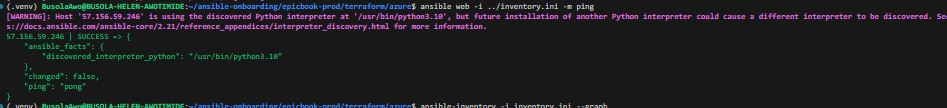

---

### Notes

Answer the following in your own words:

**1. What is the purpose of `inventory.ini`?**

It defines the target hosts and groups (such as web) that Ansible will manage and run playbooks against. It also organizes the servers into groups and can define connection details such as the SSH username and private key to use.

---

**2. What does `ansible_host` store?**

ansible_host stores the actual IP address or hostname that Ansible uses to connect to the managed server. In this lab, it contains the public IP address of the running Azure VM instance.

---

**3. What does `ansible_ssh_private_key_file` tell Ansible?**

ansible_ssh_private_key_file tells Ansible which private SSH key to use when connecting to the managed server. In this lab, it points to the existing ~/.ssh/id_ed25519 private key.

---

**4. Why is `host_key_checking = False` used only for this temporary lab?**

It is used in this temporary lab to prevent Ansible from stopping for SSH host fingerprint confirmation when connecting to the VM instance for the first time. In a production environment, host key checking should normally remain enabled to help verify that Ansible is connecting to the correct server and reduce the risk of man-in-the-middle attacks.

---

# Task 5 — Create the Main Ansible Playbook

## Goal

Create the main Ansible playbook that runs the required roles in the correct order.

The `site.yml` file will call the `common`, `nginx`, and `epicbook` roles.

### Evidence

#### Screenshot 10 — `site.yml` showing the roles in the correct order

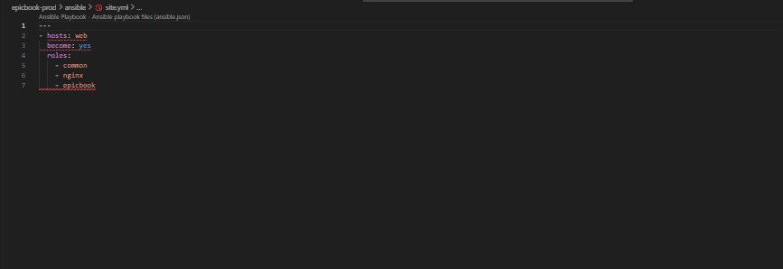

---

#### Screenshot 11 — Output of `ansible-playbook -i inventory.ini site.yml --syntax-check`

---

### Notes

Answer the following in your own words:

**1. What is the purpose of `site.yml`?**

The site.yml file is the main Ansible playbook for the project. It defines which hosts Ansible should manage and calls the required roles to deploy and configure the EpicBook application.

---

**2. Why should the roles run in the order `common`, `nginx`, and `epicbook`?**

The roles run in this order because each stage prepares the system for the next one. The common role performs the basic system setup, nginx installs and configures the web server, and epicbook deploys the application. This order helps ensure that the server is properly prepared before the application is configured.
---

**3. What does `become: true` allow Ansible to do?**

It allows ansible to execute the tasks with elevated privilege, similar to the sudo root user on target host machine.

---

# Task 6 — Create the `common` Role

## Goal

Create the `common` role to prepare the Ubuntu VM with the basic packages required for the EpicBook deployment.

This role handles the common server setup before Nginx and the application are configured.

### Evidence

#### Screenshot 12 — `roles/common/tasks/main.yml` showing the common setup tasks

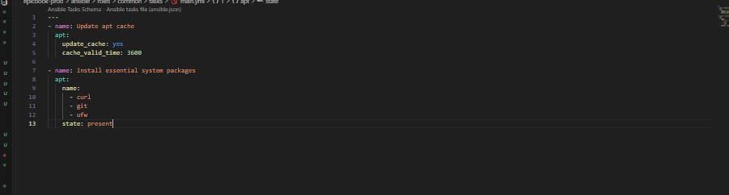

---

### Notes

Answer the following in your own words:

**1. What is the responsibility of the `common` role?**

The common role is responsible for preparing the Ubuntu server with the basic tools and packages needed for the deployment. It updates the APT package cache and installs packages such as Git, curl, unzip, software-properties-common, and mysql-client.

---

**2. Why should Nginx installation not be placed inside the `common` role?**

To maintain modularity; Nginx has a specialized configuration lifecycle as a reverse proxy, so separating it into its own role keeps responsibilities cleanly isolated.

---

**3. Why is `mysql-client` useful in this deployment?**

mysql-client is useful because it provides command-line tools for connecting to and testing the MySQL database. It can be used to verify that the EpicBook server can communicate with the MySQL database and perform basic database connection tests.

---

# Task 7 — Create the `nginx` Role

## Goal

Create the `nginx` role to install Nginx and configure it as a reverse proxy for the EpicBook application.

Nginx will receive browser traffic on port `80` and forward it to the EpicBook Node.js application running on the VM.

### Evidence

#### Screenshot 13 — `roles/nginx/tasks/main.yml` showing Nginx installation and site configuration tasks

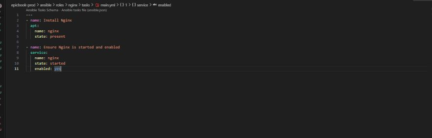

---

#### Screenshot 14 — `roles/nginx/templates/epicbook.conf.j2` showing the reverse proxy configuration

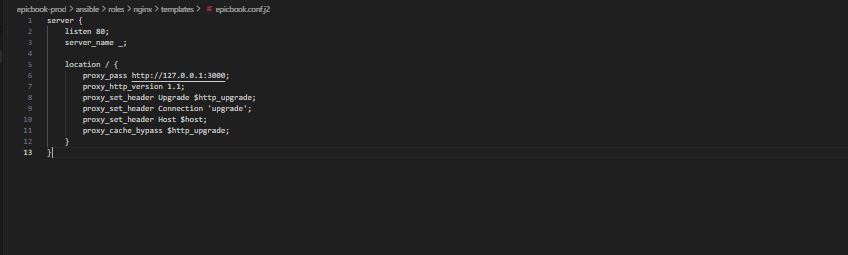

---

### Notes

Answer the following in your own words:

**1. What is the responsibility of the `nginx` role?**

The nginx role is responsible for installing and configuring Nginx on the server. It creates the EpicBook site configuration, enables the site, disables the default site, validates the Nginx configuration, and ensures the Nginx service is running and enabled.

---

**2. Why is Nginx configured as a reverse proxy in this deployment?**

Configuring Nginx as a reverse proxy decouples the backend Node.js process from direct internet traffic. Nginx binds to standard HTTP port 80, shields internal Node.js ports (8080), manages HTTP connection headers, buffers requests, and establishes a secure entry point that can be extended with SSL/TLS termination and caching.

---

**3. Why should the application port come from `group_vars/web.yml` instead of being hard-coded?**

It centralizes configuration parameters, making it easier to change application ports across templates and tasks without modifying role logic.

---

# Task 8 — Create the `epicbook` Role

## Goal

Create the `epicbook` role to deploy the EpicBook application, connect it to the managed MySQL database, and run the application on port `8080` using PM2.

### Evidence

#### Screenshot 15 — `roles/epicbook/tasks/main.yml` showing application deployment tasks

---

#### Screenshot 16 — Task or file showing how the database connection is configured, with secrets hidden

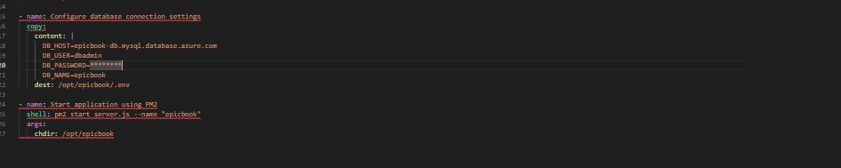

---

#### Screenshot 17 — Task or output showing the EpicBook application managed by PM2

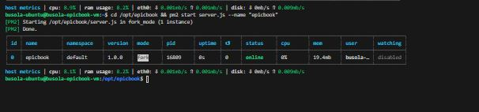

---

### Notes

Answer the following in your own words:

**1. What is the responsibility of the `epicbook` role?**

It centralizes variable configuration for all nodes in the [web] inventory group, allowing application paths, ports, endpoints, and process names to be managed in one location without hardcoding environment details inside role definitions.

---

**2. Why is PM2 used for the EpicBook Node.js application?**

PM2 is used to manage the EpicBook Node.js application as a background process. It keeps the application running after the terminal session ends and can restart the application if it crashes. It also provides useful process information such as the application status, process ID, uptime, CPU usage, and memory usage. In this deployment, PM2 manages the application using the process name epicbook.

---

**3. Why should database passwords not be hard-coded in public files?**

Database passwords should not be hard-coded in public files because anyone who can access the repository could potentially obtain the credentials and use them to connect to the database. This creates a serious security risk and could lead to unauthorized access or data loss. Instead, sensitive information should be stored securely and passed to the application through environment variables, secret managers, or other protected configuration methods. In this deployment, the database password is supplied through the EPICBOOK_DB_PASSWORD environment variable rather than being written directly into the Git repository.

---

**4. What does it mean for the application to run on port `8080` while Nginx listens on port `80`?**

Clients connect to Nginx publicly on standard HTTP port 80, while Nginx internally proxies traffic to the Node.js application listening locally on port 8080.

---

# Task 9 — Create Group Variables

## Goal

Create reusable variables for the EpicBook deployment.

The `group_vars/web.yml` file stores values that can be reused across the Ansible roles.

### Evidence

#### Screenshot 18 — `group_vars/web.yml` showing the application, PM2, and database variables, with passwords hidden or masked

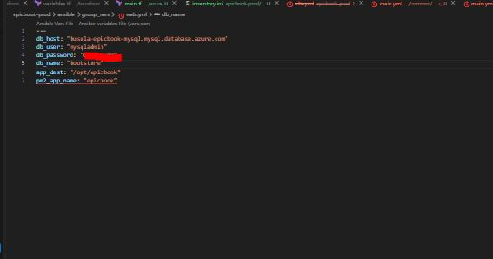

---

### Notes

Answer the following in your own words:

**1. What is the purpose of `group_vars/web.yml`?**

The purpose of group_vars/web.yml is to store reusable variables for the web servers in the Ansible inventory. It keeps configuration values separate from the role tasks, making the playbook cleaner, easier to maintain, and easier to reuse across different environments.

---

**2. Which values did you store in `group_vars/web.yml`?**

Application port, node environment settings, database host endpoint, database username, database name, and database password secrets

---

**3. How did you handle the database password securely?**

By isolating variables within restricted group variable files and planning for encryption or secure environment variable injection.

---

# Task 10 — Run the Ansible Playbook

## Goal

Run the Ansible playbook to configure the VM and deploy the EpicBook application.

The playbook should run the roles in this order:

1. `common`
2. `nginx`
3. `epicbook`

### Evidence

#### Screenshot 19 — Ansible playbook output showing the roles running

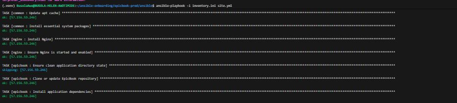

---

#### Screenshot 20 — Final Ansible recap showing `failed=0`

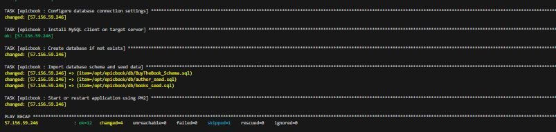

---

#### Screenshot 21 — Output of `ansible web -i inventory.ini -m command -a "systemctl is-active nginx" --become`

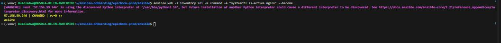

---

#### Screenshot 22 — Output of `ansible web -i inventory.ini -m command -a "pm2 status"`

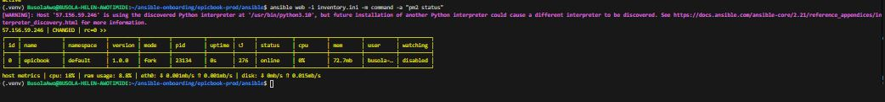

---

#### Screenshot 23 — Output of `ansible web -i inventory.ini -m command -a "curl -I http://localhost:8080"`

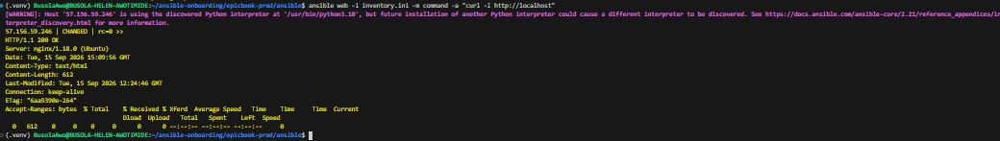

---

### Notes

Answer the following in your own words:

**1. What command did you run to execute the Ansible playbook?**

ansible-playbook -i inventory.ini site.yml

---

**2. How do you know all roles completed successfully?**

The final execution summary output reported zero failed tasks across all applied roles.

---

**3. What proves that Nginx is active?**

The systemctl is-active nginx command returned an active status.

---

**4. What proves that PM2 is managing the EpicBook application?**

The pm2 status command showed the epicbook process running with an online status

---

**5. What proves that the EpicBook application responds on port `8080`?**

Running curl -I http://localhost:8080 returned a valid HTTP response from the application server.

---

# Task 11 — Verify the EpicBook Deployment

## Goal

Verify that the EpicBook application is running, accessible in the browser, and connected to the managed MySQL database.

### Evidence

#### Screenshot 24 — Output of `curl -I http://<public_ip>`

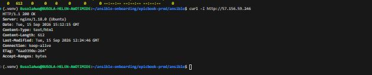

---

#### Screenshot 25 — Output of the cart API test command

---

#### Screenshot 26 — Output of the `/cart` HTTP status check

---

#### Screenshot 27 — Browser showing the EpicBook application loaded from `http://<public_ip>`

---

### Notes

Answer the following in your own words:

**1. What HTTP response did you receive from the public application URL?**

An HTTP/1.1 200 OK response.

---

**2. What did the cart API test prove?**

It proved that backend route handlers and API endpoints were fully operational, as there was steady handshake between backend routers and database..

---

**3. What did the `/cart` status check return?**

An HTTP 200 OK status code.
---

**4. What issue did you face during verification, and how did you fix it?**

PM2 initially started the application without loading database environment variables, causing Sequelize to crash with a connection refused error on port 3306. This was fixed by creating a PM2 ecosystem configuration file (ecosystem.config.js) to explicitly inject the correct Azure MySQL credentials and port settings.

---

# LinkedIn Post Required

## Evidence

#### LinkedIn Post URL

Paste your LinkedIn post URL here:

(https://www.linkedin.com/posts/topedavids_devops-azure-cloudcomputing-share-7508222694102925312-Ysvd/?utm_source=share&utm_medium=member_desktop&rcm=ACoAAAySvXcBSksEGgTHjx1oRy7rOmDlzNAFmEA)

---

#### Screenshot — Published LinkedIn post

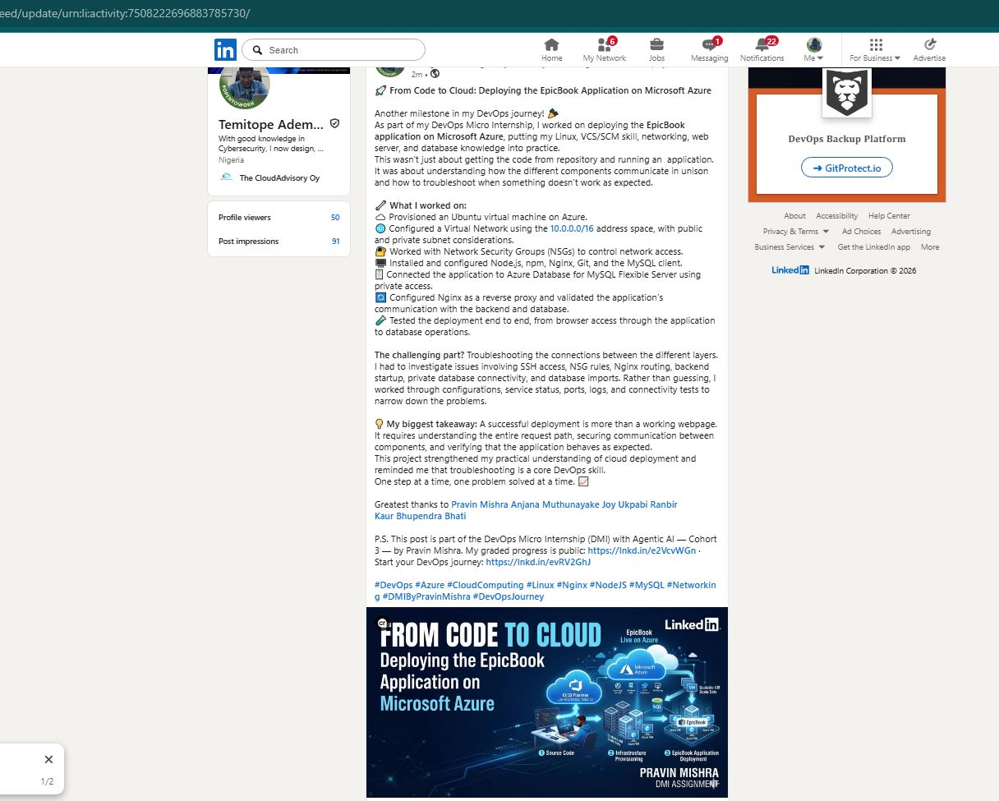

---

# Assignment Questions

Answer the following in your own words:

**1. Why is Terraform used for infrastructure provisioning?**

It provides declarative Infrastructure as Code to deploy cloud resources consistently and repeatably.

---

**2. Why are Ansible roles useful for production-style deployments?**

They establish an organized directory structure that cleanly modularizes tasks, templates, and handlers for scalability

---

**3. What is the purpose of `group_vars/web.yml`?**

To centralize host-group specific configuration variables and maintain separation from playbook logic.

---

**4. Why should database passwords not be committed to GitHub?**

To prevent sensitive security credentials from being exposed publicly in version history.

---

**5. What is the purpose of Nginx in this deployment?**

To act as a reverse proxy handling client web traffic on port 80 and forwarding requests to the application.

---

**6. Why should the managed MySQL database not be publicly accessible?**

To protect backend data storage from unauthorized external exposure and network attacks.

---

**7. Why is PM2 used for the EpicBook Node.js application?**

To guarantee application uptime, handle process restarts automatically, and manage background logging.

---

**8. What does idempotency mean in Ansible?**

The ability to run playbooks multiple times safely so that changes are applied only when differences exist.

---

**9. What issue did you face during the deployment, and how did you fix it?**

Environment variables weren't picked up automatically by PM2 during startup, which was resolved by implementing an explicit ecosystem configuration file (ecosystem.config.js).

---

**10. What security improvement would you make before using this setup in production?**

I would integrate Ansible Vault for credential encryption, configure HTTPS using SSL/TLS certificates, and strictly restrict cloud firewall security rules.

---

# Required Files

Confirm that the following files are included in your GitHub repository or assignment folder:

- [ ] `README.md`
- [ ] Terraform files under either `terraform/azure/` or `terraform/aws/`
- [ ] `ansible/ansible.cfg`
- [ ] `ansible/inventory.ini`
- [ ] `ansible/site.yml`
- [ ] `ansible/group_vars/web.yml`
- [ ] `ansible/roles/common/tasks/main.yml`
- [ ] `ansible/roles/nginx/tasks/main.yml`
- [ ] `ansible/roles/nginx/templates/epicbook.conf.j2`
- [ ] `ansible/roles/epicbook/tasks/main.yml`

---

# Submission Instructions

- Add all required screenshots in your submission.
- Full Name must be visible in required screenshots.
- Mention the cloud provider used: Azure or AWS.
- Add the VM public IP address.
- Add the final application URL.
- Add Terraform output proof.
- Add Ansible role tree proof.
- Add all required notes and assignment question answers.
- Add your LinkedIn post URL.
- Do not expose SSH private keys, passwords, cloud credentials, database credentials, Terraform state files, subscription IDs, or account IDs.
- Submit only your Google Doc link.

---

# Completion Checklist

- [ ] Task 1: Project folder layout created
- [ ] Task 2: Terraform infrastructure provisioned
- [ ] Task 3: SSH key-based access verified
- [ ] Task 4: Ansible inventory and configuration created
- [ ] Task 5: Main Ansible playbook created
- [ ] Task 6: `common` role created
- [ ] Task 7: `nginx` role created
- [ ] Task 8: `epicbook` role created
- [ ] Task 9: Group variables created
- [ ] Task 10: Ansible playbook run completed
- [ ] Task 11: EpicBook deployment verified
- [ ] Terraform files created under only one cloud provider folder
- [ ] One Ubuntu VM was created
- [ ] One managed MySQL database was created
- [ ] SSH port `22` is restricted to the controller public IP
- [ ] HTTP port `80` is accessible
- [ ] MySQL port `3306` is not publicly open
- [ ] `ansible web -i inventory.ini -m ping` returns `SUCCESS`
- [ ] `site.yml` calls the roles in the correct order
- [ ] Database secrets are hidden or handled securely
- [ ] Nginx is active
- [ ] PM2 shows the EpicBook application running
- [ ] EpicBook responds on port `8080`
- [ ] Public URL loads in the browser
- [ ] Cart API verification works
- [ ] Playbook completes with `failed=0`
- [ ] Screenshots 1–27 are included
- [ ] Assignment questions are answered
- [ ] LinkedIn post published
- [ ] LinkedIn post URL added
- [ ] No sensitive information is exposed
- [ ] Google Doc is accessible

---

## About DMI & CloudAdvisory

DevOps Micro Internship (DMI) is a project-based DevOps program run by Pravin Mishra and The CloudAdvisory, focused on real-world execution, systems thinking, and career readiness.

It helps learners build strong DevOps foundations with hands-on experience.

---

## Resources

- DMI Official Website: [https://dmi.pravinmishra.com?utm_source=github&utm_medium=readme](https://dmi.pravinmishra.com?utm_source=github&utm_medium=readme)
- University: [https://university.pravinmishra.com?utm_source=github&utm_medium=readme](https://university.pravinmishra.com?utm_source=github&utm_medium=readme)
- Discord Community: [https://discord.pravinmishra.com?utm_source=github&utm_medium=readme](https://discord.pravinmishra.com?utm_source=github&utm_medium=readme)
- Blog: [https://dmi.pravinmishra.com/blog?utm_source=github&utm_medium=readme](https://dmi.pravinmishra.com/blog?utm_source=github&utm_medium=readme)
- YouTube Playlist: [https://www.youtube.com/playlist?list=PLFeSNDtI4Cho](https://www.youtube.com/playlist?list=PLFeSNDtI4Cho)
- Pravin Mishra LinkedIn: [https://www.linkedin.com/in/pravin-mishra-aws-trainer/](https://www.linkedin.com/in/pravin-mishra-aws-trainer/)
- CloudAdvisory LinkedIn: [https://www.linkedin.com/company/thecloudadvisory/](https://www.linkedin.com/company/thecloudadvisory/)

---

*This submission is part of DevOps Micro Internship (DMI) Cohort 3 — Agentic AI Track.*