# Assignment 5 — AI-Assisted Azure DevOps Dual-Pipeline Failure Triage

Part of the DevOps Micro Internship (DMI) — Agentic AI Track

---

## Student Information

**Full Name:** Temitope Ademola-Davids

**GitHub Repository or Fork URL:** https://github.com/accelage

**Public LinkedIn Post URL:** https://www.linkedin.com/in/topedavids

---

## Purpose

In this assignment, I configured an AI-assisted, read-only failure-triage workflow for the EpicBook Infrastructure and Application Pipelines. The workflow uses Bash to gather Azure DevOps pipeline evidence and Claude Code to analyze the evidence and recommend a recovery action while keeping all changes under human control.

---

# Task 0 — Verify Tools, Authentication, and Pipeline Details

## Goal

Verify the required tools, Azure DevOps authentication, organization and project details, and numeric pipeline IDs.

No screenshot is required for this task.

---

# Task 1 — Capture the Healthy Baseline and Prepare the Supplied Files

## Goal

Confirm that both EpicBook pipelines are healthy and place the supplied assignment files in the correct repository locations.

## Evidence

### Screenshot 1 — Healthy Baseline for Both Pipelines

Terminal output showing the latest completed Infrastructure and Application Pipeline runs with successful results.

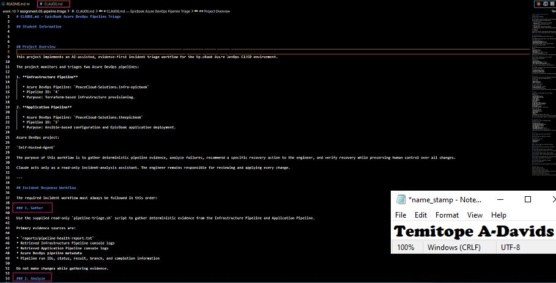

## Notes

### 1. What proves that both pipelines were healthy before the drill?

The healthy baseline is proven by the latest completed runs of both the Infrastructure Pipeline and the Application Pipeline showing successful results. The successful pipeline runs confirm that the existing infrastructure deployment and application deployment workflows were functioning correctly before the controlled failure was introduced.

### 2. Why is a healthy baseline necessary before introducing a controlled failure?

A healthy baseline establishes a known-good starting point for the drill. It ensures that any failure observed after the controlled change can be compared with the previous successful state and attributed to the intentional test rather than to an existing problem.

This makes it possible to measure whether the monitoring, detection, diagnosis, and recovery workflow responds correctly to the controlled failure.

---

# Task 2 — Configure and Review the Supplied CLAUDE.md

## Goal

Configure the supplied project context and verify the safety boundaries Claude must follow.

## Evidence

### Screenshot 2 — CLAUDE.md Context and Safety Rules

`CLAUDE.md` open in the editor with the Project Overview, Incident Workflow, Safety Rules, and Output Rules visible.

## Notes

### 1. Why does Claude need project-specific operational context?

Claude needs project-specific context so it understands the purpose of each EpicBook pipeline, the expected triage workflow, and the boundaries it must follow. This helps Claude interpret the evidence correctly without making assumptions about how the environment operates.

### 2. Which rules keep the human responsible for the recovery action?

The safety rules that prohibit Claude from automatically performing recovery actions keep the human responsible. In particular, Claude must not independently run destructive or recovery operations, modify production infrastructure, or approve changes without human review.

The workflow requires Claude to gather evidence, analyze the incident, and provide a recommendation, while the human operator reviews the evidence and decides whether the recovery action should be executed.

### 3. Which rules protect pipeline credentials and application secrets?

The rules requiring Claude to never expose, print, log, or include credentials, tokens, passwords, private keys, or other secrets in reports or output protect sensitive information.

Claude should also avoid displaying secret values when inspecting pipeline configuration or logs. If credentials are required by the pipeline, they should remain stored in the appropriate secure Azure DevOps or cloud secret-management mechanism rather than being written directly into scripts, reports, or configuration files.

---

# Task 3 — Configure and Validate the Supplied Pipeline Triage Script

## Goal

Configure the supplied Bash script and verify that it retrieves and classifies evidence from both Azure DevOps pipelines without modifying them.

## Evidence

### Screenshot 3 — Pipeline Triage Script Configuration

Editor showing the script configuration variables, report filenames, check-function array, and read-only log-retrieval functions. Ensure that no token is visible.

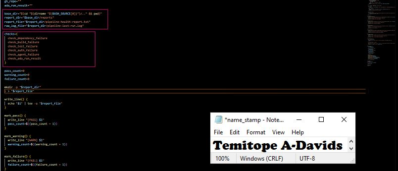

---

### Screenshot 4 — Script Validation

Terminal showing successful Bash syntax validation and executable file permission.

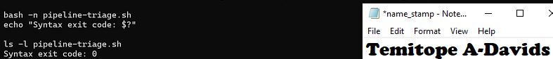

## Notes

### 1. Why are pipeline metadata and step console logs handled separately?

Pipeline metadata provides high-level information such as the pipeline name, run ID, branch, status, result, and completion time. Step console logs contain the detailed execution evidence required to understand why a particular task failed. Handling them separately allows the script to identify the relevant run first and then retrieve the detailed evidence needed for diagnosis.

### 2. How does the script obtain the actual console logs?

The script identifies the relevant Azure DevOps pipeline run and its log IDs, then uses an authenticated read-only Azure DevOps Build Logs API method to retrieve the individual console logs as text. This provides the detailed step output required for failure classification.

### 3. How does the check-function array control the classification loop?

The check-function array contains the failure-check functions that the script must evaluate. The classification loop iterates through those functions in a controlled order, allowing each function to inspect the collected log evidence for patterns associated with a particular failure category.

### 4. What prevents a failed but unmatched run from being reported as healthy?

The script checks the Azure DevOps run result independently of its pattern matches. If Azure DevOps reports that the run failed but none of the known failure patterns match the logs, the script classifies the incident as an Unclassified Pipeline Failure instead of reporting the run as healthy.

### 5. Why are different exit codes useful to another automation tool?

Different exit codes provide a machine-readable indication of the triage result. For example, an exit code can distinguish a healthy state from an incomplete or warning state, a detected pipeline failure, or a configuration/API error. This allows another automation tool to respond appropriately without having to interpret the entire report.

---

# Task 4 — Run and Understand the Healthy-State Report

## Goal

Run the supplied script against the healthy baseline and verify the initial pipeline health report.

## Evidence

### Screenshot 5 — Healthy Pipeline Report

Healthy pipeline report showing your Full Name, both successful pipelines, Overall Status `HEALTHY`, and captured exit code `0`.

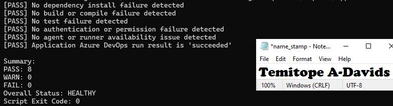

## Notes

### 1. What evidence proves that both pipelines are healthy?

The healthy baseline is proven by the latest completed Infrastructure and Application pipeline runs. Infrastructure Run 26 and Application Run 27 both show a completed status with a result of succeeded. The triage script also retrieved the console logs for both runs and found no dependency, build, test, authentication/authorization, agent availability, Terraform, deployment, or unclassified failure. The final report shows Overall Status: HEALTHY, with WARN: 0, FAIL: 0, and a script exit code of 0.

### 2. Why must the baseline exit code be verified before the incident drill?

The baseline exit code must be verified before the incident drill to establish that the environment is healthy before introducing the controlled failure. An exit code of 0 confirms that the triage script can successfully retrieve and classify the current pipeline evidence without detecting an existing failure or configuration problem. This provides a reliable comparison point for the later incident and helps distinguish the controlled failure from any pre-existing issue.

---

# Task 5 — Configure and Test the Supplied /pipeline-triage Skill

## Goal

Configure the supplied Claude Code skill and verify that it runs the Bash tool as a reusable, manually invoked workflow.

## Evidence

### Screenshot 6 — Pipeline-Triage Skill Definition

`SKILL.md` showing the frontmatter, manual-invocation setting, narrowly scoped tools, safety rules, and required output structure.

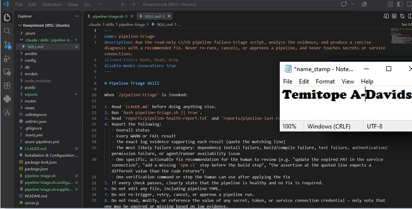

---

### Screenshot 7 — Healthy Skill Result

Healthy `/pipeline-triage` result showing that both pipelines are healthy and no fix is required.

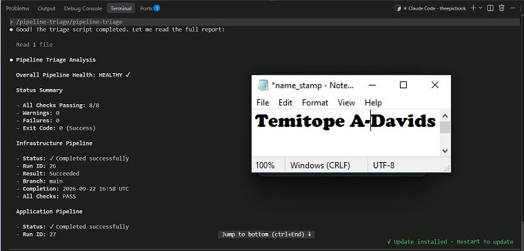

## Notes

### 1. Why is `disable-model-invocation: true` appropriate for this skill?

disable-model-invocation: true is appropriate because pipeline triage is an operational workflow that should only start when the engineer explicitly requests it. Manual invocation prevents the model from automatically deciding to run the triage workflow during unrelated work. This keeps the workflow predictable and preserves human control over when pipeline evidence is collected.

### 2. Why should the skill avoid broad Bash approval?

The skill should avoid broad Bash approval because unrestricted shell access would give Claude the ability to execute commands outside the intended read-only triage workflow. A narrowly scoped command reduces the risk of modifying files, changing infrastructure, running Terraform or Ansible, or performing pipeline mutations. The goal is to give Claude only the command execution capability required for evidence collection.

### 3. What work is performed by Bash, and what work is performed by Claude?

The Bash script performs the deterministic evidence-gathering work. It retrieves pipeline metadata and logs, checks known failure patterns, classifies the results, and generates the structured report. Claude reads and explains that evidence, identifies a likely cause, recommends one human recovery action, and provides a verification step.

### 4. Why are permission rules required in addition to written safety instructions?

Written safety instructions describe how Claude should behave, while permission rules provide an additional technical boundary around what tools and commands can actually be used. Combining both approaches provides stronger protection against unintended actions and helps preserve the read-only design of the triage workflow.

---

# Task 6 — Introduce a Safe Failure in the Application Pipeline

## Goal

Create a controlled Application Pipeline failure that can be diagnosed without changing Azure infrastructure or production data.

## Evidence

### Screenshot 8 — Controlled Application Pipeline Failure

Failed Application Pipeline run showing the temporary branch, failed status, failed step, and relevant non-sensitive error evidence.

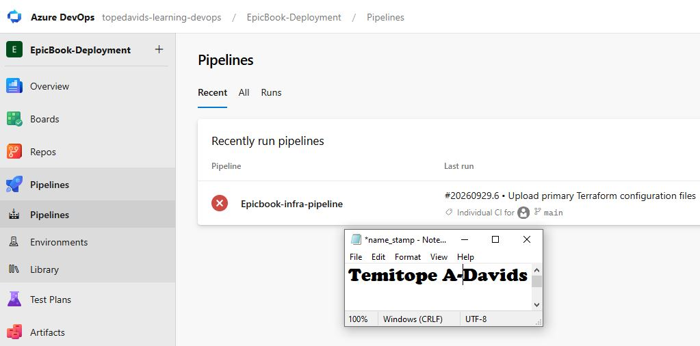

## Notes

### 1. What exact failure did you introduce?

I introduced a controlled dependency-installation failure on the temporary drill/pipeline-failure branch by deliberately specifying an invalid application dependency. This caused the Application Pipeline to fail during dependency installation before any deployment changes were applied.

### 2. Which category should detect it?

The failure should be detected as an Application Pipeline failure by the pipeline triage checks.

TFailure category: This is a validation/build-pipeline failure because the failure occurs directly in the Application Pipeline before any deployment action.

### 3. Why is the failure safe and easily reversible?

The failure is safe because it occurs before the deployment stage and does not modify Azure infrastructure, credentials, networking, database data, or the currently deployed application. It is easily reversible by restoring the dependency configuration to its previous valid value.

### 4. How did you prevent the deliberate failure from reaching `main` or changing the deployed application?

I introduced the failure on a temporary test branch rather than directly on main. The branch was used only to execute the controlled failure test.

The intentional failure was committed only to drill/pipeline-failure, which was never merged into main. The pipeline stops at the failing step, so no subsequent deployment action can execute.

---

# Task 7 — Diagnose and Save the Incident Evidence

## Goal

Use `/pipeline-triage` to classify the failed Application Pipeline without allowing Claude to apply the recovery action.

## Evidence

### Screenshot 9 — Failed-State Diagnosis and Incident Report

`/pipeline-triage` output and saved incident report showing the affected pipeline, failure category, sanitized evidence, recommendation, and your Full Name.

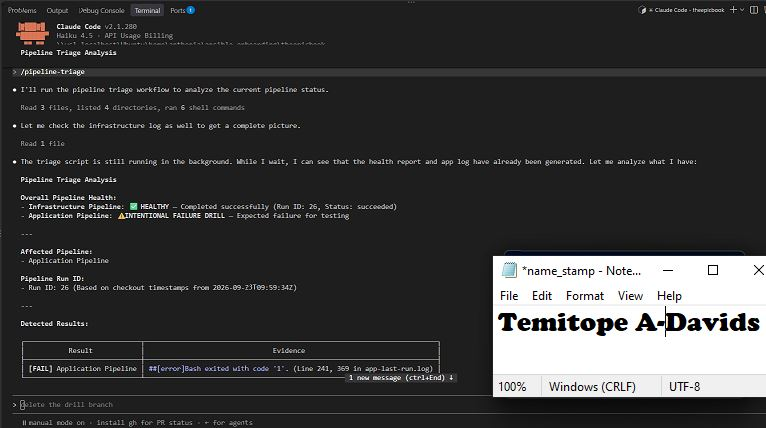

## Notes

### 1. Which failure category was identified?

The /pipeline-triage workflow identified the failure as an Application Pipeline failure. The classification was based on the failed Application Pipeline run and the evidence retrieved from its pipeline metadata and step console logs.

### 2. What exact evidence supported the diagnosis?

The diagnosis was supported by the Application Pipeline run showing a failed result, together with the console output from the failed step containing the relevant non-sensitive error message.

The incident report preserved the affected pipeline, failed step, failure status, and sanitized error evidence. This provided direct evidence for the classification rather than relying on an assumption about the cause.

### 3. Did Claude apply the fix or rerun the pipeline? Why is that important?

No. Claude did not apply the fix or rerun the pipeline.

This is important because the /pipeline-triage skill is designed to gather and analyze evidence, not independently perform recovery actions. Keeping recovery under human control prevents an AI-assisted diagnosis from automatically causing additional pipeline executions or changes before the operator has reviewed the evidence and approved the appropriate action.

### 4. Which part represents Gather, and which part represents Analyze?

The Bash triage script represents the Gather stage because it retrieves the Azure DevOps pipeline metadata and console logs, checks the evidence, and produces the structured report. Claude represents the Analyze stage because it interprets the collected evidence, explains the likely cause, recommends a human action, and provides a verification step.

---

# Task 8 — Apply the Human-Reviewed Fix and Verify Recovery

## Goal

Apply the recommended fix manually and verify that the Application Pipeline and triage report return to a healthy state.

## Evidence

### Screenshot 10 — Corrected Application Pipeline Run

Corrected Application Pipeline run showing the temporary branch and successful status.

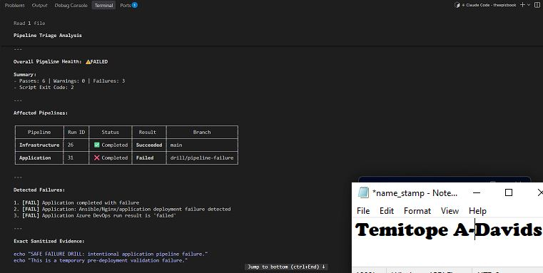

---

### Screenshot 11 — Recovery Triage Result

Recovery `/pipeline-triage` output showing Overall Status `HEALTHY`, exit code `0`, your Full Name, and both saved report filenames.

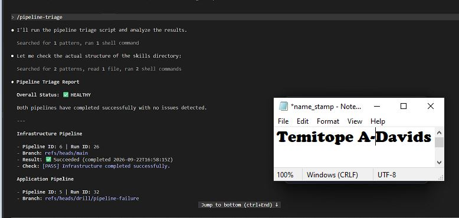

## Notes

### 1. What exact fix did you apply?

I manually reversed the controlled dependency change on the temporary branch by restoring the correct application dependency configuration. I then committed and pushed the corrected version and ran the Application Pipeline again.

### 2. Did the fix match Claude’s recommendation? Explain briefly.

Yes. Claude's recommendation matched the evidence gathered from the failed pipeline. The failure was associated with the deliberately invalid dependency, so restoring the correct dependency configuration addressed the identified cause without requiring infrastructure or credential changes

### 3. What evidence proves that the pipeline recovered?

The corrected Application Pipeline completed successfully on the temporary branch. Afterward, I ran /pipeline-triage again, and the generated report showed both pipelines as healthy, an Overall Status of HEALTHY, and exit code 0.

### 4. Why is a second triage run required after the pipeline becomes green?

A successful pipeline run provides evidence that execution completed, but the second triage run independently verifies that the monitored dual-pipeline environment has returned to the expected healthy state. It completes the Verify stage of the Gather → Analyze → Human Act → Verify workflow

### 5. What risk would be created if Claude could automatically edit, push, approve, and rerun the pipeline?

Giving Claude all of those permissions would combine diagnosis and recovery authority in a single automated workflow. An incorrect diagnosis could therefore lead directly to an unintended code change or deployment without human review. Keeping triage read-only allows AI to assist with analysis while leaving consequential recovery decisions and actions under engineer control

---

# LinkedIn Post — Mandatory

## LinkedIn Post URL

https://www.linkedin.com/posts/topedavids_devops-azuredevops-claudecode-share-7511821118538833922-BI3S/?utm_source=share&utm_medium=member_desktop&rcm=ACoAAAySvXcBSksEGgTHjx1oRy7rOmDlzNAFmEA

## Evidence

### Screenshot 12 — Published LinkedIn Post

Published LinkedIn post showing its text and at least one image or link.

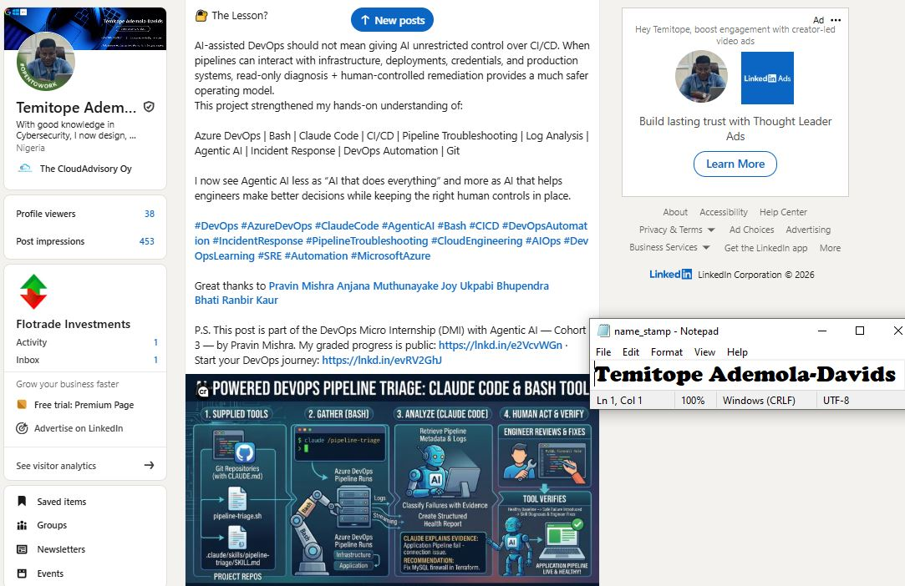

---

# Required Repository Files

Confirm that the following files are available in your repository:

* [ ] `CLAUDE.md`
* [ ] `pipeline-triage.sh`
* [ ] `.claude/skills/pipeline-triage/SKILL.md`
* [ ] `reports/incident-failure-report.txt`
* [ ] `reports/recovery-report.txt`

---

# Submission Instructions

* Complete all tasks in sequence.
* Include all 12 required screenshots.
* Answer every Notes question in your own words.
* Include your GitHub repository or fork URL.
* Include your public LinkedIn post URL.
* Ensure your Full Name appears in the required reports.
* Do not include raw logs containing sensitive information.
* Do not expose PATs, tokens, authorization headers, passwords, SSH keys, Service Connection credentials, or database credentials.

---

# Completion Checklist

* [ ] Both Azure DevOps pipelines were healthy before the drill.
* [ ] The supplied files were copied to the correct repository locations.
* [ ] Only the required student-specific placeholders were updated.
* [ ] `CLAUDE.md` contains the required context and safety rules.
* [ ] `pipeline-triage.sh` passed Bash syntax validation.
* [ ] The script has executable permission.
* [ ] The script uses read-only Azure DevOps operations.
* [ ] The script retrieves pipeline metadata and console logs.
* [ ] No token or password is stored in the script.
* [ ] The healthy baseline reported `HEALTHY` with exit code `0`.
* [ ] `/pipeline-triage` was invoked manually.
* [ ] The skill does not have broad Bash approval.
* [ ] The controlled failure affected only the Application Pipeline.
* [ ] The failure occurred before deployment changes were applied.
* [ ] The deliberate failure was not merged into `main`.
* [ ] The failed-state report was saved before applying the fix.
* [ ] Claude diagnosed the failure but did not apply the fix.
* [ ] The fix was reviewed and applied manually.
* [ ] The corrected Application Pipeline completed successfully.
* [ ] The recovery triage reported `HEALTHY` with exit code `0`.
* [ ] `incident-failure-report.txt` exists.
* [ ] `recovery-report.txt` exists.
* [ ] All Notes questions have been answered.
* [ ] All 12 screenshots have been added.
* [ ] The GitHub repository or fork URL has been included.
* [ ] The LinkedIn post is public.
* [ ] The LinkedIn post URL has been included.
* [ ] No sensitive information is exposed.

---

# Final Submission

**Full Name:** [Enter your full name]

**GitHub Repository or Fork URL:** [Paste your repository URL]

**LinkedIn Post URL:** [Paste your public LinkedIn post URL]

---

*This submission is part of the DevOps Micro Internship (DMI) — Agentic AI Track.*
